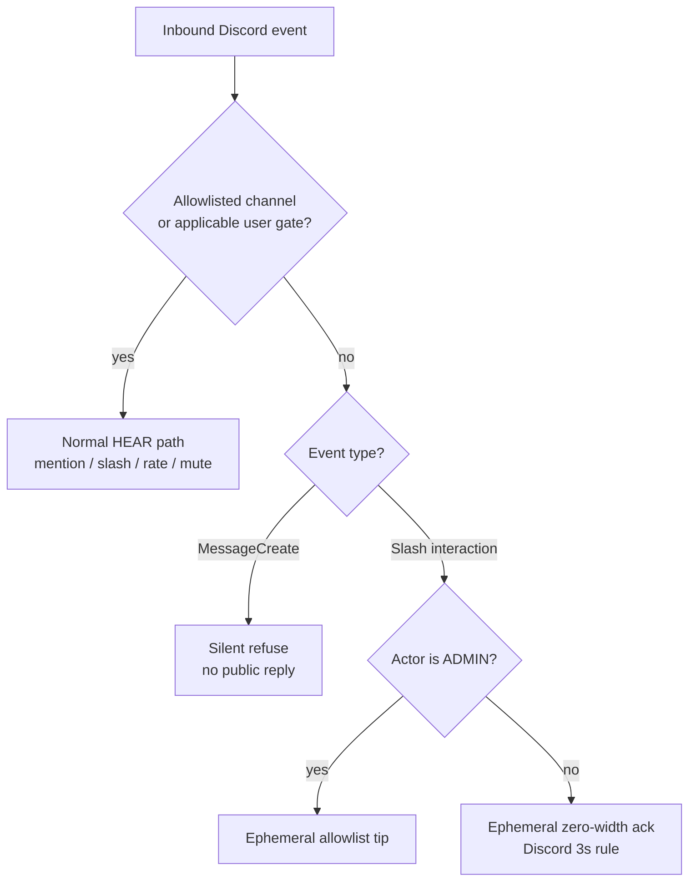

# Discord HEAR surface

Operator / UX inventory for Corvidinho’s Discord bridge (HEAR).  
**As of:** 2026-09-26 (America/Denver). Package version from `src/version.ts` / `package.json`.

Acceptance criteria live in [`hi/discord.md`](../hi/discord.md) (DISCORD-1..12, DISCORD-DENY-1..3).  
Go-live secrets checklist: [`DISCORD-GO-LIVE.md`](DISCORD-GO-LIVE.md). Box updater / slash re-register: [`BOX-UPDATE.md`](BOX-UPDATE.md).

> **Mermaid is docs-only.** Discord chat does **not** render Mermaid natively. Use embeds, code fences, or PNG in Discord; keep flowcharts in this repo doc.

---

## Slash commands (exact set of six)

Registered via `buildSlashCommandBodies()` → guild PUT overwrite + clear globals when `DISCORD_GUILD_ID` is set (`discord register-commands` / ClientReady).

| Command | Options | Ephemeral? | Purpose |
|---------|---------|------------|---------|
| `/session list` | — | yes | List active session stubs |
| `/session start` | `topic` (string, required) | public (deferred) | Start session + agent run |
| `/status` | — | yes | Bridge metrics (version, uptime, protocol, channels, sessions, work, LLM line, slash names, optional git tip) |
| `/agents` | — | yes | List local Corvidinho agent |
| `/work` | `description` (string, required) | public (deferred) | Drive a work task |
| `/mute` | `user` (user, required) | yes | Mute user (ADMIN; DISCORD-7 re-check) |
| `/unmute` | `user` (user, required) | yes | Unmute user (ADMIN) |

Gate order for every slash: **channel allowlist → mute/rate → minPermission → handler**.

---

## Outbound formats

### Thinking progress embeds (DISCORD-3)

One embed edited in place: description + color + footer (`sess · phase · elapsed [| tool | ~tok]`). Phases: starting / working / done / error. Used by @mention, `/session start`, `/work`.

### Session replies (mention / continue)

After thinking settles: plain `content` (truncated ~1800/1900), reply-referenced to the user message. Prefer parsed `task run --json` summary. No attribution footer on Discord outbound today.

### Slash replies

Mostly ephemeral plain text (`/status`, `/agents`, `/session list`, mute/unmute, gates). `/session start` and `/work` use deferred public replies with summary.

---

## Deny behavior (DISCORD-5 + DISCORD-DENY-1..3)

Outside an allowlisted channel (or from a non-configured user when a user allowlist applies):

| Path | Non-admin | Admin |
|------|-----------|-------|
| **MessageCreate** (@mention / reply / thread) | **Silent** — no public reply, no DM, no reaction | **Silent** (MessageCreate has no ephemeral; tip is slash-only) |
| **Slash** | Ephemeral **zero-width** ack (`\u200b`) only — Discord requires a response within 3s; no useful leak | Ephemeral **allowlist tip** (how to add channel/user to config + restart) |

Never post a public `"not authorized"` on channel deny. Insufficient permission for admin-shaped commands (`/mute`, `/unmute`) still uses ephemeral `"not authorized"` (different from channel deny).

Admin detection: `resolvePermissionLevel` + `CORVIDINHO_DISCORD_ADMIN_USERS` / `_ROLES` (empty ⇒ nobody ADMIN).

Tip text (approx.):

> This channel isn’t allowlisted. Add its id to discord.channels in ~/.config/corvidinho/allowlist.toml (or CORVIDINHO_DISCORD_CHANNELS / DISCORD_CHANNEL_IDS) and restart the bridge.

---

## Formatting limits (practice)

| Limit | Corvidinho practice |
|-------|---------------------|
| Message content | Hard-cap **1900** at gateway / slash adapt / `discord-post-message` |
| Thinking embeds | Description + footer only; one embed |
| Mermaid | **Repo docs only** — not Discord chat |
| Presence | Custom Status `vX.Y.Z` (DISCORD-12) |

---

## Source map

- Router: `src/discord/message-router.ts`
- Slash: `src/discord/slash-commands.ts`, `slash-dispatch.ts`, `command-handlers/*`
- Thinking: `src/discord/thinking-status.ts`
- Permissions / admin: `src/discord/permissions.ts`
- Types / tip constants: `src/discord/types.ts` (`ALLOWLIST_DENY_TIP`, `EPHEMERAL_SILENT_ACK`)
- Presence: `src/discord/presence.ts`
