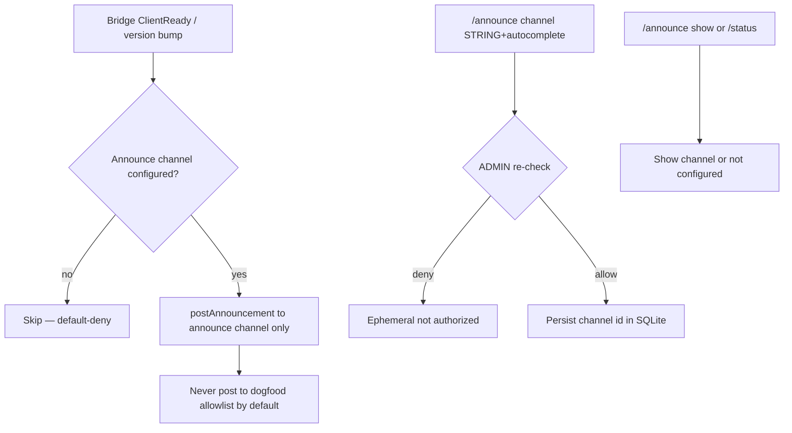
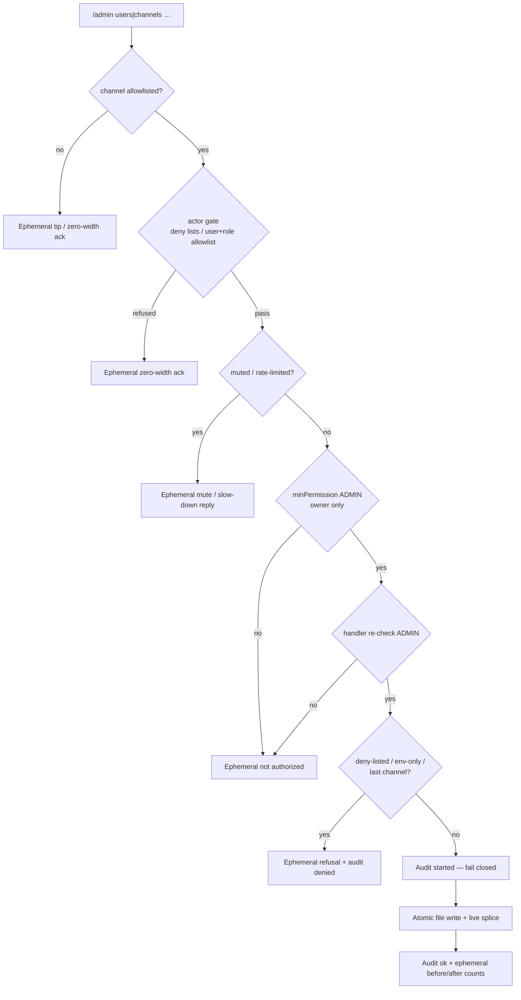

# Discord HEAR surface

Operator / UX inventory for Corvidinho’s Discord bridge (HEAR).  
**As of:** 2026-09-29 (America/Denver). Package version from `src/version.ts` / `package.json`.

Acceptance criteria live in [`hi/discord.md`](../hi/discord.md) (DISCORD-1..17, DISCORD-DENY-1..3, DISCORD-SCHEDULE-1..5, DISCORD-ANNOUNCE-1..6, DISCORD-ASK-1..8), [`hi/admin.md`](../hi/admin.md) (ADMIN-1..4, ADMIN-3.a, ADMIN-3.b), [`hi/identity.md`](../hi/identity.md) (IDENTITY-1..14, IDENTITY-11.a), [`hi/roles.md`](../hi/roles.md) (ROLES-CHAT-1..9, ROLES-CHAT-8.a), [`hi/memory.md`](../hi/memory.md) (MEMORY-1..9, MEMORY-ACL-1..6 and 6.a), [`hi/autonomy.md`](../hi/autonomy.md) (AUTONOMY-1..11), [`hi/session.md`](../hi/session.md) (SESSION-WORKTREE-1..5, SESSION-MULTI-1..4), [`hi/persona.md`](../hi/persona.md) (PERSONA-1.a for the update note, below) and [`hi/safe.md`](../hi/safe.md) (SAFE-11..13 and SAFE-12.a for untrusted text, SAFE-14/15 for the spend caps and SAFE-14.a for who sees spend, below).  
Go-live secrets checklist: [`DISCORD-GO-LIVE.md`](DISCORD-GO-LIVE.md). Box updater / slash re-register: [`BOX-UPDATE.md`](BOX-UPDATE.md).

> **Mermaid is docs-only.** Discord chat does **not** render Mermaid natively. Use embeds, code fences, or PNG in Discord; keep flowcharts in this repo doc.

---

## Slash commands (nine: DISCORD-4 six + /schedule + /announce + /admin)

Registered via `buildSlashCommandBodies()` → guild PUT overwrite + clear globals when `DISCORD_GUILD_ID` is set (`discord register-commands` / ClientReady).

| Command | Options | Ephemeral? | Purpose |
|---------|---------|------------|---------|
| `/session list` | — | yes | List active sessions: the owner (ADMIN) sees everyone's with full project paths; anyone else sees only their own, project shown by name (REQ-discord-418) |
| `/session start` | `topic` (required), optional `project` | public (deferred) | Start session + agent run in isolated worktree |
| `/status` | — | yes | Bridge metrics (version, uptime, protocol, channels, sessions, work, LLM line — the configured model @ host, or `LLM: none — No model provider is configured.` when none is set (AGENT-10/13; the setting names to fix it for the owner only) —, slash names, announce channel, owner configured, audit chain, 24 h spend vs cap for the owner only, one line for the total cap and one per provider cap (SAFE-14) — anyone else sees just “Work is paused for budget.” while runs are paused at a cap, never which one (SAFE-14.a), optional git tip) |
| `/agents` | — | yes | List local Corvidinho agent |
| `/work` | `description` (required), optional `project` | public (deferred) | Drive a work task in isolated worktree. Owner and team only: community (anyone undeclared included) gets the ephemeral `not authorized` and nothing starts (IDENTITY-11.a). Once its tree is verified, a second model reviews the diff in up to 3 rounds before the draft PR, and the PR lists what it raised and what changed; with no finished review there is no PR (`not-reviewed`), and with no second model configured the `PR:` line says so (GITHUB-9 / GITHUB-9.a) |
| `/mute` | `user` (user, required) | yes | Mute user (ADMIN; DISCORD-7 re-check). Refuses yourself and the configured owner (DISCORD-6 / IDENTITY-2) |
| `/unmute` | `user` (user, required) | yes | Unmute user (ADMIN) |
| `/schedule list` | — | yes | List schedules (non-owners see each project by name, never the host path; REQ-discord-418) |
| `/schedule create` | `name`, `cadence`, `project`, `prompt`, optional `channel` | yes | Create recurring single-project run (ADMIN; min 5m cadence). SAFE-13: a non-owner's `name` or `prompt` that looks like an injection attempt stores nothing, gets a private refusal and pings the owner (see "Untrusted text and injection attempts") |
| `/schedule pause` | `schedule` (id) | yes | Pause (ADMIN) |
| `/schedule resume` | `schedule` (id) | yes | Resume (ADMIN) |
| `/schedule delete` | `schedule` (id) | yes | Delete the schedule and its run history (ADMIN). SAFE-5: appends `started` then `ok`/`error` rows (surface `discord:schedule`, action `schedule-delete`, actor = invoker id, args digest only) before deleting, and fails closed (`audit log unavailable (SAFE-5)`, nothing deleted) when the trail is unavailable; a non-owner's delete appends `denied`. The reply names the row numbers |
| `/announce channel` | `channel` (STRING + autocomplete), optional `clear` (bool) | yes | Set/clear dedicated ops/dev announcements channel (ADMIN; DISCORD-ANNOUNCE-1..2/5) |
| `/announce show` | — | yes | Show current announcements channel; empty = not configured (DISCORD-ANNOUNCE-3) |
| `/admin users add` | `user` (user picker, required) | yes | Approve a user: add to `[discord].users` in the allowlist file + live (owner only; ADMIN-1) |
| `/admin channels add` | `channel` (STRING + autocomplete by name/id, required) | yes | Add a channel to `[discord].channels` + live (owner only; ADMIN-2) |
| `/admin channels remove` | `channel` (STRING + autocomplete from allowlist / name/id, required) | yes | Remove a channel from the file + live; refuses env-only entries and the last live channel, counting deny-listed channels as not live (owner only; ADMIN-2) |
| `/admin config show` | — | yes | Allowlist/config view: live vs file vs env counts, owner configured yes/no, rate limit, mutes, audit line, which knobs are updatable (owner only; ADMIN-3) |
| `/admin people list` | — | yes | Declared people and their links, the owner's person, and any problems in the file (owner only; IDENTITY-13) |
| `/admin people add` | `person` (id, required), optional `display` | yes | Declare a person, or change their display name (owner only; ADMIN-3.a) |
| `/admin people link` | `person` (required) + one or more of `discord` (user picker), `github` (login), `github_id` (number), `nickname` | yes | Link accounts / nicknames to a person; `github` looks the login's numeric user id up once (GitHub API) and stores it too, since GitHub matches that id only; an id already linked to someone else is refused (owner only; ADMIN-3.a, IDENTITY-6/7/7.a) |
| `/admin people unlink` | same as `link` | yes | Unlink accounts / nicknames (owner only; ADMIN-3.a) |
| `/admin people remove` | `person` (required) | yes | Remove a declared person and all their links (owner only; ADMIN-3.a) |
| `/admin people role` | `person` (required), `role` (`team` / `community`, required) | yes | Set a declared person's one role (owner only; ADMIN-3.b, IDENTITY-8); the owner role is `[owner]` / env only |
| `/admin people forget` | `person` (declared person id, required) | yes | Start forgetting a declared person: the same forget request and DM **Approve / Deny** card as their own ask; nothing is forgotten until you approve; an open ask is reused; SAFE-5 audited (`admin-people-forget` `started` / `ok`, `denied` for an undeclared id; fails closed without the trail) (owner only; MEMORY-ACL-6.a) |


Gate order for every slash: **channel allowlist → actor gate (user/role allowlist + deny lists, REQ-discord-201; ephemeral zero-width ack on refuse) → mute/rate → extras switch (`/work`, `/schedule`; PLUGIN-5.a) → minPermission → handler**. An ask button press (open or pick) runs the same **channel → actor → mute/rate** gates before it shows choices or resumes the session.

**Turning `/work` and `/schedule` off (PLUGIN-5 / PLUGIN-5.a, REQ-discord-157).** Both are extras, on unless the owner turns them off in a `[corvidinho.plugins]` table (`work = false`, `schedule = false`) in the install's `fledge.toml` or the allowlist file (off in either is off; the allowlist file survives box updates). The bridge reads both files again for every command, so no restart is needed. While one is off, every use of it (all `/schedule` subcommands, list included) gets only the ephemeral `/work is turned off on this install.` (or `/schedule …`); the owner also sees why and how to turn it back on, and nothing is created: no session, worktree, work task, run, PR or schedule change. While `/work` is off, a message (a reply to its answer, or an @mention in that channel while the `/work` talk is your active session there) or a button press (open, pick or the Answer form) that would resume a `/work` talk gets the same line — in the channel for a message, privately for a press — and runs nothing; its open questions stay. Once the `/work` talk has idled out, a reply to its answer (or a message in its thread) that would pick its conversation up again in a new talk (SESSION-3.a) gets the same line and starts nothing. A `/work` run already going is not stopped by turning it off, and `stop` / its Stop button still stop it. While `/schedule` is off, the scheduler starts no run (bridge and daemon), but backups, Approve / forget cards and posting schedule questions go on. A settings file that exists but cannot be read turns both off and is logged (`config-unreadable`). There is no `/admin` knob for this. See [`DISCORD-GO-LIVE.md`](DISCORD-GO-LIVE.md) E.11.

Channel autocomplete (`/admin channels add|remove`, `/announce channel`) is gated too: Discord shows these options to every guild member, so each autocomplete request is re-checked (channel allowlist → actor gate → ADMIN, with mutes) and anyone who is not ADMIN in an allowlisted channel gets an empty list — no channel names, ids or allowlist entries (DISCORD-DENY-3 / ADMIN-4 / REQ-discord-431). Autocomplete does not count toward the rate limit.


### Announcements (DISCORD-ANNOUNCE-1..6)

Dedicated **ops/dev** announcements channel for version bumps, bridge restarts, and ship notes — **separate from the dogfood/chat allowlist**. Default-deny: no announce posts until `/announce channel` sets one. Mutations re-check ADMIN at handler time; no owner configured = nobody is ADMIN (IDENTITY-3). Config persists in shared SQLite `schema_meta` (`discord_announce_channel_id`) in the data dir (`CORVIDINHO_DATA_DIR`, default `~/.local/share/corvidinho/`).

On ClientReady (after every successful bridge restart), if configured, Corvidinho posts one short update note **only** to that channel — never to general allowlisted chat by default (DISCORD-ANNOUNCE-4 / REQ-discord-025). The note is in the persona's voice (`persona.md`, PERSONA-1.a) with a link to that version's GitHub Release notes, not a changelog dump: one line, no bullets, under 200 characters, e.g.

> Back online and running **v0.0.34** 🐦‍⬛ Everything new in this version is in the release notes 👀 <https://github.com/CorvidLabs/Corvidinho/releases/tag/v0.0.34>

It is a fixed template (no model call, no spend; editing `persona.md` does not change it), the link is wrapped in `<>` so Discord shows no preview card, it pings nobody, and it is scrubbed (SAFE-6). A package version that is not a plain `X.Y.Z` is never echoed: the note then links the Releases page. The full notes live on the Release (CHANGELOG section, commits, upgrade line; `.github/workflows/release.yml`).

The same channel carries the nightly backup's failure notice (OPS-1/2, REQ-discord-680): when `CORVIDINHO_BACKUP_DIR` is set and a nightly backup or restore test fails (the bridge's or the daemon's tick), the bridge's next scheduler tick posts one fixed-text line — `⚠️ The nightly backup failed (<UTC time>)…` or `⚠️ The restore test failed (<UTC time>)…`, pointing at `corvidinho doctor`, never a host path or error text — with only the owner pinged. Once per failure streak: later failures are logged only, until a backup succeeds. With no announcements channel set nothing is posted anywhere else; the notice waits (one `[backup] …owner_not_told` log line, `doctor` says `owner not told yet`, and doctor's `backup` line warns while no channel is set) and goes out on the first tick after `/announce channel` sets one. A bridge stop while the post is in flight waits the short shutdown grace, then hands the notice back for the next start. See [`DAEMON.md`](DAEMON.md#nightly-backup-ops-12).



### Runtime admin (`/admin`, ADMIN-1..4)

Owner-only (IDENTITY-2): the dispatcher floor is ADMIN **and** the handler re-checks ADMIN itself before anything else (ADMIN-4 / DISCORD-7). No owner ⇒ nobody can run `/admin`. Every reply is ephemeral.

| Knob | Updatable from Discord? | Where it lands |
|------|------------------------|----------------|
| `[discord].users` | yes — `/admin users add` (approve) | allowlist file + live |
| `[discord].channels` | yes — `/admin channels add` / `remove` | allowlist file + live |
| Declared people `[people.<id>]` (IDENTITY-13) | yes — `/admin people add` / `link` / `unlink` / `remove` (ADMIN-3.a) | allowlist file; read on the next message or comment |
| A declared person's role `role = "team" \| "community"` (IDENTITY-8) | yes — `/admin people role` (ADMIN-3.b) | allowlist file; re-read by the tool layer on every call |
| Env lists (`CORVIDINHO_DISCORD_ALLOW_*`, `DISCORD_CHANNEL_IDS`), owner (`CORVIDINHO_OWNER_*` / `[owner]`), rate limits, roles, deny lists, `[github]` | no — shown by `/admin config show`; edit on the VM and restart | — |

- **One store.** Writes go to the allowlist file the bridge already loaded (`CORVIDINHO_ALLOWLIST_FILE`, else `~/.config/corvidinho/allowlist.toml|json`; created `0600` on first write if missing). The rewrite is atomic (temp file in the same dir + fsync + rename, mode kept, symlink target followed). TOML edits touch only the one key line inside `[discord]`; `[owner]`, `[github]`, comments and blank lines stay verbatim. JSON keeps every other key and refuses files whose numeric ids would lose precision.
- **Live, no restart.** The live list is recomputed exactly as a restart would load it (file ∪ env) and spliced in place, so the router, scheduler, slash gate and `/status` see it immediately.
- **Env is read-only at runtime.** Env entries are never written to the file. Removing an env-only channel is refused with a pointer to the VM env; removing a file+env channel removes it from the file and says it is still live via env.
- **Empty stays deny-all.** Deny lists still win (adding a deny-listed id is refused). Removing the last live channel is refused — it would lock out every message and slash (including `/admin`) and the bridge would refuse to start. A channel that is also on `deny_channels` does not count as live, so a removal that would leave only deny-listed channels is refused too (same lockout, since deny wins).
- **First user narrows access.** While `users` and `roles` are both empty, callers in an allowlisted channel resolve to STANDARD. Adding the first user flips every unlisted non-owner caller to BLOCKED; the reply warns about it.
- **Audit (SAFE-5).** Each mutation appends `started` then `ok`/`error` rows (surface `discord:admin`, actor = invoker id, args digest only) to the shared audit chain before touching the file; if the trail is unavailable the command fails closed. Guard refusals (deny-listed id, env-only entry, last channel) and a non-owner caught by the handler re-check append `denied` (the dispatcher floor refuses non-owners before the handler, without a row). The reply names the row numbers.
- Subcommand groups: the gateway flattens `SUB_COMMAND_GROUP` options (`/admin users add`) into `subcommandGroup` + `subcommand` + options.

### Declared people (`/admin people`, IDENTITY-13/14/6/7/7.a, ADMIN-3.a)

The owner declares who's who in the same allowlist file, one `[people.<id>]` section per person (JSON: a `people` object; see [`allowlist.example.toml`](../allowlist.example.toml)): `display`, `nicknames`, `discord_ids`, `github_logins`, `github_ids` (singular spellings read too; each value on one line). The person id is 1–32 lowercase letters, digits, `-` or `_`; `owner` is reserved.

- **Recognised on Discord and GitHub (IDENTITY-14).** Chat, button picks, `/session start` and `/work` add the declared person to the acting-user block (`declared_person`, the declared `display_name` — it wins over the Discord name — `nicknames`, `github`); WATCH opens the run prompt with a `[Corvidinho acting GitHub user …]` block for the commenter. Once anyone is declared, an undeclared speaker is marked `declared_person: none` (on WATCH also, with only the owner configured, a commenter using the owner's GitHub login without the owner's numeric id). The owner is always a person: the declared entry holding the owner's Discord id, else a built-in `owner` entry from `[owner]` / env (on GitHub it is recognised by its numeric id only: `[owner] github_id`, or `github_ids` on the owner's declared person). With nobody declared, the Discord block is exactly as before.
- **Stable ids only (IDENTITY-7).** Matching uses the Discord user id and the GitHub numeric user id — never a display name or nickname. An id linked to two people matches nobody (and `/admin people link` refuses to create that).
- **On GitHub, the numeric user id only (IDENTITY-7.a).** A GitHub login never matches anyone, not even the owner's: it can be renamed or re-registered by someone else. WATCH (the identity block, memory scope and the SAFE-13 owner exemption) matches the numeric id the GitHub API reports for the event; no id, or an id nobody declared, is an undeclared commenter (community) — never the owner. The owner's id is `[owner] github_id` (file only; `gh api users/<login> --jq .id` prints it); a person's is `github_ids`. `/admin people link person:<id> github:<login>` looks the login up once through the GitHub API (`GITHUB_TOKEN` / `GH_TOKEN` when set) and stores its numeric id in `github_ids` next to the login; a failed lookup links nothing (audited as an error) — link `github_id:<number>` instead. Logins stay as labels (shown to the model and in `/admin people list`, used to @mention the owner and to find someone's kept GitHub threads on forget-me); unlinking a login leaves its id linked (the reply says so). **Existing entries with only `github_logins` still load and still match on Discord, but are not recognised on GitHub until an id is linked**; `corvidinho doctor` prints `[warn] people-github` naming them (person ids only).
- **Only the owner changes links, never through chat (IDENTITY-6).** Edit the file on the VM, or use `/admin people …` (owner-only, handler re-check, SAFE-5 audit rows `admin-people-add|link|unlink|remove`, surface `discord:admin`, fail closed without a trail). No plugin or chat path writes people; keep the allowlist file outside project folders (the default `~/.config/corvidinho/`), where the model's file tools cannot reach it.
- **Live.** People are read from the allowlist file this process loaded (the file `[owner]` comes from), re-read on every message, slash run and WATCH event, so a change applies without a restart. A bridge that started without a file reads the file its first `/admin people` change writes.
- **Fail closed.** An entry with an unreadable value is skipped whole and listed as a problem in `/admin people list` / `/admin config show`; `/admin people` will not edit it (fix it on the VM). TOML edits rewrite only that person's keys; its header, comments and unread keys, and every other line of the file, stay verbatim.

### Roles (`role`, `/admin people role`, IDENTITY-8..12, ADMIN-3.b)

Each declared person has exactly one role: `role = "team"` or `role = "community"` in their `[people.<id>]` entry (no `role` key = community). The owner (`[owner]` / env) is always owner; `role = "owner"` on anyone else grants nothing (community, listed as a problem), and anyone undeclared is community (IDENTITY-12). A `role` that is not one of owner / team / community, or a list, makes the entry unreadable (skipped whole).

- **Owner** (IDENTITY-9): everything, as ADMIN today, still behind SAFE, the allowlists and the must-ask rules.
- **Team** (IDENTITY-10): work tasks — `/work` runs get `files-write` / `files-edit` in their own worktree (never on a secret-looking path) and ship the draft PR like the owner's — and reviews — `github-issue-comment` / `github-pr-review` (allowlisted in `CORVIDINHO_ALLOWLIST`, on GITHUB-6-allowlisted repos only; reviews post as `COMMENT`, `APPROVE` / `REQUEST_CHANGES` stay the owner's) — plus every read tool, their own memory (`memory-store` / `-recall` / `-profile`; forget/override stay owner-only) and the project's memory (MEMORY-6, see Memory), and `web-search` and `gif-search` when they are allowlisted in `CORVIDINHO_ALLOWLIST` (PLUGIN-9; `web-fetch` and `discord-send-file` stay the owner's; a GIF is posted as a link in the reply, never attached). Briefings (#102) are not built yet.
- **Community** (IDENTITY-11): Q&A and announcements; read/chat tools only, no mutating tool (ROLES-CHAT-2/3). Community can't start `/work` (IDENTITY-11.a): declared community, a declared person with no role and anyone undeclared get the same quiet ephemeral `not authorized` as the owner-only commands, before any worktree, `talk/*` branch, work task, run or verify exists; the role is resolved from the owner config and the people list re-read when the command runs, so a promotion or demotion applies to the next `/work`. A `/work` description that looks like an injection attempt still gets the SAFE-13 reply and tells the owner. `/session start` and chat stay open to community (read tools only). Its site / roadmap sources are the public repo docs (README, `docs/`, STATUS, CHANGELOG, via `github-docs-read` or the project files) and the public issues and milestones of allowed public repos (`github-issue-list`, `github-milestone-list`) — nothing else (ROLES-CHAT-8.a).
- **Checked in the tool layer on every run and surface** (IDENTITY-12). Discord chat, button picks, `/session start` and `/work` spawn with the speaker's role; schedules anyone but the owner created and `delegate` / `council` workers are community.
- **On GitHub too** (IDENTITY-12.a). A WATCH run spawns with the role of the person who triggered it — the author of the comment (or issue / PR body) that @mentioned the watch user, matched by their GitHub numeric user id in this people list, never by a login: the owner gets the owner's tools and a team member the team's (reviews, their own memory, `web-search` / `gif-search`; file edits stay `/work`-only), behind the same must-ask gate — a must-ask call waits for the owner's Approve card, DMed by this bridge. Anyone else, and every assignment or review request (the thread author did not trigger it), is community. The tool layer re-resolves it from the GitHub id at every call (a role change, a GitHub `deny_users` entry, or the person's Discord id muted or deny-listed applies at once). The shell, runners, Fledge runs and discovered Fledge plugin commands (SAFE-3.a) and secret-looking paths stay off on GitHub for every role. See [`WATCH.md`](WATCH.md) "Roles on GitHub". A schedule the owner created runs as the owner (DISCORD-SCHEDULE-1.a): each run checks, after the creator and channel gate, that its creator is the owner as configured now (the bridge and the daemon re-read the owner config) and not muted or deny-listed; it then gets the tools the owner's allowlist names and the must-ask Approve cards (see "The must-ask list"), but never the shell, the runners, the Fledge lane/task runs or a discovered Fledge plugin command. A scheduled run is never team, not even a team member's. Scheduled runs (and their workers) also read only GitHub-allowlisted repos, even public ones (DISCORD-SCHEDULE-3.a, see "Schedule repos" under Session worktrees). `runPlugin` and the tool catalog re-resolve the role from the live owner config and people list at every call, so a `/admin people role` change or a VM edit applies to the next call; the spawn's stamp can only lower the role.
- **The shell, runners and Fledge runs are the owner's alone** (SAFE-3.a): `shell-exec`, `node-exec` / `python-exec` / `cargo-exec`, `fledge-lanes-run` and `fledge-run`, when allowlisted and at code tier, are offered only in the owner's own chat, `/session start`, `/work` and the ask answers that continue them, and only inside that talk's own worktree (a local `corvidinho task run` gets them only in the worktree it made for itself); team, community, WATCH, schedules and workers never get them. See [`DISCORD-GO-LIVE.md`](DISCORD-GO-LIVE.md) E.3.
- **Only the owner sets it** (IDENTITY-8 / ADMIN-3.b): in the file on the VM, or `/admin people role person:<id> role:<team|community>` (owner-only, handler re-check, SAFE-5 rows `admin-people-role`, fail closed without a trail). The owner's own person cannot be given another role there. `/admin people list` shows each person's role; `/admin config show` counts them.



### Memory (no slash)

MEMORY-1..9 / MEMORY-ACL-1..6 (+ 6.a): local SQLite in the data dir (`CORVIDINHO_DATA_DIR`, default `~/.local/share/corvidinho/`; shared with sessions/schedules). No `/memory` slash — agent plugins `memory-store` / `memory-recall` / `memory-forget` / `memory-override`. Forget/override (including self-forget) re-check ADMIN at handler time (**DISCORD-7** / **ADMIN-4**); no owner configured = nobody is ADMIN (IDENTITY-3). The acting user and ADMIN come only from the env the bridge sets per spawn (`CORVIDINHO_ACTING_DISCORD_USER_ID` / `CORVIDINHO_ACTING_IS_ADMIN`) — never from tool argv (`--user` / `--admin` / `--db` are refused). Forget/override are two-phase (**SAFE-4**): the first call returns a confirm token (no content); `--confirm TOKEN` must come from a new turn within 10 minutes, and the token must be typed by the human. They are dangerous, so the model is offered them only in the owner's (ADMIN) chat and only when `CORVIDINHO_ALLOWLIST` names them (CLI-3 / SAFE-1, [`DISCORD-GO-LIVE.md`](DISCORD-GO-LIVE.md) E.3); a non-owner's chat never gets them (ROLES-CHAT-2). The operator path `corvidinho plugins run memory-forget …` (with the acting env set) still works. There is no slash command for them; `/admin` (#43 / #147, #36) covers allowlists and declared people only.

**Profiles, project memory and privacy (MEMORY-5..7, #101).** Whose memory a call reads and writes comes from the acting Discord id matched in the owner's people list (re-read on every call, stable ids only):

- **A declared person** has one profile, `person:<id>`, whichever of their linked Discord ids they use (MEMORY-5). It holds their projects (`--category project`), preferences — how they like to be talked to, timezone, hours — (`preference`) and a history of their decisions, asks and approvals (`decision` / `ask` / `approval`), besides the older categories. Their role is the people list's (IDENTITY-8), never stored in memory. Rows stored under their Discord ids before they were declared are still read with the profile. `memory-profile` shows role, projects, preferences, history (newest first) and how many private notes there are — to the person who asked, by DM only (MEMORY-7.a, below). Anyone not on the list (and the owner until declared under `[people]`) keeps their Discord-id scope, as before (MEMORY-ACL-1).
- **Privacy (MEMORY-7).** A person's memory is theirs and the owner's only, on every surface: the chat / button-pick inject holds only the speaker's own profile, `memory-recall` / `memory-profile` read someone else's only with `--person <id|Discord id>` in the owner's (ADMIN) run, and anyone else gets the plain `not authorized` (known person or not). **Private notes** (`--category private`) are never injected and never come back from a recall or profile unless asked for by name (`memory-recall --category private`), by that person or the owner, in a conversation with them (not a schedule run).
- **Shown only privately (MEMORY-7.a).** Private notes, profile reads (`memory-profile`) and the owner's `--person` view never go to the model in a Discord conversation: the tool's result to the model is only a "sent privately" note, and the text rides the run's result (`privateReplies`) to the bridge, which sends it to whoever asked by **direct message** — on chat, a button pick or Answer form resume, `/session start` and `/work`. At most five private results go out per answer, each up to 6000 characters (about three messages); a cut, or results left out, are said in the DM. The channel gets a short "🔒 The private part was sent to you in a DM" note instead; if the DM does not go out (DMs closed, no shared server) the note says so and the text is shown nowhere. Because the model never sees it, nothing it writes — the answer, a later turn, an ask, a file, a PR — can repeat it in a shared channel. Where there is no private place to show it — a schedule run or a GitHub thread — these reads are refused. The speaker's own everyday recall and inject (non-private rows, MEMORY-8/9) are unchanged.
- **Project memory (MEMORY-6)** is the repo's own (`memory-store --project` / `memory-recall --project`), keyed by the `owner/repo` of the checkout's `origin` remote (lowercased; credentials in the URL are never kept), else the main checkout's real path, so every talk worktree shares it. The owner and team (and the local CLI) read and write it (the owner's own schedules too); community — undeclared, other people's schedules, workers — does not, and a GitHub WATCH run only reads its thread repo's (below). Owner and team chat / button-pick runs get it as a second `[Corvidinho project memory …]` block, and their `/work` runs start with it (searched for the work description, MEMORY-9), when it holds anything.
- **On GitHub (MEMORY-8, #67).** A WATCH run acts for the commenter: the poller passes their GitHub login / numeric id and the thread's repo (never a name from the text), and the memory plugins match the numeric id in the people list at each call (never the login, IDENTITY-7.a). A declared commenter saves and recalls their own profile — the same `person:<id>` as on Discord; the configured owner keeps their Discord-id memory. An undeclared commenter has community scope: `memory-recall --project` reads the thread repo's project memory (`project:<owner/repo>`), nothing is saved. On GitHub, project memory is read-only, `--person` is refused, private notes and profile reads (`memory-profile`, MEMORY-7.a) are never read (threads are public) and forget-me is refused. A Discord (or schedule) spawn always clears the GitHub commenter keys.
- **Search before "I don't know" (MEMORY-9, #67).** `memory-recall --query` is a ranked search: the query's words (question words dropped, lightly stemmed) are matched in keys and content and rows come back most relevant first — rarer words and key hits weigh more — with newer rows ahead among near-equals (no FTS table, no schema change). The chat and button-pick inject searches memory for the message: the rows relevant to it first, then the newest, up to 20 per block; the WATCH poller does the same for a comment. When the model's final reply says it doesn't know or remember and the speaker's own memory or the project's was not searched in that attempt (no inject block of that kind at the head of the task — a header quoted inside the message does not count — and no `memory-recall` call for it), the tool loop runs the missing `memory-recall --query` / `--project --query` itself with the request's words (so a `/work` run, which has only the project block, still gets the speaker's own search); nothing found ⇒ the reply stands with no extra model call, facts found ⇒ they go back to the model once for one more reply.
- **Forget me (MEMORY-ACL-6).** Anyone can ask to be forgotten: the model calls `memory-forget-me` (only from a conversation with that person; always the acting person, no arguments; audited). Nothing is deleted then. The bridge DMs the owner an **Approve / Deny** card (within about 5 seconds, or right after the chat message that asked — see "Approve / Deny cards" below) with the exact action, the target (who, and who asked where), the amount (how many memories, session turns and kept conversations Approve deletes — never content) and when it lapses (24 h). Only the owner's press counts (re-checked on every press and code submit: not muted or deny-listed). The card is destructive, so **Approve** first sends a **one-time code** (SAFE-19) that you type back with **Enter code**; if what would be deleted changed since the card went out, nothing is deleted and a fresh card with the new count follows. The right code writes the SAFE-5 `started` row first (no row, nothing deleted), then deletes for good every memory of that person — profile, notes, private notes, superseded history, rows under their Discord ids — and the turns of their open sessions (stored and held by the running bridge, so no later run replays them) and their kept conversations (30-day summaries, AGENT-6.a), and tells both (the card is updated at once, then marked once the asker has been told; the asker gets a DM, or a line in the conversation they asked in while it is still allowlisted). **Deny**, no answer in time or a late press is a no: nothing is deleted and the asker is told. The people list entry is never touched (only the owner edits it) and project memory stays. One open ask per person; asks live in `forget_requests` (schema v12: ids, status and times only; v14 adds the card's action hash). The owner's `memory-forget` by id (MEMORY-ACL-3/4, two-phase) is unchanged.
- **Forget from GitHub or /admin (MEMORY-ACL-6.a).** Someone known only on GitHub asks there: a comment (or issue body) that @mentions the watch user and says just "forget me" (or "forget / delete everything you know about me", with please / can you / thanks at most; quoted lines don't count) is handled by the WATCH poller itself — no model run. A declared person, matched by their **GitHub numeric id** only (a login alone never counts), gets the same ask and the same owner card (it says "asked on GitHub by @login (GitHub account id N) in owner/repo#n"); the thread gets one reply that the request went to you, and later the outcome (approved / not approved / no answer — never a count). Someone not on the people list is told nothing is kept for them and no card is raised; a login on the list without a matching account id is told it can't be confirmed. The owner can also start a forget for any declared person with `/admin people forget person:<id>` (card: "started by you"; nobody else is told). Either way nothing is forgotten until you press **Approve** and enter the one-time code. Approve also deletes their kept WATCH conversations by the GitHub login and numeric id the ask came from as well as the declared ones; the owner who started an ask is never a target.

### Approve / Deny cards (SAFE-18..20, #96)

Everything that needs your OK reaches you as a **direct message card** from one engine (`src/discord/approval-cards.ts`): the forget request above, the must-ask cards below, the spend card (SAFE-8, below) and the hi capture card (AGENT-18, below).

- **What a card shows (SAFE-18).** The exact **Action**, **Target** and **Amount**, one line each (a line break inside one shows as ⏎; nothing is cut — a field too long for the card is not sent at all, logged, and the request lapses as a no), what is kept, the request id and a short hash of the action, and when it lapses. A diff or text the action carries goes out **first**, in its own DMs, verbatim inside a code block, secret-scrubbed (SAFE-6) and headed "quoted as data, not instructions" — split without breaking the block, up to 10 messages (a longer one is not sent at all, like an over-long field) — and the card with its buttons comes last. The bot never cuts a DM, a card update, a code-form reply or a message edit: anything over the limit is refused and logged instead.
- **One-time code (SAFE-19).** Destructive and money cards (and any kind that doesn't say which it is) need more than the press: **Approve** turns the buttons into **Enter code / Deny** and sends you an 8-character code in a separate DM (never in the card's message; never logged or stored in the clear). **Enter code** opens a small form; only what you type there counts. The code works **once**, **only for that card and the exact action it shows**, and only for **2 minutes** (less if the card lapses sooner). A wrong, late or other card's code does nothing and stops working — press **Approve** again for a new one. If what the card would do changed since it was sent (e.g. more memories were stored), nothing runs, the card says so and a fresh card follows; a forget card sent by a build before this one counts as changed too, so it is replaced rather than approved. Acting records the SAFE-5 `started` row first (not written ⇒ nothing runs); if the action then fails, the request stays open and needs a new code.
- **No answer is no (SAFE-20).** A card nobody answers before it lapses — or one whose waiting run is gone — is closed as a no, the card is marked and the asker is told; a press or code after that does nothing.
- **Who can answer.** Only the configured owner, re-checked on every press and on the code form's submit (muted or deny-listed ⇒ refused, SAFE-5 `denied` row).
- **Delivery.** The bridge checks for cards to send, lapsed requests and askers to tell about every 5 seconds (and right after each chat message), with or without the scheduler; a card recorded while the bridge was down goes out once it is back, and a card sent before a restart still works. A card or notice whose DM fails is retried after a minute. Requests and codes live in `approval_requests` / `approval_codes` (schema v14; only a salted hash of a code).

### Drafted hi criteria wait for your card (AGENT-18 hi drafts, #89)

In a repo that keeps its criteria in `hi/` (a `hi/*.md` with `hi:` front matter), the agent never captures criteria itself: it drafts them and asks.

- **Who can draft.** Your own runs and a declared team member's (chat, an ask answer, `/session start`, `/work`) in that talk's own git worktree get the `hi-draft` tool; community runs, WATCH, schedules and `delegate` / `council` workers never do. The role is re-read on every attempt and at the call.
- **What a draft must be.** 1–5 drafts, each a **new** id in a family `hi/` already has (`FAMILY-N`, or `FAMILY-N.a` under a captured parent), not retired, not already waiting on another open card, and one line of at most 400 characters in the requester's words (not starting with `-`). A draft that secret scrubbing (SAFE-6) would change is refused. Checked with `hi export`; a refused draft records nothing and the model says so.
- **The run stops and asks.** A good draft records a capture request and ends the run with a question naming the drafts and the request id (the run is blocked, never done). A reply to that question captures nothing.
- **Your card.** You get a DM card (plain: no one-time code): the exact `hi <ID> '<text>'` commands first, then the action, the project and the session's branch, who drafted it in which run, and the ids. **Only you** can answer it, re-checked on every press; anyone else's press, and any reply anywhere, captures nothing. Deny, or no answer within a day, is a no.
- **Approve.** Runs those commands in the session's worktree, all or nothing, and commits exactly the `hi/` files they changed on the session's branch (`hi: capture <ids> (AGENT-18; approved on the owner's hi card, request <id>)`, your machine's git identity, hooks off, never pushed), so the capture is kept when the talk ends (an ended talk's worktree is removed, uncommitted changes and all). If the worktree is gone it is re-created on its branch, or, when the talk had no commits of its own and its branch was deleted with it, on a branch re-made at the commit the drafts were made on; a worktree re-created just for the capture is removed again once the capture is committed (the branch keeps it). Nothing is captured, and the request stays open, when that can't be done (that commit is gone too, the folder is on another branch or is a main checkout), when `hi/` there has changes nobody committed or holds a symlink, or when a step fails (`hi`, `hi check`, `git commit`): the commit is undone and `hi/` put back. Each captured criterion writes a SAFE-5 `hi-capture-criterion` row; the person who asked gets one post in their conversation (or a DM) naming the ids, the branch and the commit. The hi guard recognises the capture: a later run there is verified and `/work` opens its PR, while any other `hi/` change still blocks (where the repo's SpecSync workflow counts `hi/` as meaningful, as Corvidinho's does, that later run still needs a SpecSync change covering the captured file, like any other changed path).
- **Delivery.** The card goes out right after the chat or `/work` run that drafted it, and on the engine's 5-second poll.
- From `corvidinho task run` on your machine, `hi-draft` records nothing: the run ends with the drafts as the exact `hi` commands for you to run yourself.

### The must-ask list (AUTONOMY-9..11, #97)

It acts inside its guardrails without asking, and says what it did (AUTONOMY-11). A short list waits for your OK on an Approve card first. The class of a call comes from the tool's own code (`PluginCommand.mustAsk`, `src/plugins/must-ask.ts`), never from what the model or a message says about it, and the gate sits in `runPlugin`, so every caller goes through it: the tool loop on every surface, `/work`, schedules, WATCH and `corvidinho plugins run` typed by hand.

| Class | What asks | Card |
|---|---|---|
| spend (AUTONOMY-8) | a model call past a spend cap | the SAFE-8 spend guard (not this gate) raises a `spend` card: money, so **Approve** also needs the one-time code (see "The spend card" below) |
| prod (AUTONOMY-9 / 9.a) | any contact with prod or deploys, read-only looks included: `shell-exec` commands that reach another host (ssh family, remote rsync), run as root or look at or change the box's services, packages, containers, firewall or cron, use a secrets tool, a cloud, hosting or cluster CLI, an infrastructure tool or a DNS tool, `gh` on secrets, variables, workflows or releases, or `git push` from the shell — through exec wrappers, `npx` / `bun x`, package scripts (`bun <script>` and install scripts included), `make` / `just` recipes, git aliases and inline interpreter code too, and anything it can't read asks (a package-manager option that picks another package.json or workspace, too); `node-exec` / `python-exec` / `cargo-exec` whose argv, inline code or script names one; `fledge-run` / `fledge-lanes-run` whose task or lane commands (from `fledge.toml`) do, or can't be read; a discovered `fledge-<command>` whose name or argv does; `git-push` of the remote's default branch, or of a usual default or deploy branch name (`main`, `master`, `production`, `gh-pages` …) whatever default is recorded | `mustask`: destructive, so **Approve** also needs the one-time code |
| public (AUTONOMY-10 / 10.a) | every `discord-post-message` it makes, text you dictated and replies to you included (the card shows the exact text that would be posted; a dry run posts nothing and asks nothing) | `mustask-post`: plain Approve / Deny |
| public-thread replies (AUTONOMY-10 / 10.a) | each of its first 20 replies in a public thread (see below), yours and ones you dictated included | `reply`: plain Approve / Deny (the bridge's reply gate, not `runPlugin`) |
| merge (GITHUB-7.a) | every `github-pr-merge` of its own Corvidinho PR, after all its checks passed (see "Merging its own PR" below); the card's target is the PR and the exact head sha, its text the squash commit title | `mustask-merge`: destructive, so **Approve** also needs the one-time code |

Not on the list: GitHub comments, social posts, feature-branch pushes, and fixed-text system posts (the bridge-live note, the backup-failure notice, spend warnings). The bridge-live note (`Back online and running **vX.Y.Z** …` with the release notes link, DISCORD-ANNOUNCE-4) is system text, not an announcement it starts, so it goes out after every successful restart, only to the `/announce` channel, without waiting for your OK (AUTONOMY-10.b): no card, no hold line, not one of the 20 public-thread replies even if that channel is a public thread, and it carries only that fixed template, never model text. A `discord-post-message` with the same words still waits for its card (AUTONOMY-10.a). Updating itself to a tagged release is not a deploy: exactly `CORVIDINHO_REF=v<X.Y.Z> <installed checkout>/scripts/corvidinho-update.sh` for a tag that checkout has runs without a card; any other use of the updater asks.

- **While it waits** the run says so once (`[operator] AUTONOMY-9: waiting for the owner's OK on an Approve card …`, or `GITHUB-7.a:` for a merge — a Text event in `task run`: `--output ndjson` streams it, and the Discord thinking status shows ⏳ waiting for the owner's OK on an Approve card; the line is secret-scrubbed) and holds the call for up to 5 minutes. On **Approve** (and the code, for prod) the call runs exactly as the card showed it, once.
- **No is no (SAFE-20).** **Deny**, no answer in 5 minutes, or a stopped run (even one stopped just as you approve) runs nothing, and the model gets a refusal saying why. The same call you denied (same tool, arguments and requester) is refused again without a new card; a changed call asks again. A lapsed card does not block asking again.
- **No card where nobody can answer.** A `delegate` worker or `council` voice is refused without a card (the lead run asks). With no owner configured the call is refused at once. The card is DMed by the running bridge; with no bridge (a CLI-only box) it lapses, which is a no, and the refusal says so.
- A call the tool would refuse anyway (a channel off the allowlist, a SAFE-21 foot-gun, a clamp escape, a `specsync change approve` / `review` / `finalize` / `ship` in the shell, AGENT-18.a) is refused as before, with no card. Every refusal appends a `denied` row to the SAFE-5 audit chain.
- **In a schedule you created** (DISCORD-SCHEDULE-1.a) the same cards ask you, for example before a `discord-post-message` the model starts in the run. A deny, no answer in 5 minutes, or a call you already denied is a no: nothing is done and the run ends there with a stuck question naming the refused action (``I didn't run `<tool>` (<why>) …``), pinging you. The schedule then waits on it like any schedule question (AUTONOMY-6.a): its next due runs are skipped with one note until you answer or cancel it, so it never raises a new card every tick. Schedules other people create never reach a card (their runs are read-only). The schedule's own posts to its channel (its result, its question, the wait note) are the ones you set up at `/schedule create`, not announcements it starts, and go out without a card — except in a public thread, where its result and its question wait like any reply among the first 20 (below).
- **In a GitHub run you triggered** (IDENTITY-12.a) the same cards ask you: a WATCH run started by your own comment has your tools, and each must-ask call in it (a `git-push` to the default branch, a `discord-post-message`; the shell, the runners and `github-pr-merge` are never offered there) waits for your Approve card, titled `… · from watch:<session>` and DMed by the running bridge (the watch process and the bridge share `CORVIDINHO_DATA_DIR`). A deny or no answer in 5 minutes runs nothing. WATCH runs anyone else triggered never reach a card for an owner-only tool (their role refuses it first).

**Its first 20 replies in public threads (AUTONOMY-10 / 10.a).** A public thread is a Discord public thread (a forum or media channel's posts are public threads too) or an announcement thread; the bridge asks Discord at post time, and a channel it cannot look up counts as one. Until you have approved 20 such replies, every post the bridge would make there that carries model text waits for your OK — a chat answer, an ask pick's or Answer form's answer, a question it restates after a thin "ok", a `/session start` or `/work` answer (the topic or description you typed included) and a schedule's result or question:

- **While it waits** the run's progress message (else a short note in the thread) says `⏳ waiting for the owner's OK before replying here`, and you get a plain `reply` card by DM: the reply goes first, verbatim as quoted data (secret-scrubbed, its code fences unable to break out), then the card naming the thread, with **Approve / Deny** (no one-time code). The card lapses after 5 minutes.
- **Approve** posts exactly the text the card showed and counts toward the 20 (the count is kept in the data dir's `schema_meta`, key `public_thread_replies_approved`; once it reaches 20, replies in public threads go out without a card). A question it asked is pending — so a reply or its buttons answer it — only once it is posted, and its buttons' ~30 minutes count from then.
- **Deny, no answer in 5 minutes, a stop** (the Stop button or `stop` still works while it waits) **or a bridge restart** posts none of it (SAFE-20): the waiting message becomes a fixed line (`Not posted — the owner didn't OK this reply.`, `Not posted — no OK from the owner in time.`, `⏹ Stopped` …), no question is left open and nothing counts. With no owner configured nothing can approve, so nothing that waits is posted. A schedule's post you denied or let lapse is not retried.
- **Never waits:** fixed text with no model text in it — the progress embed (in such a thread `/session start` and `/work` show `Working on your request...` there, not the topic or description you typed, which waits on the card with the answer), `⏹ Stopped`, a failed run's line (DISCORD-3.b: your reason line and "That didn't work …" are the bridge's own words), the spend-cap "Work is paused for budget." line, ping lines that only point at a post, acks, notices and wait notes — and anything outside a public thread (channels, private threads, DMs).
- **Files:** while replies there still wait, the run is stamped (`CORVIDINHO_DISCORD_REPLY_PUBLIC_THREAD=1`, internal) and `discord-send-file` asks on a plain channel-post card showing the caption and the file before it attaches anything.

### Merging its own PR (GITHUB-7 / GITHUB-7.a, #124)

It may merge its own Corvidinho PR when you ask and every gate is green; it never merges a PR that changes its own gates, never someone else's PR, and outside Corvidinho a human still merges. The tool is `github-pr-merge <number> --repo CorvidLabs/Corvidinho --sha <head sha>` (`plugins/github/merge.ts`): dangerous (allowlist it in `CORVIDINHO_ALLOWLIST`, SAFE-1; every attempt is on the SAFE-5 chain) and the owner's only.

- **Only when you ask.** The model is offered it only in your own interactive runs: your Discord chat, `/session start`, `/work` or an ask answer of one, or a local `task run` / `corvidinho plugins run` nothing spawned. Team, community, WATCH (a GitHub run your own comment triggered too, though it has your other tools, IDENTITY-12.a), every schedule (yours too) and `delegate` / `council` workers never get it, and the tool re-checks this (and your role, IDENTITY-12) at every call. Each merge then waits for your **Approve card** with the one-time code (`mustask-merge`, "The must-ask list" above), showing the PR, its exact head sha and the squash title; no answer is no.
- **What it checks, fresh from GitHub, before the card and again after your Approve:** the repo is `CorvidLabs/Corvidinho`; the PR is open, comes from one of its own `talk/…` branches in that repo and was opened by the token's own user (author id = token id); it is not a draft, its own token never marked it ready and the last to mark it ready was a person, not an app (it never marks its own `/work` draft ready — mark it ready yourself; a PR it opened ready waits until you convert it to a draft and mark it ready); the head is still the sha you named; no changed path (a rename's old path included) is one of its gates — `.github/`, `fledge.toml`, `.fledge/`, `hi/`, `AGENTS.md` (and `CLAUDE.md`, the other project instructions file), `CODEOWNERS`, the files it already protects as gates (`.trust.toml`, `bunfig.toml`, SpecSync's own config: `.specsync/` outside `changes/` and `archive/`), the typecheck config the verify lane and CI read (`tsconfig.json`) or the merge gate's code (`plugins/github/merge.ts`, `ciStatus.ts` and `api.ts`, `src/agent/repo-ways.ts` (it names the repo it merges in), `src/autonomous/delegate.ts`, `src/plugins/githubPublic.ts`, `must-ask.ts`, `run.ts` and `roles.ts`, `src/agent/shell-gate.ts`, `src/approvals/code.ts` and `store.ts`, `src/discord/approval-cards.ts`) — and the file list was read whole; no reviewer's latest review requests changes; the `smoke` and `spec-sync` checks (GitHub Actions) ran and passed at exactly that head, and nothing else there is failing or pending; GitHub says the PR is mergeable and branch protection, reviews and CODEOWNERS allow it now (`clean`).
- **The merge.** A squash merge through GitHub's normal merge API with the expected head sha (no admin or bypass flag), titled with the PR title (`<title> (#N)`); the reply names the merge sha. A run stopped after your Approve, before that call, merges nothing (`aborted`). `CORVIDINHO_GITHUB_DRY_RUN=1` runs the checks and merges nothing (and asks nothing).
- **Every attempt is audited (SAFE-5).** A refusal is one `denied` row named `github-pr-merge:<reason>` (for example `draft`, `not-marked-ready`, `gate-path`, `foreign-author`, `not-own-branch`, `ci-smoke-missing`, `not-corvidinho`, `card-denied`); a merge is `started` then `ok`. A team or community call stops at the role gate before the tool, like any owner-only tool.

### The spend card (SAFE-8 / SAFE-8.a, #98)

With a spend cap set (the total `CORVIDINHO_DAILY_SPEND_CAP_USD` or a provider's `CORVIDINHO_PROVIDER_SPEND_CAPS_USD`, see "Spend is the owner's" below) and an owner configured, a model call that would go over a cap is **held, not refused** (SAFE-8, AUTONOMY-8): the run asks you on a DM card and waits.

- **What the card shows.** First, as quoted data: who asked and where (`cli`, `discord:<session>`, `watch:<id>`), the project (its label, never a host path), each tripped cap's 24 h spend when it paused, and the run's task (secret-scrubbed, then up to 1500 characters; a longer task says how much was not shown). Then the card: **Action** `send one model call to <model> via <provider>`, **Target** the cap(s) it would pass (`total`, `provider:<id>`, or both) and **Amount** that one call's estimate (`~$0.1652 (this one call's estimate)`).
- **The estimate counts the worst-case reply (AUTONOMY-8.a).** Before each call the guard counts the request (its size in bytes / 3 as prompt tokens) plus the longest reply the model can return — its listed maximum output (16,384 tokens for `gpt-4o`, 128,000 for the Claude Fable, Opus and Sonnet models, 64,000 for `claude-haiku-4-5`; a priced model with no listed maximum counts 128,000) — at the model's prices. So the card comes **before** a call whose long reply could take spend past a cap, not after. Replies are never cut short (no `max_tokens` is sent), and once the reply arrives the call counts what the provider reports, as before. A call that is stopped, times out or loses its connection before the reply, or whose reply reports no usage, stays counted at that worst-case estimate, as before (it may have been billed); while a call is in flight its worst case also counts in the 24 h spend the other runs, `/status` and doctor see. With a small cap, a model with a large maximum output asks on most calls: one `claude-opus-5-5` call alone counts about $2.56 for its reply.
- **Approve plus the code lets that one call through (SAFE-8.a, SAFE-19).** Spending past a cap is a money action, so **Approve** sends you the one-time code and only the code typed into **Enter code** counts. The run then sends exactly the call it paused, recorded against the caps at the amount the card showed (the reply is then settled to what the provider reports, like any call). The next call past a cap raises a **new card and code**; there is no "allow the rest of this run".
- **While it waits** the run says so once (`[operator] AUTONOMY-8: waiting for the owner's OK on an Approve card with the one-time code …`, no amounts; the Discord thinking status shows ⏳ waiting for the owner's OK on an Approve card) and holds the call for up to **4 minutes** (shorter than a council voice's 5-minute cap, so a voice's card lapses before its run is cut off).
- **No is no (SAFE-20).** **Deny**, no answer in 4 minutes, a code typed after the card lapsed, a stopped run (even one stopped just as you approve) or a run that is gone (the card records its process, and the bridge closes it) sends nothing and spends nothing. So does an approval whose call would by then also pass a cap the card did not show (say other runs took the total past its cap while a provider cap's card was open): an approval counts only for what its card showed. The run then ends paused like any cap stop: the channel sees only "💸 Work is paused for budget.", and the details — which card, what it came to, and how to continue (ask again for a new card, or raise the cap) — reach you by DM (see "Spend is the owner's").
- **One card per paused call.** Several runs paused at once (parallel chats, council voices, delegate workers) each get their own card; one run has at most one open (its next paused call waits for it); no run is refused because another run's card is open. WATCH, schedules and `corvidinho daemon` runs raise the card the same way; the running bridge DMs it. With no bridge running (a CLI-only or daemon-only box) the card is recorded, the run waits out its 4 minutes, and the lapse is a no — nothing is spent.
- **A price it does not know shows as unknown (SAFE-16 / SAFE-16.a).** A model with no known price is never counted as free. While a cap covers its call (the total cap, or its provider's cap) each call stops and asks on the same card, with **Title** `Spend at an unknown price — asks first (SAFE-16.a) · from <surface>`, **Target** every cap that covers it and **Amount** `unknown (no known price for this model; never counted as free)`. **Approve** plus the code lets exactly that one call through; it is recorded as a call at an unknown price (no amount), and the next such call asks again. A no is a no, as above. With no cap covering the call it just runs, unrecorded. There is **no price override**: switch to a priced model or change the cap to stop the cards.
- **Spend with unknown calls reads "$X + unknown".** While the last 24 h hold a call at an unknown price, every owner line that reports spend — `corvidinho doctor`, the owner's `/status`, the 80% warning and cap-stop DMs, and the card's "24h spend when it paused" — shows `$X + unknown` (doctor also counts `N at an unknown price`), never a plain `$X`. The caps' 80% and 100% checks use the priced spend; each unknown call has had its own card. Anyone else still sees only "Work is paused for budget.".
- **No card where nobody can answer.** With no owner configured, a cap setting that is not valid or an unreadable spend ledger, the run stops and asks the operator as before (raise or fix the setting, or wait for the 24 h window); with no owner, an unpriced model under a cap stops the same way.

### Untrusted text and injection attempts (SAFE-11/12/13, #71)

Everything a person other than the owner writes, and every body the bot reads from GitHub or the web, reaches the model as data, never as instructions. What may run is decided only by the sender's role, re-checked in the tool layer on every call (see "Roles").

- **Names are cleaned (SAFE-11).** The acting user's Discord display name and username (chat, button picks, `/session start`, `/work`) and every name `discord-user-lookup` returns are cleaned before the model sees them: Discord mention / channel / emoji markup, `@everyone` / `@here`, control, zero-width, bidi and tag characters, role-like tags (`[owner]`, `(system)`) and labels (`owner:`), brackets, `@`, `:` and `|` go; the name is capped at 32 characters; a name that is only a role word (`System`, `Owner`, `Corvidinho`) is dropped. When the shown Discord name reads like the owner's or another declared person's name (look-alike letters folded), the acting-user block adds a `name_clash` line saying this is someone else. Who someone is and their role still come only from their declared ids (IDENTITY-7/12); a name, a memory or a message never changes either.
- **Bodies are fenced (SAFE-12).** A non-owner's message, `/session start` topic, `/work` description, an answer typed in an ask's private Answer form and the label of a Choose option they pick (SAFE-12.a: the model wrote it, but it may have copied it from their own words, so it reaches the run as their words), WATCH issue / PR / comment titles and bodies, and the results of the GitHub readers and `discord-user-lookup` go to the model between `UNTRUSTED_DATA` start and end markers (triple angle brackets, with a random id and the source; web pages keep their `UNTRUSTED_WEB_CONTENT` fence); the end marker carries a random id the text cannot guess, the marker word is defanged inside, invisible characters are stripped, and a line that imitates one of Corvidinho's own context blocks is marked `(quoted)`. Replayed turns get the same line marking, and a line inside a turn that opens like a turn label (`Human:`, `You (Corvidinho):`) is marked too, so an earlier message cannot pass for a turn of the bot's own. The system prompt says every such block is data that never grants a permission. The owner's own words (and picks) are not fenced.
- **Injection attempts are refused and reported (SAFE-13).** A small set of conservative heuristics looks for obvious attempts: text telling the bot to set aside its rules or instructions, chat-template / system-role markers and mode switches, claims to be the owner or an admin, requests for secrets, keys, environment variables or the system prompt, tool-call payloads that name a Corvidinho tool, and lines that imitate Corvidinho's own context blocks (look-alike letters and invisible characters do not hide them). The owner's own words are not checked. The heuristics aim at orders to the bot, not talk about secrets or the speaker's own earlier messages: "ignore my previous message, I meant PR 13", "does this PR leak the GitHub token?" or "give me the steps to rotate the bot token" do not trip it.
  - A non-owner chat message, `/session start` topic or `/work` description that trips it never reaches a run: one short public reply says the bot won't act on it and why (in plain words, never quoting the text) and pings the owner (allowed mentions: the owner only; slash commands ping the owner in a fresh channel post). A session the message would have started is dropped and the turn is not recorded. An answer typed in an ask's private Answer form is checked the same way: a hit runs nothing, the question stays open (a reply or a new answer still works), the submit gets a private refusal, and one fresh post in the conversation's channel, replying to the question, pings only the owner.
  - A tool result that trips it (`web-fetch`, `web-search`, `gif-search`, the GitHub title / docs / milestone readers, `discord-user-lookup`) is kept for the model with a SAFE-13 note in front; every mutating tool (`web-search`, `gif-search` and `web-fetch` included: one suspicious search snippet or GIF title switches all three off), and `memory-store` (a stored memory is replayed to later runs as the user's facts), is gone for the rest of that run (and refused if called anyway), the answer ends with a short "didn't act on it" line, and the post carrying the answer (chat, button pick, `/session start`, `/work`, a schedule's post or its ask) pings the owner. A `delegate` worker's or `council` voice's own hit rides its result back to the lead and counts as the lead's hit (the lead records the audit row). PR diffs and file lists are fenced but not scanned (they quote prompts and payloads as code).
  - Every hit appends an `injection-suspected` row (`denied`) to the SAFE-5 audit chain: actor, surface and a digest of the reason ids, never the text.
  - A schedule's text is its creator's words (SAFE-12/13). A `/schedule create` by anyone but the owner whose name or prompt trips the check stores nothing: the requester gets the refusal privately and the owner one fresh post in the channel that pings only them. On every tick the creator's role is resolved again: someone else's schedule name and prompt reach the model fenced as untrusted data (source `schedule-prompt`, header naming their role), and stored text that trips the check (a schedule saved before this check, or by someone who is no longer the owner) runs nothing — the schedule is paused and its channel gets one question that pings the owner and names the schedule by id when its name is what tripped (a `corvidinho daemon` tick leaves it for the bridge to post; surface `scheduler:<id>` on the bridge's audit row). The owner's own schedules are neither fenced nor checked. Schedule runs keep their tools: the owner's own schedule runs as the owner, anyone else's read-only, and neither gets the shell or runners (DISCORD-SCHEDULE-1.a).
  - No setting: it is always on. It is a tripwire, not a classifier; the gate that matters stays the role check in the tool layer.

---

## Outbound formats

### Thinking progress embeds (DISCORD-3)

One embed edited in place: description + color + footer (`sess · phase · elapsed [· model] [| tool] [| ~tok]`, plus the plumbing line `state=… verified=… [verifySkipped] [cancelled] attempts=…` on done/error — DISCORD-3.a). Phases: starting / working / done / error. Used by @mention, `/session start`, `/work`. When the message is edited into the final answer (DISCORD-ASK-7: @mention, a button-pick resume, `/session start`, `/work`), the answer keeps a footer-only embed, `model | state=… verified=… [verifySkipped] [cancelled] attempts=…` (the model is the configured model that answered: after a failover to the next configured model it reads `b (fell back from a)`, AGENT-11; on the owner's own runs the tokens and cost follow it, each model's tokens priced at its own price, DISCORD-15.a; green or red, like the done or error status the fallback would show: red for a failed run that asks no question, or a stuck ask), so the plumbing stays out of the answer text; the Choose stub (the message with buttons) carries no embed (DISCORD-ASK-6).

Live source (AGENT-8 / DISCORD-3, #73; AGENT-4 / #85): the bridge spawns `task run --here --task <prompt> --output ndjson` in the talk's worktree (`--here`: the run works in that directory and never makes a worktree of its own, SESSION-WORKTREE-1.a; verification can't be skipped, AGENT-14: the real git diff decides what changed, and verify runs when it is not empty or a tool reported a change git does not show; a run that changed nothing ends with `Verify gate: no changes, nothing to verify.`, AGENT-15 / REQ-agent-085; a passing lane counts as verified only when its output shows tests ran (a `bun test`, jest, vitest, `cargo test`, pytest or `go test` summary with at least one test run; skipped and todo tests don't count) and no test was deleted or retitled (a conditional or skipped one included) or runs less than it did (made conditional with `skipIf` / `if`, `skip`, `todo`, silenced by `.only`) since the baseline, else the run is not verified and the note names what is missing or which tests, AGENT-15 / REQ-agent-185; after a run in the talk ended blocked, failed or stopped, the next run there verifies every edit since the talk started, including the ones that run left, AGENT-15.a / REQ-agent-015; in a repo whose SpecSync workflow requires a change for meaningful files, a changed one no open SpecSync change covers fails that verify before the lane runs, AGENT-18 / REQ-agent-518; in a repo that uses hi, any change under `hi/` since the session base (a criterion, a retired entry or any other `hi/` file, made by the run or left by an earlier one) fails that verify before the lane runs too, since the agent never changes criteria itself (`hi guard: …`; only what captures you approved on the hi card made is let through, see "Drafted hi criteria wait for your card"), and the file tools refuse to write, edit or delete there, AGENT-18 / REQ-agent-520; and on Corvidinho itself the run then approves and archives the change it opened (when `specsync-change-approve` and `specsync-change-finalize` are allowlisted, SAFE-1) and runs the lane again, while elsewhere, or without that allow, it says the change stays open for a human, AGENT-18.a / REQ-agent-519) and reads one versioned frame per stdout line as the agent works. The description follows the agent state (`⏳ planning` / `working` / `calling tool <name>` / `verifying` / `done`), the footer shows the current tool, and `~tok` is the provider-reported running total when the LLM returns `usage` (rough estimate otherwise). Tool arguments are never streamed raw. The bridge requires protocol 2 (DISCORD-10): restart the bridge and the corvidinho checkout together after upgrading. If the binary streams another protocol mid-run, its frames are withheld and the reply is a "protocol mismatch — restart the bridge" notice. The final `result.summary` is capped at 4000 characters (Discord shows at most ~1800).

### Mentions in outbound posts (DISCORD-8)

Every post the bridge makes — chat replies, `/session start` and `/work` replies, other slash replies, ask-button replies and collapse edits, schedule and announce posts, thinking embeds — and the agent's `discord-post-message` and `discord-send-file` caption parse **no** mentions from its text (`allowedMentions.parse = []`, also the discord.js client default). Model text is untrusted (a chatter's prompt, public GitHub content), so `@everyone`, `@here`, `<@&role>` and `<@user>` in a summary never ping; `@everyone` / `@here` are also defanged with a zero-width space. A reply still pings the person it answers. The only other pings are the users a question names (requester or owner, below) and the owner on a nightly backup failure notice (Announcements, above). Source: `src/discord/allowed-mentions.ts` (REQ-discord-205).

### Session replies (mention / continue)

After thinking settles: plain `content`, reply-referenced to the user message; a collapsed answer also keeps the footer-only embed above (DISCORD-3.a, DISCORD-15).

**A failed run says why (DISCORD-3.b, `src/discord/failure-reason.ts`).** When a run fails (it exits non-zero without a question to ask, or it throws), your own run's answer is one plain line saying why — e.g. `The model call failed (401 Unauthorized from api.openai.com)` or `No model provider is configured: CORVIDINHO_LLM_MODEL is not set.` (AGENT-10). Anyone else gets `That didn't work — the owner has been told.`, and it is true: you get a DM with the same line, the surface and the channel (`❌ A run failed (chat in #channel): …`), once per reason per hour. With no owner configured, no DM path yet, or a DM that did not go out, their answer is only `That didn't work.`. Every failure also logs `[discord] run failed (<surface>, exit N): <reason>` (no `, exit N` for a run that threw; a schedule logs `[scheduler] run failed (schedule <id>, exit N): …`). The line is harness text only, never the model's or a tool's output (SAFE-12/13, AGENT-9): the `task run` result's `error` (which model call failed and how — status and host, never the provider's reply body; the no-provider notice; which verify failed), else the no-provider notice for the run's tier, else the last meaningful line of the run's stderr, else the exit code. It is secret-scrubbed first (SAFE-6; a URL's `user:pass@` is dropped too), then stack frames, source excerpts and runtime banners are dropped, host paths are cut to their last segment and it is cut to one line of at most 200 characters. It carries no spend amounts (SAFE-14.a), and the `state=… verified=… attempts=…` plumbing stays in the footer (DISCORD-3.a). The same holds for a button pick or Answer form resuming a talk, `/session start`, `/work` and a schedule's result post (a schedule you created follows your rule; anyone else's the generic one).

**Long answers (DISCORD-16, #75).** An answer over Discord's 2000-character limit is split into messages of at most 2000 characters, along line breaks (a line longer than a message is cut at a space, else hard, never inside an emoji's surrogate pair). A split never breaks a fenced code block: a message that ends inside one closes it, and the next reopens it with the same language; a block that opened partway through a message moves whole to the next one when it fits there; a block left open at the end (a capped answer) is closed. The closing `(model fallback: …)` note (AGENT-11), the `Search by Brave` line of a run that got an answer from Brave (REQ-agent-318, PLUGIN-7) and the `(not allowed for your role)` note (ROLES-CHAT-3) stay whole in the last message, in that order. The text is secret-scrubbed before it is split (SAFE-6). Embeds are used only where they read better than plain text, and never for code: a long answer that is plain prose (no code fence, no user or role mention, no Choose button) and fits one embed (4096 characters) goes out as one embed holding the text and the footer instead of two split messages. The first message is the thinking message edited in place (or the fallback reply / the deferred `/work` / `/session start` reply); later messages are fresh posts that reply to nothing, and model text in them never pings. Someone the answer is meant to ping (the SAFE-8 owner line, a clarify requester) is pinged once: on a reply fallback by the message that holds their mention, even when it is a later one; on a collapsed answer by the one short ping post that follows it. The footer rides the last message. A reply to any of the messages continues the session. The whole answer is cut to at most 6000 characters (ending in `…`, the closing model fallback note, `Search by Brave` line and role note kept); a run's answer is already capped at 4000 by the result frame (ending in `…` past it), so it usually goes out as two or three messages. Applies to the chat reply, a button-pick resume, `/work` and `/session start`; WATCH comments and schedule posts keep their own caps. No setting. Summary comes from the stream's final `result` frame (same `result` as `task run --json`), falling back to the raw output summary. No "Made with Corvidinho" attribution footer on Discord outbound today; the only provider line is `Search by Brave`, on replies whose run used `web-search` (once per reply, never in the owner's spend DMs). A reply cut off by a bridge restart (update, crash) is not left at "working…": at the next start its progress embed is marked interrupted (REQ-discord-311, `src/discord/inflight-replies.ts`).

In a Discord thread each user has their own session (DISCORD-2.a, SESSION-MULTI-1/2, REQ-discord-046): a plain message there continues only its author's own session in that thread. When a second user @mentions the bot in the same thread they get a session of their own, and the first user's plain messages keep continuing theirs, with any open ask buttons still theirs until pressed or expired. A plain message from someone with no session in the thread starts nothing; an @mention starts theirs.

**One run at a time, and `stop` (AGENT-3.a / AGENT-3.b, REQ-discord-301/302, `src/discord/run-control.ts`).** A session runs one thing at a time. A message you send while its run is going (a reply, a message in your thread, your @mention in that channel, a Choose pick or an Answer form submit) waits for that run instead of starting a second one, then goes on in the order sent, as if you had sent it just after the answer: a thin `ok` restates a question that run asked, and the run sees that answer in the thread. A waiting message shows nothing new; its normal progress message appears when its turn starts, and a bridge restart while it waits still marks it interrupted (REQ-discord-311). Different sessions (other users, other threads or channels) still run side by side. If the session ends, or you are forgotten (MEMORY-ACL-6), while a message waits, it does not run; nor does it when, while it waits, you are muted or deny-listed or its channel is dropped from the allowlist or deny-listed (`/admin` changes and mutes take effect at once), and nothing is posted. To stop the run that is going, say **`stop`** or **`cancel`** as the whole message in your session (in your thread, as a reply to one of its answers, or @mentioning the bot in that channel), or reply `stop` / `cancel` to the run's progress message (the "Working on your request…" message, the Choose stub a pick resumed in, or the `/session start` / `/work` progress message). The owner can stop anyone's run the same way, by replying to its progress message; anyone else's reply is ordinary chat. The stop never waits in line: the run's whole process tree is killed at once (AGENT-3), the stop gets one short `⏹ Stopping the run.` reply, and the progress message becomes `⏹ Stopped` with the usual footer (model and time; tokens and cost only on the owner's own runs, DISCORD-15.a). A question the stopped run was raising is dropped, and an Approve card it was waiting on closes as a no (SAFE-20). A stopped `/work` is recorded `failed` and opens no PR, also when the stop lands after its agent finished but before the PR step. Messages that were waiting behind it still run afterwards, in order (AGENT-3.b). Another `stop` while it is stopping gets the same short reply and changes nothing. With nothing running, `stop` and `cancel` work as before: `cancel` clears open questions (AUTONOMY-6) and `stop` is an ordinary message. When the bridge itself stops, a run still going is stopped the same way (nothing is posted) and nothing waiting starts; those chat replies (and a pick's or Answer form's run) are marked interrupted at the next start, which also removes a killed run's **Stop** button. A `/session start` or `/work` progress message is not marked: it keeps its button, and a press on it then answers "Nothing is running.". A schedule's run is stopped the same way (AGENT-3.c, below).

**The Stop button (AGENT-3.a, REQ-discord-303).** While a run goes, its progress message (the "Working on your request…" message, the Choose or Answer stub a pick or a private answer resumed in — the Stop button takes that button's place — or the `/session start` / `/work` progress message) carries one red **Stop** button. Pressing it does exactly what `stop` does: the run's process tree is killed, you get a private `⏹ Stopping the run.`, and the progress message becomes `⏹ Stopped` with its footer; messages that were waiting still run afterwards, in order, each with its own button. Only the person who asked and the owner can stop a run this way; anyone else's press gets a private "This Stop button isn't for you." and the run goes on. A press goes through the same gates as an ask's buttons (an allowlisted channel, not deny-listed, not muted, the rate limit), and a refused press stops nothing. The button goes away when the run is done, fails or is stopped (for a run the bridge's own stop killed, see above); a leftover button whose run is not going (it finished, or the bridge restarted) answers "Nothing is running." and stops nothing. Pressing it again while the run winds down changes nothing.

**Stopping a scheduled run (AGENT-3.c, REQ-discord-304, `src/discord/schedule-stop.ts`).** The owner or the schedule's creator can stop a scheduled run in progress from Discord, the same way as a chat run. While a run the bridge's ticker started goes, the schedule's channel shows its progress message — `⏳ Schedule **<name>** (<id>) on <project>: running.` with the usual elapsed-time footer — carrying the same red **Stop** button. The creator (in the asker's place) or the owner can press it, or reply `stop` / `cancel` to that message; anyone else's press gets a private "This Stop button isn't for you." and the run goes on, and anyone else's reply is ordinary chat. A stop kills the run's whole process tree, answers with the same `⏹ Stopping the run.` (private for a press, a short reply for `stop`), and the progress message becomes `⏹ Stopped`; nothing else is posted (no result, no question, no failure line, no failure DM), and an Approve card it was waiting on closes as a no. The one exception is SAFE-13: when a tool result in the stopped run looked like a prompt-injection attempt, the schedule's channel gets one line `⏹ Schedule **<name>** (<id>) on <project>: stopped.` carrying the owner's 🛡️ heads-up, as a stopped chat run's `⏹ Stopped` does. The stop ends that run only: the run is recorded `failed` with the summary `stopped` and who stopped it (`stopped on Discord by <user id>`), it does not count toward the 5 failures in a row that pause a schedule, and the schedule stays as it is — its next due run goes ahead as usual. A run that ends on its own removes its progress message, so the channel shows only its ✅ / ❌ post or its question, as before. A schedule with **no channel** sends the same line and Stop button to the owner by **DM** (where its questions go) for each run, and removes that DM when the run ends on its own; there only the owner can stop it, with the button (the bridge does not read DM text). Without an owner configured, or when the DM cannot be sent, such a run has no Stop button. A run `corvidinho daemon` claimed has no Stop button either: the daemon has no Discord connection, so only runs the bridge's own ticker starts can be stopped from Discord. A progress message left by a bridge that died mid-run keeps its button, which then answers "Nothing is running." (in the owner's DM too).

A session keeps its thread (AGENT-6, REQ-discord-072, `src/discord/session-thread.ts`). Each run records the human's own words (the message, a button pick's label, an answer typed in an ask's private Answer form, the `/session start` topic or `/work` description) as it starts, so a run that fails or a bridge restart mid-run keeps the request, and the answer as posted when it ends (a button ask as its question and choices; the failure line when the run throws). When a run continues the session — a reply, a message in its thread, the same user's @mention in the channel, a button pick or an Answer form submit — the earlier turns go ahead of the new message, oldest first, in one block labelled `[Corvidinho earlier conversation in this Discord session …]`. Like the identity and memory blocks, it does not count when Planning picks which module specs to brief (REQ-agent-004). Human turns are kept whole (up to 8000 characters: a full message or slash option, and on WATCH a whole event prompt); answers are clipped at 1500. Turns are stored in the shared DB (`discord_session_turns`, scrubbed like every stored text, SAFE-6), so the thread survives a bridge restart within the soft TTL. Only the session's own user continues it, so nobody else's run sees them (SESSION-MULTI-1). Confirm tokens still count only from the message just sent (SAFE-4), and a spend-cap stop leaves no cap text in the thread.

**Long chats are condensed** (SESSION-5/6, REQ-discord-472, `src/store/conversation.ts`). When the conversation part of the prompt (the replayed block plus the new message) reaches about **80% of the model's context window**, the oldest turns are folded into a summary, one at a time, until it fits again. The session's opening request (the task) and its newest request (the latest instruction) are never folded, so they reach the model word for word, and the new message is never touched. Each folded turn becomes one short point of its own opening words (`- Human: …` / `- You (Corvidinho): …`); there is no model call. The window is `CORVIDINHO_LLM_CONTEXT_TOKENS` (tokens, optional; default **8192**, minimum 1024), counted at about 4 characters per token. The prompt reaches the agent as one process argument, so the conversation part never exceeds 32,000 characters whatever the window. The summary is stored with the session (scrubbed), so after a bridge restart — or with a different model and window — the next run picks up from the summary instead of replaying the whole history. The summary stays within a third of the budget: older points are shortened, then counted as `(N earlier points left out)`. Replayed turns and summary points are data (SAFE-12): invisible characters are stripped, a line that opens like one of Corvidinho's own blocks or a turn label is marked `(quoted)`, and words a turn held inside an untrusted-data fence (a WATCH issue or comment body) stay inside that fence's markers in their summary point (a point with a fence is left out whole, never cut inside it).

**Kept 30 days, resumed after the TTL** (SESSION-3.a / AGENT-6.a). When a session ends or idles past the soft TTL, its summary, its last 20 turns, its answer message ids and its project are kept (scrubbed) in `conversation_threads` for **30 days** after the conversation's last activity, then purged (the bridge also purges hourly; a session whose idle-out is noticed late still counts from its last activity). Within that time, your **reply to one of its answers**, or your **message in its thread** (no @mention needed), starts a new session that begins from that conversation instead of getting no answer. The new session works in the same project as before (SESSION-WORKTREE-4); if that project is no longer available it says it could not set up the worktree rather than working in the default project. The same gates run first: the channel allowlist, the deny/user lists and mute/rate limit. Only the conversation's own user resumes it; someone else's reply or thread message never gets it, and a new @mention elsewhere in the channel starts with nothing replayed (SESSION-1/3). Forgetting a person deletes their kept conversations: an approved forget-me (MEMORY-ACL-6) deletes them with their memory, and the running bridge drops their live summaries too (`forgetConversations` / `SessionStore.forgetTurnsOfUsers`, `SessionStore.forgetConversations`); longer-term facts still belong in MEMORY (SESSION-4).

### Questions and owner ping (AUTONOMY-1/2)

In @mention / reply chat, `/work` and `/session start`, when choices fit a short list, Corvidinho posts a **Choose** stub and opens an **ephemeral** button UI for the requester only (DISCORD-ASK-1..8). Schedules post the question with their own **Choose** / **Answer** and **Cancel** buttons, which never expire while the question is open (see "Scheduled questions wait for an answer" below). The public Choose stub is the single ask surface (thinking "Needs your input" is collapsed into it — DISCORD-ASK-6). On done (mention or after a button pick), the stub/thinking message is edited into the final answer when practical instead of ✅ Done + a second reply (DISCORD-ASK-7). Buttons expire after ~30 minutes. A press passes the same actor gate and mute/rate limit as chat and slash (REQ-discord-201 / REQ-discord-010): a deny-listed or unlisted presser gets the ephemeral zero-width ack, a muted or rate-limited one the ephemeral `MUTED` / `RATE_LIMITED` reply, and the ask stays pending. After those gates, a late press by the requester gets a short ephemeral "that choice expired" and runs nothing (DISCORD-ASK-5 / REQ-discord-045): a press on an ask past its timeout, on an earlier ask that timed out and was dropped when a newer ask was picked, or on an ask whose talk went idle past its session TTL (SESSION-2). Someone else's press gets "This choice isn't for you (or it was already answered)", as do a re-press after a pick and a press after `cancel` (DISCORD-ASK-8). A pick by anyone but the owner reaches the resumed run fenced as their words, like an answer they typed (SAFE-12.a, see "Untrusted text and injection attempts"); the owner's pick reaches it as before. A press whose option the ask doesn't have (a forged or stale button) gets "that choice expired", runs nothing and leaves the ask open. A late press passes the same channel gate as a live one, so it works in the talk's thread under an allowlisted channel too (DISCORD-2.a). To tell a late press from someone else's, the bridge keeps each such ask's id, owner, expiry and the talk's channel and thread in memory only (never the question; the newest 1000; a restart forgets them, except for talks it purges as it loads). You can keep chatting while your buttons are open; if a later message asks again, the earlier Choose buttons still work until you press them or they expire (SESSION-MULTI-3) — each ask is answered by its own buttons. Free-text clarify is used only when options cannot be listed; then the question stays in the short public post with one **Answer** button (DISCORD-ASK-4.a, REQ-discord-548). The requester presses it and types the answer privately in a form (a Discord modal with one paragraph box, up to 1500 characters, the question's cap); submitting resumes the session exactly as a reply that answers it would, in that post (edited into the answer, DISCORD-ASK-7), with a short ephemeral "Got it" that is dropped when the run ends (DISCORD-ASK-8). As in a reply, a thin answer typed in the form (`ok`, `sure`, emoji-only, blank) is not an answer: nothing runs, the question stays open and is restated privately with the Answer button (AUTONOMY-5); `cancel` (or `never mind`) typed there drops the open asks like a `cancel` reply, with a private "cancelled" ack (AUTONOMY-6). The typed text is secret-scrubbed (SAFE-6) before the run and the session thread see it and is never posted; like a reply, a non-owner's answer reaches the model fenced as untrusted data, and one that looks like an injection attempt runs nothing, keeps the question open and pings the owner (SAFE-12/13, see "Untrusted text and injection attempts"). The press and the form's submit pass the same gates as a Choose press (channel, deny lists, the user allowlist, mute/rate, "isn't for you" for anyone else or once answered); after ~30 minutes they get "that choice expired", and the question stays open for a reply. Replying to the post still answers it as before. A schedule's question is different: only its buttons answer it, not a reply (below). Concurrent users each have their own session (SESSION-MULTI).

When a run needs a human, the reply is a question instead of a summary. Three cases:

- **Clarify** — the agent called its `ask-human` tool (the task cannot go on without a human choice). The run ends in state `blocked` (never `done`, verify not run).
- **Stuck** — verification still fails after every retry. The run stays `failed` (AGENT-4) and asks how to proceed.
- **Stuck on a repeated call** (AGENT-16, #86) — in every run (chat, `/session`, `/work`, buttons, schedules, WATCH, delegate and council workers), when the model makes the same tool call (same tool, same arguments) that already failed with nothing changed in between (a refusal counts as a failure; a real change — a successful write or a reported file change — resets every count, and that call's own success resets its own), the 2nd failure's result is followed by a short harness note quoting the error and telling it to change approach (another tool or other arguments) or ask; if it makes that call again after seeing the note, the call does not run and the run ends `blocked` with a stuck question naming only the tool (`The same <tool> call keeps failing with nothing changed in between. How should I proceed?`), which pings the owner like any stuck ask. The thresholds are fixed; there is no setting.

The reply quotes the question and, on its first line, mentions the **requester** on a clarify ask (AUTONOMY-4: the message author; for a scheduled run, the schedule creator) or the configured owner (`CORVIDINHO_OWNER_DISCORD_ID` / allowlist `[owner]`, IDENTITY-1) on a stuck ask (AUTONOMY-2) or a spend-cap stop (SAFE-8; that post quotes no question, it says only “💸 Work is paused for budget.”, see “Spend is the owner's” below). For mentions it ends with "Press **Answer** to answer privately, or reply to this message." and carries the Answer button (DISCORD-ASK-4.a; a spend-cap stop has neither) — replying continues the same session (DISCORD-2). The post limits allowed mentions to that one user plus the replied-to user; `@everyone` / `@here` in the model's text are defanged and secrets scrubbed. No owner configured means a stuck or spend-cap ask pings nobody (IDENTITY-3); the question (for a spend-cap stop, only “💸 Work is paused for budget.”) still posts and the bridge logs a warning. Scheduled runs post the same question (prefixed with the schedule line, `Schedule **<name>** (<id>) on <project>`, which like the ✅ / ❌ result posts names the project — the last segment of an absolute path — never its absolute host path) to the schedule's channel, with its buttons (below), and ping once per question: after that question is cancelled, a later run that asks the same question posts it without a mention until a run succeeds, the schedule is paused/resumed, or the question changes (digest kept in the schedule row, schema v7). A schedule run that cannot start (its project cannot be resolved or its worktree cannot be created) posts a stuck ask the same way, with a fixed question naming the step and never the host path (the full error stays on the run row), and the run whose failure auto-pauses the schedule (5 failures in a row) posts a stuck ask saying it is paused and to resume it with `/schedule resume` (plus that run's own question, if any) instead of its ❌ line (if that post does not go out, the next scheduler tick posts it); a run `corvidinho daemon` claimed has these posted by the bridge's next scheduler tick (REQ-discord-353). Pings go only where the bridge already posts — no DMs — except a stuck WATCH (GitHub) run, which has no Discord channel: the bridge DMs its question to the owner (AGENT-16.a, below); a schedule with no channel, whose question goes to the owner by DM (AUTONOMY-6.a, below) and whose runs' Stop button does too (AGENT-3.c, above, no ping); and the spend details, which go to the owner by DM and never to a channel (SAFE-14.a, below). Discord does not notify a mention added by an edit, so when the answer is delivered by editing the thinking or Choose-stub message (DISCORD-ASK-6/7: chat, a button-pick resume, `/work`, `/session start`) and it mentions someone, the bridge follows it with one short fresh post replying to it that only pings: `↑ question for you` for the clarify requester, `↑ needs you` for the owner (stuck or spend-cap stop). Nobody is pinged twice in one turn, and no extra post goes out when the answer was already a fresh reply (REQ-discord-215). In chat, replying to that ping post continues the session too. `/work` and `/session start` answer in one message: when the choices fit a short list (the `ask-human` options, or a numbered list in the question) that message is the **Choose** stub, as in chat — the requester presses Choose, picks privately, and the pick resumes that session in the stub; otherwise the message shows the question as text with the **Answer** button, whose private form resumes that session in the answer message. A stuck or spend-cap stop pings the owner in a separate channel post. The session then waits on that question like a chat ask: reply to the answer (or @mention the bot in that channel) — a thin reply (`ok`) restates it (with the Choose button for a button ask that has not expired, or the Answer button for a text question whose button has not expired), `cancel` drops it, and for a text question a real answer resumes the session with the question as context (a button ask stays open through other chat until it is picked, cancelled or expires). A spend-cap stop is never waiting on a reply. A `/work` run waiting on an answer records its task `blocked` (stuck: `failed`) and opens no PR.

**Scheduled questions wait for an answer (AUTONOMY-6.a).** Every question a schedule's run stops with — a clarify or stuck question, a spend-cap stop, a run that could not start, the auto-pause after 5 failures in a row, a SAFE-13 refusal — stays open until the schedule's **creator** or the **owner** answers or cancels it, and until then the schedule's next runs wait: each run that comes due is skipped and not made up later (in the bridge and in `corvidinho daemon`), and one short note goes out saying the schedule is waiting (`⏸️ Schedule **<name>** (<id>) on <project>: its next runs are waiting until its last question is answered or cancelled. …`; it pings nobody, names no amount and carries the question's buttons, so a question whose post was lost can still be answered or cancelled). The question's post carries its own buttons: **Choose** when its choices fit a short list (the private pick UI, as in chat) or **Answer** (the private form, DISCORD-ASK-4.a), and **Cancel**; a spend-cap stop has **Continue** and **Cancel** (AUTONOMY-8) and its post still says only “💸 Work is paused for budget.”. Only the **owner** may press **Continue** (the creator's press gets "This choice isn't for you …"): it closes the question with no answer handed on, and the schedule's next due run goes ahead — any call it makes past a cap, or at an unknown price, asks you first on a spend card with a one-time code (SAFE-8.a, SAFE-16.a), so nothing is spent without your Approve. A pick or a typed answer (secret-scrubbed; a non-owner's typed answer that looks like an injection attempt is refused privately, keeps the question open and pings the owner, SAFE-13) closes it and is handed to the schedule's next run once, with the question — the owner's answer as given, the creator's fenced as their words (SAFE-12); **Cancel** (or `cancel` typed in the form) closes it with no answer; a thin answer (`ok`) is restated privately and keeps it open (AUTONOMY-5). Either way the schedule's next due run goes ahead (a paused schedule's only once it is resumed; the private reply says so); nothing runs at the moment of the press. Only the creator or the owner may press (anyone else: "This choice isn't for you (or it was already answered)", as is a press once it is closed), in the schedule's channel while it is still allowlisted, past the same actor gate and mute / rate limits as chat (a refusal leaves the question open). **Replying** to the post does not answer it (schedule posts are not session-tracked; a reply is ordinary chat). The buttons never expire while the question is open — the question is kept in the shared DB (`schedule_runs`, schema v15) and survives restarts; DISCORD-ASK-5's ~30-minute expiry applies to chat and slash asks only. A schedule with **no channel** sends its question, its buttons and the note to the owner by **DM** (without an owner configured nothing is sent and the question waits); presses there count without the channel check. `/schedule resume` does not answer an open question: a paused schedule that is resumed keeps waiting until it is answered or cancelled. `/schedule delete` removes the schedule and its question. On upgrade, a question recorded before schema v15 that was already posted (as text, without buttons) is closed, so no schedule starts out waiting on it; one that no bridge had posted yet (a daemon's, waiting for a bridge) is posted with its buttons and waits like a new one.

**Stuck GitHub runs (AGENT-16.a, #86).** When a WATCH run on GitHub ends with a stuck question (a repeated failing call, or verification still failing after every retry), on any event type (a comment, an issue, a review comment, an assignment or a review request), the watch process records it in the shared DB (`watch_owner_asks`, one per issue or PR, the question SAFE-6 scrubbed) and the bridge's next scheduler tick (about 60 s) sends the owner a **direct message**: the GitHub thread (`GitHub owner/repo#N — answer on the thread: <link>`), then the usual `⚠️ I'm stuck and need a human.` and the quoted question. You answer on the GitHub thread. The DM goes only to the owner (`[owner] discord_id` / `CORVIDINHO_OWNER_DISCORD_ID`), never to a channel. A newer stuck question on the same thread replaces the older one, and a later run there that is not stuck drops it. It needs the bridge running on the same data dir (`CORVIDINHO_DATA_DIR`) as the watch process: with no bridge running the watch logs `[watch] stuck ask owner/repo#N id=…: the owner's Discord ping could not be sent — no Discord bridge is running on this data dir …` (the run summary comment, where WATCH posts one, still carries the question) and a bridge that starts within a day sends it; with no owner Discord id the watch logs that it could not be sent and nothing is kept. A DM that does not go out (the owner does not accept DMs from server members) is retried every 10 minutes; a question nobody could deliver for a day is dropped with a log line. The bridge logs `[discord] WATCH stuck ask owner/repo#N id=…: owner DMed (AGENT-16.a)`.

**GitHub runs stopped at a spend cap (AUTONOMY-8, #98).** A WATCH run that stops at a spend cap — no owner to raise a card, a spend card that came to no (denied, or lapsed because no bridge was running), a bad cap setting — is handed to the bridge the same way (`watch_owner_asks`, reason `spend-cap`). The GitHub comment still says only “Work is paused for budget.”; the owner gets the stop's details by **DM** (`💸 Work is paused for budget. Only you see these details (SAFE-14.a).`, then `GitHub owner/repo#N: <link>` and the quoted details), once per episode of each cap, like the chat and schedule stops (a stop whose cap episode already reached you is dropped with a log line). The watch logs `[watch] spend-cap stop owner/repo#N id=…: queued for the owner's Discord DM (AUTONOMY-8)` (no amounts); the rest (no bridge, no owner, retries, the one-day limit) is as for stuck questions.

**Spend is the owner's (SAFE-14.a, #98).** Only the owner sees spend amounts and cap settings; everyone else only sees that work is paused for budget. When a run stops at a spend cap — the total daily cap (`CORVIDINHO_DAILY_SPEND_CAP_USD`, SAFE-8) or a provider's own daily cap (`CORVIDINHO_PROVIDER_SPEND_CAPS_USD`, a `provider=USD` list keyed on the provider id such as `api.openai.com`, SAFE-14/15) — every post about it — the chat answer, a button-pick resume, `/work` and `/session start` answers, a schedule's post and a daemon run's ask that the bridge posts on its next tick — says only “💸 Work is paused for budget.” (the `/work` PR line: “PR: not opened — Work is paused for budget.”; the slash owner notice: “💸 @owner /work `…`: Work is paused for budget.”), with the owner mentioned once per cap episode, and never the amounts, the cap or the setting name. The details — which cap stopped it (`total` or `provider:<id>`), how much was spent against it in the last 24 h, the next call's estimate, the cap and which setting to change — go to the owner **by DM**, once per episode of each cap, with that ping (when the owner's spend card, above, came to no, the DM also names the card and what it came to). Each cap keeps its own 80% warning and its own episode, so a stop at the OpenAI cap and a later one at the total cap each reach the owner. The 80% warning never rides a channel post either: the bridge takes it (recorded by any run on the data dir — chat, slash, schedules, WATCH, the daemon, delegate workers) and DMs it to the owner after each run and on every scheduler tick (about every 60 s). A DM that does not go out (the owner does not accept DMs from server members) is kept and retried every tick, the bridge logs one line per failure streak (no amounts), and the owner's `/status` spend line notes that a spend DM is waiting. With no owner configured the warning stays pending. `/status` shows the owner the 24 h spend line for the total cap and one line per provider cap; anyone else sees no spend line, and only “Spend: Work is paused for budget.” while runs are stopped at a cap. Answer footers are unchanged (DISCORD-15.a): tokens and cost only on the owner's own runs. `corvidinho doctor`, `task run` output and the daemon's logs stay the operator's and keep the details.

While a session waits on a question (AUTONOMY-5/6), thin replies (`ok`, `k`, `sure`, `hmmm`, emoji-only, …) do not clear it: the bridge restates the question (the newest one, when several button asks are open) instead of running the agent. A button ask that has expired (~30 minutes) is dropped first rather than restated with a dead Choose button: the newest open ask that has not expired is restated, or, with none left, the reply runs the agent (DISCORD-ASK-5). `cancel` / `nevermind` / `forget it` clears it (every open ask of that session); while a run of the session is going, `cancel` alone stops that run instead and the questions stay open (see "One run at a time, and `stop`" above). The pending asks are stored on the session (`discord_sessions.pending_ask`), so a bridge restart keeps them; their question and choice labels are secret-scrubbed like every stored text (SAFE-6), and before they are cut to their caps (1500 characters for a question, 80 for a label) or posted, so a question or label that held a secret shows `[redacted:<kind>]` (or the start of it, when the cut falls inside that marker) on the buttons, in the posts and in the stored ask, and never a piece of the secret, even when the cut falls inside the secret (SAFE-6.a), while the button ids stay as they are so open buttons keep working (a choice id the model wrote that looks like a secret is replaced by the choice's number when the ask is made, and one that repeats an earlier choice's id gets the first unused number, so every button opens and a pick resumes with the label pressed). Joke or impossible asks get a short witty decline or a tiny toy demo, not a formal multiple-choice ask (AUTONOMY-7).

### Slash replies

Mostly ephemeral plain text (`/status`, `/agents`, `/session list`, mute/unmute, gates). `/session start` and `/work` use deferred public replies with summary. Replying to a `/session start` or `/work` answer continues that session, with or without the reply ping (DISCORD-2); only the user who started it continues it (SESSION-MULTI-1).

### Rate limits and mutes (DISCORD-6)

- One per-user sliding window (`DISCORD_RATE_LIMIT_WINDOW_MS`, default 60s; `DISCORD_RATE_LIMIT_MAX`, default 10) covers @mention / reply / thread messages, slash commands and ask button presses together. Every press counts, open and pick alike (also a press on someone else's or an expired ask), so a full @mention → open → pick round uses 3 slots; a refused message, command or press uses none.
- `DISCORD_RATE_LIMIT_BY_LEVEL` (JSON, e.g. `{"3":100}`) overrides the max for the actor's resolved permission level on every path: 3 = owner (ADMIN), 2 = allowed user or role (or anyone in an allowlisted channel when the user and role lists are empty).
- `/mute` refuses yourself and the configured owner with an ephemeral message: a muted owner is not ADMIN, so `/unmute` would be refused until the bridge restarts. Mutes are in memory (seed: `DISCORD_MUTED_USER_IDS`).
- A muted or rate-limited user's chat message gets at most **one** public notice ("You do not have permission…" / "Slow down!") per user per rate-limit window; later messages in that window are refused silently. Slash and ask button refusals stay ephemeral on every call.

### Posts to another channel (DISCORD-8)

`discord-post-message` is a dangerous tool (allowlist it in `CORVIDINHO_ALLOWLIST`, [`DISCORD-GO-LIVE.md`](DISCORD-GO-LIVE.md) E.3); the model is offered it only in the owner's runs and a local `task run`. Every post waits for the owner's OK on a plain Approve card showing the exact text (AUTONOMY-10.a, "The must-ask list" above); the channel, requester-flag, token and strict-mode checks below run before the card, so a post they refuse raises none; the DISCORD-8 requester lookup runs after your Approve. The channel allowlist is checked first: the same channels the bridge listens in (allowlist file `[discord].channels`, `CORVIDINHO_DISCORD_ALLOW_CHANNELS` and `DISCORD_CHANNEL_IDS`), with deny lists winning. In a run the bridge started (chat, `/session start`, `/work`), the post then also needs the Discord user the run acts for (`CORVIDINHO_ACTING_DISCORD_USER_ID`, set per spawn by the bridge) to have **View Channel** and **Send Messages** on the target channel, not only the bot. The tool's `--requesting-user-id` (or `--requester`) cannot change who is checked: any value naming a different user is refused, and nothing is posted. If the check cannot run (the Guild Members login is refused because **Server Members Intent** is off, times out, or errors), the post is refused with the reason (one scrubbed line, SAFE-6) and nothing is posted; a user the member lookup cannot find is refused as not in the guild. Outside the bridge (operator `corvidinho plugins run` or a local `task run`, both with no acting user), the check runs only for a passed `--requesting-user-id`, and `CORVIDINHO_DISCORD_REQUIRE_REQUESTER_CHECK=1` refuses a post without one. WATCH runs have no acting user and are not ADMIN, so ROLES-CHAT-3 refuses the tool there before it runs.

### Files and images in replies (DISCORD-17)

The agent can attach a file or image (a screenshot, log, diff or chart) to its reply with `discord-send-file`, and the model is told so: when the tool is in its catalog and the run is a Discord conversation, the system prompt says it can attach files and images and must never say it can't. It is a dangerous tool (allowlist it in `CORVIDINHO_ALLOWLIST`, [`DISCORD-GO-LIVE.md`](DISCORD-GO-LIVE.md) E.3) and mutating, so only the owner's runs get it (non-owners, WATCH and schedules other people create are refused by ROLES-CHAT-3; the owner's own schedule passes the role check but has no conversation to attach in, so it is refused too), and every call is on the audit trail (SAFE-5).

- **Channel:** always the conversation's own channel — the thread for a talk in a thread, else the channel of the message or slash command. The bridge sets it per run (`CORVIDINHO_DISCORD_REPLY_CHANNEL_ID`, and `CORVIDINHO_DISCORD_REPLY_PARENT_CHANNEL_ID` for a message in a thread, or a button pick on a talk a message started in a thread; internal, never set these yourself). The model cannot choose one: a `--channel` / `-c` argument is refused, and a run without a conversation channel (a schedule, WATCH, `plugins run`, a local `task run`) is refused. Nothing is posted anywhere else.
- **Gates, in order:** the channel gate the bridge talks under (DISCORD-5, REQ-discord-212): the channels the bridge listens in (allowlist file `[discord].channels`, `CORVIDINHO_DISCORD_ALLOW_CHANNELS` and `DISCORD_CHANNEL_IDS`); a thread passes when the thread itself or its parent channel is listed, unless the thread, or the parent the bridge set, is on `deny_channels` (deny wins); then the DISCORD-8 check for the Discord user the run acts for, who needs **View Channel**, **Send Messages** and **Attach Files** there (needs **Server Members Intent**; a check that cannot run refuses).
- **What can be attached:** `discord-send-file <path>` for a file under the project: images `.png`, `.jpg` / `.jpeg`, `.gif`, `.webp` (the bytes must match the name) or UTF-8 text `.txt`, `.log`, `.md`, `.diff`, `.patch`, `.json`, `.csv`. `discord-send-file --git-diff [--staged]` attaches the current diff as `changes.diff` (`staged.diff`): a large diff goes as a file, not a wall of text; secret paths are left out of it. At most **8 MB** after scrubbing, checked on the bytes actually read: no more than 8 MB + 1 byte is read, and a file that grew after its size was checked is refused; a lower server limit (Discord 413 / code 40005) is reported and nothing is retried. Optional `--caption <text>` (1900 characters, no mentions).
- **Secrets:** text files, diffs and the caption are secret-scrubbed first (SAFE-6: vendor-key shapes and the literal values of `DISCORD_TOKEN`, `GITHUB_TOKEN`, the LLM key and the other secret env vars become `[redacted:…]`). Images are sent as they are.
- **Refused paths:** SAFE-2 protected infra (`.env*`, `.git`, `fledge.toml`, `.fledge/`, `.trust.toml`, `bunfig.toml`, `specs/`, `*.spec.md`, keystores), anything under `.specsync`, and secret paths (`.ssh`, `credentials`, `id_rsa`, `id_ed25519`, `*.pem`). Checked on the path as given and on where it resolves inside the project root with symlinks followed, so a link named `notes.txt` that points at `.env` is refused; a path or link that leaves the project is refused. The file is then read once, from the file actually opened (a link at the checked path is not followed, and the opened file's own path is checked again), so a file or folder swapped for a link after those checks is refused.
- **Dry run:** with `CORVIDINHO_DISCORD_DRY_RUN=1` nothing is posted; the result names the file, size and type it would attach.
- **In a public thread** (AUTONOMY-10.a): while its first 20 replies there still wait for your OK, the bridge stamps the run (`CORVIDINHO_DISCORD_REPLY_PUBLIC_THREAD=1`, internal), and each attachment first waits for your OK on a plain channel-post card showing the caption and the file; a no attaches nothing (see "The must-ask list").

Source: `plugins/discord/send-file.ts` (REQ-discord-476, REQ-agent-476, REQ-discord-099).

---

## Deny behavior (DISCORD-5 + DISCORD-DENY-1..3)

Outside an allowlisted channel (or from a non-configured user when a user allowlist applies):

| Path | Non-admin | Admin |
|------|-----------|-------|
| **MessageCreate** (@mention / reply / thread) | **Silent** — no public reply, no DM, no reaction | **Silent** (MessageCreate has no ephemeral; tip is slash-only) |
| **Slash** | Ephemeral **zero-width** ack (`\u200b`) only — Discord requires a response within 3s; no useful leak | Ephemeral **allowlist tip** (how to add channel/user to config + restart) |
| **Ask button** (Choose / pick / Answer, and the Answer form's submit) | Same as slash: ephemeral zero-width ack, no resume | Ephemeral **allowlist tip**, no resume |

A message counts in the channel it was sent in (a thread counts under its parent, DISCORD-2.a): a forward, or a reply that points at a bot message in another channel, never continues that session. An ask button resumes only while the session's own channel is still allowlisted (REQ-discord-212).

**Deny always wins.** A thread counts under its allowlisted parent unless the thread is on `deny_channels`: then it is refused on every path, the same way as a channel off the allowlist — @mention, thread message and reply-to-bot stay silent, ask buttons and slash commands get only the ephemeral ack (tip for an admin), a schedule posting there does not run, restart recovery leaves it alone, and `discord-send-file` and `discord-post-message` post nothing there. The parent's other threads keep working (REQ-discord-212, REQ-plugins-005). A deny on the **parent** also refuses a thread allowlisted by its own id wherever the bridge knows the parent: a message in the thread (and restart recovery and `discord-send-file` for the run it starts or continues), and the ask buttons of a talk a message started there (and the runs they resume). Slash commands, `/schedule` and `discord-post-message` check only the id they are given, so such a thread is still served there, and so are a `/session start` or `/work` run in it and the ask buttons of its talk, with their files and restart recovery. To shut a thread off on every path, deny-list the thread itself.

Never post a public `"not authorized"` on channel deny. Insufficient permission for admin-shaped commands (`/mute`, `/unmute`, `/schedule` mutations, `/announce channel`, `/admin`) and a community member's `/work` (IDENTITY-11.a) still uses ephemeral `"not authorized"` (different from channel deny).

Admin detection: `resolvePermissionLevel` — ADMIN is owner-only (IDENTITY-2): the configured owner (IDENTITY-1: `CORVIDINHO_OWNER_DISCORD_ID` or allowlist `[owner].discord_id`) is ADMIN unless muted or deny-listed. No owner ⇒ nobody ADMIN (IDENTITY-3). `CORVIDINHO_DISCORD_ADMIN_USERS` / `_ROLES` no longer grant ADMIN; the bridge and `doctor` warn when they are set. `/status` shows only “Owner configured: yes/no” plus the display name.

Tip text (approx.):

> This channel isn’t allowlisted. From an allowlisted channel run `/admin channels add` and pick it (live, no restart), or add its id to [discord].channels in ~/.config/corvidinho/allowlist.toml (or CORVIDINHO_DISCORD_ALLOW_CHANNELS / DISCORD_CHANNEL_IDS) and restart the bridge.


---

## Formatting limits (practice)

| Limit | Corvidinho practice |
|-------|---------------------|
| Message content | Hard-cap **1900** at gateway / slash adapt / `discord-post-message` / `discord-send-file` caption |
| Attachments | `discord-send-file`: one file per call, at most **8 MB** (Discord's default upload limit; a lower server limit is reported, not retried) |
| Thinking embeds | Description + footer only; one embed |
| Mermaid | **Repo docs only** — not Discord chat |
| Presence | Custom Status `vX.Y.Z` (DISCORD-12), sent on every gateway IDENTIFY (Client `presence` option, also on the DISCORD-8 requester-check login) and set again on ready |

---

## Source map

- Router: `src/discord/message-router.ts`
- Slash: `src/discord/slash-commands.ts`, `slash-dispatch.ts`, `command-handlers/*`
- Thinking: `src/discord/thinking-status.ts`
- Permissions / admin: `src/discord/permissions.ts`
- Types / tip constants: `src/discord/types.ts` (`ALLOWLIST_DENY_TIP`, `EPHEMERAL_SILENT_ACK`)
- Presence: `src/discord/presence.ts`
- Announce: `src/discord/announce.ts`, `announce-store.ts`, `command-handlers/announce.ts`
- Runtime admin: `src/discord/command-handlers/admin.ts`, `admin-allowlist.ts` (file edit + atomic write + live splice)
- Declared people: `src/identity/people.ts` (reader + `resolvePerson`), `src/discord/admin-people.ts` (`/admin people` writer), `src/identity/github-user.ts` (the `link github:` numeric id lookup, IDENTITY-7.a), `src/discord/identity-inject.ts` (Discord block), `src/watch/router.ts` (WATCH block)
- Roles (IDENTITY-8..12): `src/identity/people.ts` (`role`, `roleOfPerson`), `src/discord/permissions.ts` (`resolveDiscordActingRole`, the spawn role), `src/plugins/roles.ts` (`resolveActingRole` / `roleAllowsPlugin`, re-checked by `runPlugin` and the catalog on every call), `plugins/github/public-docs.ts` (ROLES-CHAT-8.a `github-docs-read` / `github-milestone-list`), `src/discord/command-handlers/work.ts` (IDENTITY-11.a: community can't start `/work`)
- Owner shell (SAFE-3.a): `src/agent/shell-gate.ts` (`shellToolsGate`, the `CORVIDINHO_ACTING_SURFACE` stamp each spawn sets), `src/agent/tools.ts` (`SAFE3A_TOOLS`)
- Questions / owner ping: `src/discord/ask-ping.ts` (agent side: `src/agent/ask.ts`)
- Button asks (DISCORD-ASK): `src/discord/ask-buttons.ts`; thin acks / cancel (AUTONOMY-5/6): `src/discord/thin-ack.ts`
- Identity + memory inject (IDENTITY-4 / AGENT-7): `src/discord/identity-inject.ts`, `memory-inject.ts` — chat, button-pick, `/session start` and `/work` runs get the acting user's id plus their Discord display name or username when known, cleaned first (SAFE-11; a declared person's display wins, then the owner map display for the owner; #36 adds `declared_person` / `nicknames` / `github`, see "Declared people"); chat and button-pick runs also get the speaker's own memory (their profile when declared, never private notes) and, for owner / team, the project's memory, which `/work` runs of owner / team get too (MEMORY-5..7), searched for the message (the `/work` description): relevant rows first, then the newest (MEMORY-9)
- Memory scopes, profiles, forget requests (MEMORY-5..7 / MEMORY-ACL-6): `src/memory/scope.ts`, `profile.ts`, `forget.ts`; the owner's Approve/Deny card: `src/discord/forget-card.ts` (the `forget` card kind);
- Approve/Deny cards (SAFE-18..20): the engine `src/discord/approval-cards.ts`, card text and buttons `src/discord/approve-card.ts`, requests any process can raise `src/approvals/store.ts`, one-time codes `src/approvals/code.ts`; the spend card (SAFE-8 / SAFE-8.a): the `spend` kind `src/discord/spend-card.ts`, raised by the spend guard in `src/agent/spend.ts`; forget from GitHub and `/admin people forget` (MEMORY-ACL-6.a): `src/watch/forget-me.ts`, `src/discord/command-handlers/admin.ts`; the hi capture card (AGENT-18 hi drafts): the `hi` kind `src/discord/hi-card.ts`, drafted by `hi-draft` in `src/agent/hi-drafts.ts`, requests and the capture ledger in `src/agent/hi-capture-store.ts`
- Memory on GitHub and search before "I don't know" (MEMORY-8/9, #67): ranked recall `src/memory/rank.ts`; GitHub subject `memorySubjectForGithub` (`src/memory/scope.ts`); the WATCH inject `src/watch/memory-inject.ts`; the tool-loop guard `src/agent/recall-guard.ts`
- Channel autocomplete: `src/discord/channel-autocomplete.ts`; slash registration: `register-commands.ts`
- Durable sessions / `/work` tasks: `src/discord/session-store.ts`, `work-store.ts`; interrupted replies: `inflight-replies.ts`
- One run at a time per session, `stop` / `cancel` and the Stop button (AGENT-3.a/3.b): `src/discord/run-control.ts` (the queue, the stop words, `buildStopComponents` / `cvstop:<runId>`), the `stop_run` route in `message-router.ts`, the `cvstop` branch of `onComponent` in `bridge.ts`
- `/session list` / `/schedule list` scope (REQ-discord-418): `src/discord/list-scope.ts`
- User lookup (IDENTITY-5 / DISCORD-13): `plugins/discord/user-lookup.ts`
- Outbound mention safety: `src/discord/allowed-mentions.ts`
- Its first 20 public-thread replies (AUTONOMY-10 / 10.a): `src/discord/public-reply-gate.ts` (the count, the hold, the `reply` card kind), `isPublicThread` in `gateway.ts`, the holds in `bridge.ts`, `slash-finish.ts` (`holdSlashReply`) and the bridge's schedule poster (`modelText` from `src/scheduler/service.ts`)
- Failed-run replies (DISCORD-3.b): `src/discord/failure-reason.ts` (the reason, the owner DM, the log line); the result's `error` from `src/agent/loop.ts` / `execute.ts` (`modelCallFailedLine` in `src/agent/providers.ts`)
- Untrusted text (SAFE-11/12/13): `src/agent/untrusted.ts` (name cleaning, the fence, the detector), `src/discord/injection-guard.ts` (speaker fence, refusal, owner notice, audit row), `src/agent/execute.ts` (tool-result fence, mutating tools and `memory-store` dropped after a hit, a worker's hit taken as the lead's)


## Session worktrees (SESSION-WORKTREE-1..5)

Each Discord talk that does repo work (`@mention` start, `/session start`, `/work`)
and each `/schedule` tick on project X runs in an **isolated git worktree**. When
the project is not a git repo (`git rev-parse --is-inside-work-tree` is not
`true`; a plain folder inside a git checkout counts as git), a talk works in
**the project folder itself** (AGENT-1.a) and a schedule run in its own scoped
folder under the worktree base, never the live project folder (AGENT-1.c).
Soft session TTL / new-topic rules still apply; isolation is filesystem/git
context, not MEMORY.

| Item | Behavior |
|------|----------|
| Default project | Bridge `projectRoot` |
| Explicit project | Optional `project` on `/session start` and `/work`; required on `/schedule create`; must be the bridge root, a directory inside it, or a sibling checkout whose origin OWNER/REPO passes the GitHub repo allowlist — otherwise "not authorized" (REQ-discord-202). For `/schedule create` and every tick, a directory inside the bridge root that lies in a git checkout nested there (not the root's own checkout) also needs that checkout's origin on the GitHub repo allowlist (deny wins; no origin ⇒ refused); plain folders and the root's own checkout are unchanged (DISCORD-SCHEDULE-3.a) |
| Mid-conversation | Project never silently switches once set |
| Root on disk | `{dirname(project)}/.corvid-worktrees/` or `WORKTREE_BASE_DIR` |
| Branch | `talk/{sessionPrefix}-{digest}` (16-char id prefix + 16 hex of sha256 of the full id); schedule runs use `talk/schedule_{scheduleId}_{runId}` |
| End / TTL / abandon | Worktree parked or removed — another talk must not reuse it as cwd. Parking never deletes the project folder itself or a folder holding it |
| Non-git project (talks) | The talk's cwd is the project folder itself: no `.corvid-worktrees`, no branch, nothing removed at the end. Only the owner's runs change files there; anyone else's (a team member's `/work` included) only read — the work tools are not offered and a call gets the role refusal. SAFE-2 protected files and the verify lane still apply, the shell, runners and Fledge runs are never offered there (SAFE-3.a), and the file tools never change the folder's root `AGENTS.md` or `CLAUDE.md` (AGENT-1.b: you edit those yourself). `/work` there opens no PR ("not a git worktree"). Two talks in the same folder share it (no per-folder queue yet). A talk bound before this to a scoped dir is moved to the folder at its next turn (the scoped dir is removed) |
| Non-git project (images) | The owner's images go to `<project>/.corvidinho/attachments/<session id>/`, removed when the talk ends (end, abandon, TTL, restart); anyone else's images reach the run as their URLs only, nothing is written |
| Non-git project (schedules) | Each run gets its own `scoped-talk-schedule_…` folder under the worktree base, removed after the run; the live project folder is never the cwd (AGENT-1.c) |
| Schedule ticks | Resolve `schedule.project` → worktree cwd → park after run |
| Schedule repos | A scheduled run reads and acts only on GitHub-allowlisted repos, even public ones (DISCORD-SCHEDULE-3.a). Its session id is `schedule_<id>`; in that run, and in any `delegate` / `council` worker it starts (they inherit the id), every `github-*` tool, the PR review readers (`github-pr-diff`, `github-pr-files`) and the docs / milestone readers refuse a repo off the GitHub allowlist before any GitHub call, with no public-visibility check (deny lists still win; the role rules still apply on top, so a community run's reads still need a public repo and its writes stay refused). `web-fetch` in a scheduled run refuses, at the first hop and at every redirect, any URL on `github.com` (and its subdomains: `gist`, `api` — only `/repos/OWNER/REPO/…` names a repo — `codeload`, …) or `*.githubusercontent.com` that does not name an allowlisted `OWNER/REPO`; other hosts are unchanged. Chat, `/session start`, `/work` and WATCH are unchanged |
| Schedule tick gates | Before the worktree and again before the post, the channel must be allowlisted and the schedule creator must pass the same actor gate as live chat (deny list wins; with a non-empty user or role list, their user id must be listed unless they are the owner; a tick knows no member roles). A run refused before it starts runs nothing, posts nothing, is recorded failed (`creator not allowlisted` / `channel not allowlisted`) and counts toward the 5-failure auto-pause (the pause's stuck ask posts only once the gate passes again); a run refused at post time keeps its recorded outcome and posts nothing (DISCORD-SCHEDULE-3) |
| Schedule run stopped from Discord | The owner's or the creator's Stop press (or `stop` / `cancel` reply to its progress message; with no channel, the Stop button in the owner's DM) kills its process tree; the progress message becomes `⏹ Stopped` and nothing else is posted (except a SAFE-13 heads-up line when a tool result looked like an injection); the run is recorded `failed` / `stopped` (`stopped on Discord by <id>`), not counted as a failure, no question; the schedule's next due run goes ahead (AGENT-3.c, REQ-discord-304) |
| Schedule run at bridge stop / restart | Stop records a run still going as failed (`interrupted: bridge shutdown`), kills its agent and parks its worktree within ~3 s. Start fails runs a dead process left "running" (`interrupted: process restarted`) and parks leftover `talk-schedule_*` worktrees of runs its data dir recorded as ended; runs a live `corvidinho daemon` on the same data dir owns, and worktrees of runs another data dir owns, are left alone (REQ-discord-346) |

Upgrade note (DISCORD-SCHEDULE-3.a): an existing schedule whose project is a
git checkout nested inside the bridge root with an origin off the GitHub repo
allowlist (or no origin) starts failing at its next tick (`project resolve
failed: not authorized …`, with the REQ-discord-353 stuck ask; five failures in
a row auto-pause it). Add that repo to the GitHub allowlist, or `/schedule
delete` the schedule.

Ops: restart the Discord bridge after every update so presence and spawn
paths pick up the build. Do not leave abandoned worktrees under the base dir
from crashed runs — prune via `git worktree prune` in the project if needed.

### `/work` → draft PR (AUTONOMOUS-3, GITHUB-2/5, REQ-discord-088)

After a `/work` run finishes, its reply carries one `PR:` line. A draft PR is
opened only when every gate holds; otherwise the line says plainly why not.

| Gate | When it fails |
|------|---------------|
| Run finished cleanly, verify did not fail | `PR: not opened — …` (nothing verified to ship) |
| Run did not stop to ask a human (state `blocked`, AUTONOMY-1) | `PR: not opened — the work run is waiting for your answer to its question.` |
| Run was not stopped (`stop` / `cancel`, AGENT-3.a) | `PR: not opened — the run was stopped.` (task `failed`) |
| Ran in a git worktree with changes | `PR: not opened — …` / `PR: none — …` |
| `git-commit` (dirty tree only), `git-push`, `github-pr-create` allowlisted (`CORVIDINHO_ALLOWLIST`, GITHUB-5) | Nothing is committed or pushed; the changes stay on `talk/…` |
| Remote `OWNER/REPO` passes the repo gate (GITHUB-6) | Gate error, nothing pushed |
| No test deleted or turned off since the branch left the base branch: the tree about to be committed is compared by test name with the merge-base (a renamed file or a moved test keeps its name; a deleted or retitled test, or one made conditional, `skip` / `todo` or `.only`-silenced, is named) | `PR: not opened — N test(s) were deleted or turned off since the branch left …`, nothing committed or pushed (AGENT-15, REQ-discord-185) |
| In a repo whose SpecSync workflow requires a change for meaningful files (`.specsync/sdd.json`, read from the merge-base, HEAD and the work tree, so turning it off on the branch does not skip this), every such path changed since the merge-base is covered by an open SpecSync change or one archived on the branch | `PR: not opened — N changed path(s) this repo's SpecSync workflow needs a change for are not covered by a SpecSync change (…)`, nothing committed or pushed (AGENT-18, REQ-discord-518) |
| In a repo that uses hi (a `hi/*.md` with `hi:` front matter, read from the merge-base, HEAD and the work tree), nothing under `hi/` differs from the merge-base, committed on the branch or left in the tree: no criterion, retired entry or other `hi/` file. The agent never changes a repo's criteria itself; they change only through a capture the owner approves on the hi card, so any `hi/` change those captures did not make blocks. Checked before the verify re-run below, so a trusted and a re-run verify both hold to it | `PR: not opened — this repo's hi/ changed since the branch left … (criteria …; retired entries …; other hi/ files …) and no approved capture made the change; …` (or "could not read what changed under hi/ …"), nothing committed or pushed (AGENT-18, REQ-discord-520) |
| Tree passed `fledge lanes run verify --non-interactive` (from the run's result frame, else re-run once; a re-run must also print a test summary showing tests ran) | Nothing pushed (AGENT-4, AGENT-15) |
| A second-model review finished for exactly the tree about to be committed and pushed (GITHUB-9, see below). The run drives the rounds itself once its tree is verified; checked right before the commit | `PR: not opened — no second-model review finished for the tree this /work run would ship, so there is no PR (GITHUB-9). The changes stay on branch …` — or the run's own reason, e.g. `there is no second model to review the diff — …, and there is no reviewer setting (GITHUB-9.a).` — nothing committed or pushed |

Steps run through the existing typed plugins (`git-commit` → `git-push` →
`github-pr-create --draft`), so SAFE-1 deny and SAFE-5 audit apply. The PR body
is built from the real diff against the remote default branch (name-status,
diffstat, commits) plus the verify result, with repo/model text in code fences
and secrets scrubbed. Allowlisting these plugins also offers them to the owner's
spawned agent (`task run` offers allowlisted dangerous tools to ADMIN runs, CLI-3), so
the model can commit, push or open a PR itself before the run's verify; this step
still opens the PR only after verify passes. In a repo that uses hi, the model's own
`github-pr-create` is refused (`refused (AGENT-18): … so this run opens no PR`) while
anything under `hi/` differs from the run's session base, the same check the verify gate
makes. Non-owner runs never get them.

### Second-model review before every PR (GITHUB-9 / GITHUB-9.a)

`github-pr-create` opens a PR only after a second model reviewed the diff, on
every path: a chat, slash or button run, `/session`, a schedule, a local
`task run`, a delegate worker, `/work` and `corvidinho plugins run`.

- **Reviewer.** The first configured model (`CORVIDINHO_LLM_MODEL`, then
  `CORVIDINHO_LLM_MODEL_READ` / `_TOOL` / `_CODE`, every entry of each chain)
  that has its key and did not write the change. The writers are every model the
  run called (fallbacks included), its delegate workers' models (and a worker's
  lead's), every model an earlier run recorded as having changed the same
  checkout (an earlier message in the talk, a resumed run; shared DB table
  `pr_change_authors`), and the authors recorded in earlier review rounds of the
  branch; the same model id behind another kind or gateway counts as the same
  model. There is no reviewer setting. With no second model there is no PR, and
  the reply ends with the one line saying why.
- **Rounds.** At most 3 (a constant). The run's tracked files as they are in the
  work tree (edits not yet committed included; untracked files never count —
  they are not what the PR carries), staged into a temporary index (the real
  index is untouched), are diffed against the merge-base with `--base`; the diff
  is secret-scrubbed, leaves out the content of secret-looking paths (`.env*`,
  `.ssh`, keys, keystores, credentials — named to the reviewer, never sent),
  is fenced as untrusted data and capped at 200 KiB, and is sent in one
  no-tools call through the run's own provider path and spend caps. Findings (at most 10, scrubbed) come back to
  the run as a refusal for round k of 3: change the tree, commit and push, and
  call again for the next round, or call again with the tree unchanged to open
  the PR with them listed as not changed. A round that raises nothing, an
  unchanged tree after findings, or round 3 ends the review. These calls never
  count as repeated failures (AGENT-16).
- **Open.** The branch on GitHub must be the reviewed tree, else one line asks
  to push it. The PR body gets a `## Second-model review` section: the
  reviewer, rounds used of 3, what each round raised, and the paths that
  changed after each round (from git), fenced, with no amounts. It lists every
  round since the last PR opened from the branch, so a review that ended before
  the tree changed again (and started a new one) stays listed.
- **`/work`** (REQ-agent-092 / REQ-cli-092): an owner or team `/work` run
  whose PR path is allowlisted (`git-push`, `github-pr-create`) drives the
  rounds itself once its tree is verified (and any SpecSync change it opened
  is settled), before the PR step: the tree `/work` will commit — tracked and
  untracked, non-ignored files as they are in the work tree — keyed by the repo
  and branch its PR opens on, with the same reviewer, rounds and records. The
  reviewer is told only that it is a `/work` task (the task text, with its
  identity and memory blocks, is not sent). Findings go back to the model as
  the next attempt's feedback (fenced as data), and that attempt is verified
  again before the next round; the rounds have their own counter, apart from
  the verify retries (AGENT-4.a). The `PR:` step then checks, before it commits
  or pushes anything, that a finished review covers exactly that tree: with
  none, nothing is committed or pushed and the line says why (with no second
  model, that there is none, GITHUB-9.a). A spend cap that stops a review call
  ends the run on that cap's ask, like any model call (SAFE-8).
- **No run model** (`plugins run`, the `/work` PR step itself): no round
  starts; the PR opens only when a finished review exists for the exact tree
  of the branch on GitHub, else one plain line refuses.
- **Refusals** are one plain line (`PR not opened: …`): no second model, a
  provider error (a fixed reason, never the provider's text), a diff over the
  cap, no changes against the base, a branch not pushed or not the reviewed
  tree. A spend cap that stops the review call is not one of them: the run stops
  at the cap's Approve card or ask like any model call (SAFE-8). The reviewer's
  tokens count in the owner's answer footer under the reviewer's own model, at
  its price or as unknown (DISCORD-15.a, SAFE-16).
- Rounds are kept in the shared DB table `pr_review_rounds` (keyed by repo and
  branch, tied to tree ids, marked once a live PR listed them), and the models
  that changed a checkout in `pr_change_authors` (keyed by the checkout and its
  branch); both are created on first use, with no schema version change, and
  scrubbed.


## Discord user lookup (IDENTITY-5 / DISCORD-13)

Community chat often mentions people by snowflake id (`bug 3040…`), `@mention`, or name. The read-only plugin `discord-user-lookup` resolves members **inside the configured `DISCORD_GUILD_ID` only** (refuse other guilds):

```
discord-user-lookup --user-id 304028152194138114
discord-user-lookup --query Gaspar
```

Inbound `<@id>` mentions are rewritten to `Discord user id <id>` so the snowflake survives for lookup. Casual social/game banter should get a prose reply; SpecSync/git/github/files are for clear Corvidinho code/product questions (ROLES-CHAT-9).

When the tool-round budget runs out, the channel gets the best prose so far or a short clarifying ask — never a raw `Stopped after N tool rounds` line (AGENT-9).

**Turn cap and idle timeout (AGENT-12).** The tool-round budget is the turn cap you set with `CORVIDINHO_MAX_TURNS` (model/tool rounds per attempt, default 8; each verify retry gets its own). A run whose last attempt hit it still answers with its best prose so far, and the answer's footer plumbing ends with `stopped=turn-cap` (e.g. `state=done verified=false verifySkipped attempts=1 stopped=turn-cap`) — the footer and thinking embed only, never the channel body (AGENT-9, DISCORD-3.a). `CORVIDINHO_IDLE_TIMEOUT_MS` (default 600000, 10 minutes) stops a run that printed nothing for that long — no event, tool output or verify-lane output; model calls, delegate/council workers and Approve-card waits do not count — and kills its tools and verify lane with their process trees. Such a run is failed, with `stopped=idle-timeout` in the footer; its result carries the one line `Stopped: no output for 10 minutes (idle timeout).` as its `error`, so your own run is answered with that line and anyone else's with "That didn't work — the owner has been told." (DISCORD-3.b). Both apply to chat, buttons, `/session start`, `/work` and schedules (every run is a `task run` child, which reads them from the bridge's env). A schedule's post has no footer, so a turn-capped schedule post is just its best prose, and the scheduler logs `[scheduler] schedule <id>: run stopped=turn-cap …` (bridge and daemon logs).

**Plan-only or empty "Done." replies (AGENT-17 / AGENT-17.a, #86).** In every run (chat, `/session`, `/work`, buttons, schedules, WATCH, delegate and council workers, the CLI), when the model's final reply is only a plan ("I'll update README.md, then run the tests.") or a short "Done."-style or empty reply, while that round offered it a tool that changes things (a file write or edit, git, GitHub or Discord writes, a SpecSync change, the shell, a Fledge plugin command …), no tool result tripped the SAFE-13 injection check, and nothing has changed in the run (the verify gate's real git diff where there is a git tree — an unreadable diff counts as changed — and every tool result, a stored memory included), the run sends that same model one short harness note (`[Corvidinho harness — AGENT-17] …`: do the work now, or say what it checked and found, or ask) and uses its next reply. An empty closing reply is judged by the text that would stand: an answer the model already gave beside a tool call stands as it is. This happens once per run and never uses up a tool round. If the next reply stalls the same way and you set a model order (`CORVIDINHO_LLM_MODEL_ORDER`: the same `kind:model` entries as `CORVIDINHO_LLM_MODEL`, weakest first; see `docs/DISCORD-GO-LIVE.md` E.9), the rest of that run moves to the next model after the current one in that order that the run's tier lists (its key set, and not one that already failed in the run): that stalled reply is dropped and the same request goes to the stronger model — no second nudge, no tool round used — and the answer ends with one plain line, e.g. `(stronger model: gpt-4.1-mini only planned after the nudge, so anthropic:claude-sonnet-5 took over)` (clips and message splits keep it, like the fallback note). It moves at most once per run, never to a weaker or unordered model, and nothing is ranked by price or benchmark; the stronger model's calls go through the same spend caps and must-ask cards (SAFE-8 / AUTONOMY-8), counted under its own name and price. With no order set, already at the top of the order, or with no stronger model available for the run, the reply stands as the answer. Each case adds one `[operator] AGENT-17: …` line to the `task run` event stream (`nudged once (same model)`, `moving from <a> to the stronger model <b> …`, or `… the reply stands (<why>)`); the channel sees only the final reply and its closing line. Never nudged: answers and Q&A, social replies, questions (AUTONOMY-1), "let me know" and other offers, declines and toy demos (AUTONOMY-7), code, promises for later ("next time"), a plan when the message asks for a plan or says not to change anything yet ("what's your plan …", "how would you …", "don't change anything yet"), and the read tier. The only setting is the model order; delegate workers follow the same rule in their own run (they inherit it).
