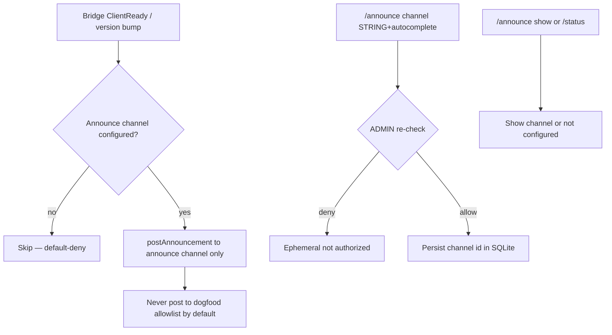
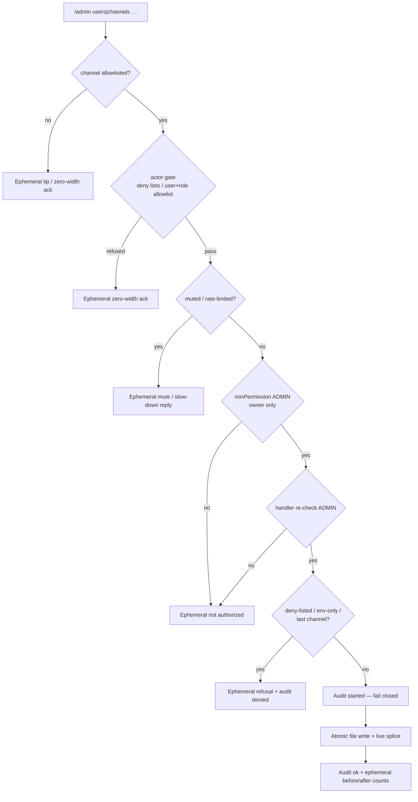

# Discord HEAR surface

Operator / UX inventory for Corvidinho’s Discord bridge (HEAR).  
**As of:** 2026-09-27 (America/Denver). Package version from `src/version.ts` / `package.json`.

Acceptance criteria live in [`hi/discord.md`](../hi/discord.md) (DISCORD-1..13, DISCORD-DENY-1..3, DISCORD-SCHEDULE-1..5, DISCORD-ANNOUNCE-1..6, DISCORD-ASK-1..8), [`hi/admin.md`](../hi/admin.md) (ADMIN-1..4), [`hi/identity.md`](../hi/identity.md) (IDENTITY-1..5), [`hi/autonomy.md`](../hi/autonomy.md) (AUTONOMY-1..7) and [`hi/session.md`](../hi/session.md) (SESSION-WORKTREE-1..5, SESSION-MULTI-1..4).  
Go-live secrets checklist: [`DISCORD-GO-LIVE.md`](DISCORD-GO-LIVE.md). Box updater / slash re-register: [`BOX-UPDATE.md`](BOX-UPDATE.md).

> **Mermaid is docs-only.** Discord chat does **not** render Mermaid natively. Use embeds, code fences, or PNG in Discord; keep flowcharts in this repo doc.

---

## Slash commands (nine: DISCORD-4 six + /schedule + /announce + /admin)

Registered via `buildSlashCommandBodies()` → guild PUT overwrite + clear globals when `DISCORD_GUILD_ID` is set (`discord register-commands` / ClientReady).

| Command | Options | Ephemeral? | Purpose |
|---------|---------|------------|---------|
| `/session list` | — | yes | List active sessions: the owner (ADMIN) sees everyone's with full project paths; anyone else sees only their own, project shown by name (REQ-discord-418) |
| `/session start` | `topic` (required), optional `project` | public (deferred) | Start session + agent run in isolated worktree |
| `/status` | — | yes | Bridge metrics (version, uptime, protocol, channels, sessions, work, LLM line, slash names, announce channel, owner configured, audit chain, 24 h spend vs cap, optional git tip) |
| `/agents` | — | yes | List local Corvidinho agent |
| `/work` | `description` (required), optional `project` | public (deferred) | Drive a work task in isolated worktree |
| `/mute` | `user` (user, required) | yes | Mute user (ADMIN; DISCORD-7 re-check). Refuses yourself and the configured owner (DISCORD-6 / IDENTITY-2) |
| `/unmute` | `user` (user, required) | yes | Unmute user (ADMIN) |
| `/schedule list` | — | yes | List schedules (non-owners see each project by name, never the host path; REQ-discord-418) |
| `/schedule create` | `name`, `cadence`, `project`, `prompt`, optional `channel` | yes | Create recurring single-project run (ADMIN; min 5m cadence) |
| `/schedule pause` | `schedule` (id) | yes | Pause (ADMIN) |
| `/schedule resume` | `schedule` (id) | yes | Resume (ADMIN) |
| `/schedule delete` | `schedule` (id) | yes | Delete the schedule and its run history (ADMIN). SAFE-5: appends `started` then `ok`/`error` rows (surface `discord:schedule`, action `schedule-delete`, actor = invoker id, args digest only) before deleting, and fails closed (`audit log unavailable (SAFE-5)`, nothing deleted) when the trail is unavailable; a non-owner's delete appends `denied`. The reply names the row numbers |
| `/announce channel` | `channel` (STRING + autocomplete), optional `clear` (bool) | yes | Set/clear dedicated ops/dev announcements channel (ADMIN; DISCORD-ANNOUNCE-1..2/5) |
| `/announce show` | — | yes | Show current announcements channel; empty = not configured (DISCORD-ANNOUNCE-3) |
| `/admin users add` | `user` (user picker, required) | yes | Approve a user: add to `[discord].users` in the allowlist file + live (owner only; ADMIN-1) |
| `/admin channels add` | `channel` (STRING + autocomplete by name/id, required) | yes | Add a channel to `[discord].channels` + live (owner only; ADMIN-2) |
| `/admin channels remove` | `channel` (STRING + autocomplete from allowlist / name/id, required) | yes | Remove a channel from the file + live; refuses env-only entries and the last live channel, counting deny-listed channels as not live (owner only; ADMIN-2) |
| `/admin config show` | — | yes | Allowlist/config view: live vs file vs env counts, owner configured yes/no, rate limit, mutes, audit line, which knobs are updatable (owner only; ADMIN-3) |


Gate order for every slash: **channel allowlist → actor gate (user/role allowlist + deny lists, REQ-discord-201; ephemeral zero-width ack on refuse) → mute/rate → minPermission → handler**.

Channel autocomplete (`/admin channels add|remove`, `/announce channel`) is gated too: Discord shows these options to every guild member, so each autocomplete request is re-checked (channel allowlist → actor gate → ADMIN, with mutes) and anyone who is not ADMIN in an allowlisted channel gets an empty list — no channel names, ids or allowlist entries (DISCORD-DENY-3 / ADMIN-4 / REQ-discord-431). Autocomplete does not count toward the rate limit.


### Announcements (DISCORD-ANNOUNCE-1..6)

Dedicated **ops/dev** announcements channel for version bumps, bridge restarts, and ship notes — **separate from the dogfood/chat allowlist**. Default-deny: no announce posts until `/announce channel` sets one. Mutations re-check ADMIN at handler time; no owner configured = nobody is ADMIN (IDENTITY-3). Config persists in shared SQLite `schema_meta` (`discord_announce_channel_id`) in the data dir (`CORVIDINHO_DATA_DIR`, default `~/.local/share/corvidinho/`).

On ClientReady (after every successful bridge restart), if configured, Corvidinho posts a short `bridge live **vX.Y.Z**` note plus ≤5 bullets from the matching `CHANGELOG.md` section (fallback: package description or tip) **only** to that channel — never to general allowlisted chat by default (DISCORD-ANNOUNCE-4 / REQ-discord-025).



### Runtime admin (`/admin`, ADMIN-1..4)

Owner-only (IDENTITY-2): the dispatcher floor is ADMIN **and** the handler re-checks ADMIN itself before anything else (ADMIN-4 / DISCORD-7). No owner ⇒ nobody can run `/admin`. Every reply is ephemeral.

| Knob | Updatable from Discord? | Where it lands |
|------|------------------------|----------------|
| `[discord].users` | yes — `/admin users add` (approve) | allowlist file + live |
| `[discord].channels` | yes — `/admin channels add` / `remove` | allowlist file + live |
| Env lists (`CORVIDINHO_DISCORD_ALLOW_*`, `DISCORD_CHANNEL_IDS`), owner (`CORVIDINHO_OWNER_*` / `[owner]`), rate limits, roles, deny lists, `[github]` | no — shown by `/admin config show`; edit on the VM and restart | — |

- **One store.** Writes go to the allowlist file the bridge already loaded (`CORVIDINHO_ALLOWLIST_FILE`, else `~/.config/corvidinho/allowlist.toml|json`; created `0600` on first write if missing). The rewrite is atomic (temp file in the same dir + fsync + rename, mode kept, symlink target followed). TOML edits touch only the one key line inside `[discord]`; `[owner]`, `[github]`, comments and blank lines stay verbatim. JSON keeps every other key and refuses files whose numeric ids would lose precision.
- **Live, no restart.** The live list is recomputed exactly as a restart would load it (file ∪ env) and spliced in place, so the router, scheduler, slash gate and `/status` see it immediately.
- **Env is read-only at runtime.** Env entries are never written to the file. Removing an env-only channel is refused with a pointer to the VM env; removing a file+env channel removes it from the file and says it is still live via env.
- **Empty stays deny-all.** Deny lists still win (adding a deny-listed id is refused). Removing the last live channel is refused — it would lock out every message and slash (including `/admin`) and the bridge would refuse to start. A channel that is also on `deny_channels` does not count as live, so a removal that would leave only deny-listed channels is refused too (same lockout, since deny wins).
- **First user narrows access.** While `users` and `roles` are both empty, callers in an allowlisted channel resolve to STANDARD. Adding the first user flips every unlisted non-owner caller to BLOCKED; the reply warns about it.
- **Audit (SAFE-5).** Each mutation appends `started` then `ok`/`error` rows (surface `discord:admin`, actor = invoker id, args digest only) to the shared audit chain before touching the file; if the trail is unavailable the command fails closed. Guard refusals (deny-listed id, env-only entry, last channel) and a non-owner caught by the handler re-check append `denied` (the dispatcher floor refuses non-owners before the handler, without a row). The reply names the row numbers.
- Subcommand groups: the gateway flattens `SUB_COMMAND_GROUP` options (`/admin users add`) into `subcommandGroup` + `subcommand` + options.



### Memory (no slash)

MEMORY-1..4 / MEMORY-ACL-1..5: local SQLite in the data dir (`CORVIDINHO_DATA_DIR`, default `~/.local/share/corvidinho/`; shared with sessions/schedules). No `/memory` slash — agent plugins `memory-store` / `memory-recall` / `memory-forget` / `memory-override`. Forget/override (including self-forget) re-check ADMIN at handler time (**DISCORD-7** / **ADMIN-4**); no owner configured = nobody is ADMIN (IDENTITY-3). The acting user and ADMIN come only from the env the bridge sets per spawn (`CORVIDINHO_ACTING_DISCORD_USER_ID` / `CORVIDINHO_ACTING_IS_ADMIN`) — never from tool argv (`--user` / `--admin` / `--db` are refused). Forget/override are two-phase (**SAFE-4**): the first call returns a confirm token (no content); `--confirm TOKEN` must come from a new turn within 10 minutes, and the token must be typed by the human. They are dangerous, so the model is offered them only in the owner's (ADMIN) chat and only when `CORVIDINHO_ALLOWLIST` names them (CLI-3 / SAFE-1, [`DISCORD-GO-LIVE.md`](DISCORD-GO-LIVE.md) E.3); a non-owner's chat never gets them (ROLES-CHAT-2). The operator path `corvidinho plugins run memory-forget …` (with the acting env set) still works. There is no slash command for them; `/admin` (#43 / #147) covers allowlists only.

---

## Outbound formats

### Thinking progress embeds (DISCORD-3)

One embed edited in place: description + color + footer (`sess · phase · elapsed [· model] [| tool] [| ~tok]`, plus the plumbing line `state=… verified=… [verifySkipped] [cancelled] attempts=…` on done/error — DISCORD-3.a). Phases: starting / working / done / error. Used by @mention, `/session start`, `/work`. When the message is edited into the final answer (DISCORD-ASK-7: @mention, a button-pick resume, `/session start`, `/work`), the answer keeps a footer-only embed, `model | state=… verified=… [verifySkipped] [cancelled] attempts=…` (green or red, like the done or error status the fallback would show: red for a failed run that asks no question, or a stuck ask), so the plumbing stays out of the answer text; the Choose stub (the message with buttons) carries no embed (DISCORD-ASK-6).

Live source (AGENT-8 / DISCORD-3, #73; AGENT-4 / #85): the bridge spawns `task run --task <prompt> --output ndjson` (no `--no-verify`; verify runs when tools report changed files or the run's git working tree changed, REQ-agent-085, and is skipped only when both are empty) and reads one versioned frame per stdout line as the agent works. The description follows the agent state (`⏳ planning` / `working` / `calling tool <name>` / `verifying` / `done`), the footer shows the current tool, and `~tok` is the provider-reported running total when the LLM returns `usage` (rough estimate otherwise). Tool arguments are never streamed raw. The bridge requires protocol 2 (DISCORD-10): restart the bridge and the corvidinho checkout together after upgrading. If the binary streams another protocol mid-run, its frames are withheld and the reply is a "protocol mismatch — restart the bridge" notice. The final `result.summary` is capped at 4000 characters (Discord shows at most ~1800).

### Session replies (mention / continue)

After thinking settles: plain `content` (truncated ~1800/1900), reply-referenced to the user message; a collapsed answer also keeps the footer-only embed above (DISCORD-3.a). Summary comes from the stream's final `result` frame (same `result` as `task run --json`), falling back to the raw output summary. No attribution footer on Discord outbound today. A reply cut off by a bridge restart (update, crash) is not left at "working…": at the next start its progress embed is marked interrupted (REQ-discord-311, `src/discord/inflight-replies.ts`).

In a Discord thread each user has their own session (DISCORD-2.a, SESSION-MULTI-1/2, REQ-discord-046): a plain message there continues only its author's own session in that thread. When a second user @mentions the bot in the same thread they get a session of their own, and the first user's plain messages keep continuing theirs, with any open ask buttons still theirs until pressed or expired. A plain message from someone with no session in the thread starts nothing; an @mention starts theirs.

A session keeps its thread (AGENT-6, REQ-discord-072, `src/discord/session-thread.ts`). Each run records the human's own words (the message, a button pick's label, the `/session start` topic or `/work` description) as it starts, so a run that fails or a bridge restart mid-run keeps the request, and the answer as posted when it ends (a button ask as its question and choices; the failure line when the run throws). When a run continues the session — a reply, a message in its thread, the same user's @mention in the channel, or a button pick — the earlier turns go ahead of the new message, oldest first, in one block labelled `[Corvidinho earlier conversation in this Discord session …]`. Like the identity and memory blocks, it does not count when Planning picks which module specs to brief (REQ-agent-004). The block is capped at 6000 characters (each turn at 1500): the opening request and the newest turns are kept and the middle becomes `(N earlier turns omitted)`; there is no summarising. Turns are stored in the shared DB (`discord_session_turns`, scrubbed like every stored text, SAFE-6), so the thread survives a bridge restart within the soft TTL, and they are deleted when the session ends or idles out — a fresh session starts with no replay (SESSION-3; longer-term facts belong in MEMORY, SESSION-4). Only the session's own user continues it, so nobody else's run sees them (SESSION-MULTI-1). Confirm tokens still count only from the message just sent (SAFE-4), and a spend-cap stop leaves no cap text in the thread. No setting.

### Questions and owner ping (AUTONOMY-1/2)

In @mention / reply chat, `/work` and `/session start`, when choices fit a short list, Corvidinho posts a **Choose** stub and opens an **ephemeral** button UI for the requester only (DISCORD-ASK-1..8). Schedules post the question as text (no buttons). The public Choose stub is the single ask surface (thinking "Needs your input" is collapsed into it — DISCORD-ASK-6). On done (mention or after a button pick), the stub/thinking message is edited into the final answer when practical instead of ✅ Done + a second reply (DISCORD-ASK-7). Buttons expire after ~30 minutes. You can keep chatting while your buttons are open; if a later message asks again, the earlier Choose buttons still work until you press them or they expire (SESSION-MULTI-3) — each ask is answered by its own buttons. Free-text clarify is used only when options cannot be listed. Concurrent users each have their own session (SESSION-MULTI).

When a run needs a human, the reply is a question instead of a summary. Two cases:

- **Clarify** — the agent called its `ask-human` tool (the task cannot go on without a human choice). The run ends in state `blocked` (never `done`, verify not run).
- **Stuck** — verification still fails after every retry. The run stays `failed` (AGENT-4) and asks how to proceed.

The reply quotes the question and, on its first line, mentions the **requester** on a clarify ask (AUTONOMY-4: the message author; for a scheduled run, the schedule creator) or the configured owner (`CORVIDINHO_OWNER_DISCORD_ID` / allowlist `[owner]`, IDENTITY-1) on a stuck ask (AUTONOMY-2) or a spend-cap stop (SAFE-8). For mentions it ends with "Reply to this message to answer." — replying continues the same session (DISCORD-2). The post limits allowed mentions to that one user plus the replied-to user; `@everyone` / `@here` in the model's text are defanged and secrets scrubbed. No owner configured means a stuck or spend-cap ask pings nobody (IDENTITY-3); the question still posts and the bridge logs a warning. Scheduled runs post the same question (prefixed with the schedule line) to the schedule's channel and ping once per question: a schedule stuck on the same question keeps posting it each tick without a mention until a run succeeds, the schedule is paused/resumed, or the question changes (digest kept in the schedule row, schema v7). A schedule run that cannot start (its project cannot be resolved or its worktree cannot be created) posts a stuck ask the same way, with a fixed question naming the step and never the host path (the full error stays on the run row), and the run whose failure auto-pauses the schedule (5 failures in a row) posts a stuck ask saying it is paused and to resume it with `/schedule resume` (plus that run's own question, if any) instead of its ❌ line (if that post does not go out, the next scheduler tick posts it); a run `corvidinho daemon` claimed has these posted by the bridge's next scheduler tick (REQ-discord-353). Pings go only where the bridge already posts — no DMs. Discord does not notify a mention added by an edit, so when the answer is delivered by editing the thinking or Choose-stub message (DISCORD-ASK-6/7: chat, a button-pick resume, `/work`, `/session start`) and it mentions someone, the bridge follows it with one short fresh post replying to it that only pings: `↑ question for you` for the clarify requester, `↑ needs you` for the owner (stuck, spend-cap stop or the 80% spend warning). Nobody is pinged twice in one turn, and no extra post goes out when the answer was already a fresh reply (REQ-discord-215). In chat, replying to that ping post continues the session too. `/work` and `/session start` answer in one message: when the choices fit a short list (the `ask-human` options, or a numbered list in the question) that message is the **Choose** stub, as in chat — the requester presses Choose, picks privately, and the pick resumes that session in the stub; otherwise the message shows the question as text. A stuck or spend-cap stop pings the owner in a separate channel post. The session then waits on that question like a chat ask: reply to the answer (or @mention the bot in that channel) — a thin reply (`ok`) restates it (with the Choose button for a button ask), `cancel` drops it, and for a text question a real answer resumes the session with the question as context (a button ask stays open through other chat until it is picked, cancelled or expires). A spend-cap stop is never waiting on a reply. A `/work` run waiting on an answer records its task `blocked` (stuck: `failed`) and opens no PR.

While a session waits on a question (AUTONOMY-5/6), thin replies (`ok`, `k`, `sure`, `hmmm`, emoji-only, …) do not clear it: the bridge restates the question (the newest one, when several button asks are open) instead of running the agent. `cancel` / `nevermind` / `forget it` clears it (every open ask of that session). The pending asks are stored on the session (`discord_sessions.pending_ask`), so a bridge restart keeps them. Joke or impossible asks get a short witty decline or a tiny toy demo, not a formal multiple-choice ask (AUTONOMY-7).

### Slash replies

Mostly ephemeral plain text (`/status`, `/agents`, `/session list`, mute/unmute, gates). `/session start` and `/work` use deferred public replies with summary. Replying to a `/session start` or `/work` answer continues that session, with or without the reply ping (DISCORD-2); only the user who started it continues it (SESSION-MULTI-1).

### Rate limits and mutes (DISCORD-6)

- One per-user sliding window (`DISCORD_RATE_LIMIT_WINDOW_MS`, default 60s; `DISCORD_RATE_LIMIT_MAX`, default 10) covers @mention / reply / thread messages and slash commands together.
- `DISCORD_RATE_LIMIT_BY_LEVEL` (JSON, e.g. `{"3":100}`) overrides the max for the actor's resolved permission level on both paths: 3 = owner (ADMIN), 2 = allowed user or role (or anyone in an allowlisted channel when the user and role lists are empty).
- `/mute` refuses yourself and the configured owner with an ephemeral message: a muted owner is not ADMIN, so `/unmute` would be refused until the bridge restarts. Mutes are in memory (seed: `DISCORD_MUTED_USER_IDS`).
- A muted or rate-limited user's chat message gets at most **one** public notice ("You do not have permission…" / "Slow down!") per user per rate-limit window; later messages in that window are refused silently. Slash refusals stay ephemeral on every call.

### Posts to another channel (DISCORD-8)

`discord-post-message` is a dangerous tool (allowlist it in `CORVIDINHO_ALLOWLIST`, [`DISCORD-GO-LIVE.md`](DISCORD-GO-LIVE.md) E.3); the model is offered it only in the owner's runs and a local `task run`. The channel allowlist is checked first. In a run the bridge started (chat, `/session start`, `/work`), the post then also needs the Discord user the run acts for (`CORVIDINHO_ACTING_DISCORD_USER_ID`, set per spawn by the bridge) to have **View Channel** and **Send Messages** on the target channel, not only the bot. The tool's `--requesting-user-id` cannot change who is checked: naming a different user is refused, and nothing is posted. If the check cannot run (the Guild Members login is refused because **Server Members Intent** is off, times out, or errors), the post is refused with the reason (one scrubbed line, SAFE-6) and nothing is posted; a user the member lookup cannot find is refused as not in the guild. Outside the bridge (operator `corvidinho plugins run`, local `task run`, WATCH, all with no acting user), the check runs only for a passed `--requesting-user-id`, and `CORVIDINHO_DISCORD_REQUIRE_REQUESTER_CHECK=1` refuses a post without one.

---

## Deny behavior (DISCORD-5 + DISCORD-DENY-1..3)

Outside an allowlisted channel (or from a non-configured user when a user allowlist applies):

| Path | Non-admin | Admin |
|------|-----------|-------|
| **MessageCreate** (@mention / reply / thread) | **Silent** — no public reply, no DM, no reaction | **Silent** (MessageCreate has no ephemeral; tip is slash-only) |
| **Slash** | Ephemeral **zero-width** ack (`\u200b`) only — Discord requires a response within 3s; no useful leak | Ephemeral **allowlist tip** (how to add channel/user to config + restart) |
| **Ask button** (Choose / pick) | Same as slash: ephemeral zero-width ack, no resume | Ephemeral **allowlist tip**, no resume |

A message counts in the channel it was sent in (a thread counts under its parent, DISCORD-2.a): a forward, or a reply that points at a bot message in another channel, never continues that session. An ask button resumes only while the session's own channel is still allowlisted (REQ-discord-212).

Never post a public `"not authorized"` on channel deny. Insufficient permission for admin-shaped commands (`/mute`, `/unmute`, `/schedule` mutations, `/announce channel`, `/admin`) still uses ephemeral `"not authorized"` (different from channel deny).

Admin detection: `resolvePermissionLevel` — ADMIN is owner-only (IDENTITY-2): the configured owner (IDENTITY-1: `CORVIDINHO_OWNER_DISCORD_ID` or allowlist `[owner].discord_id`) is ADMIN unless muted or deny-listed. No owner ⇒ nobody ADMIN (IDENTITY-3). `CORVIDINHO_DISCORD_ADMIN_USERS` / `_ROLES` no longer grant ADMIN; the bridge and `doctor` warn when they are set. `/status` shows only “Owner configured: yes/no” plus the display name.

Tip text (approx.):

> This channel isn’t allowlisted. From an allowlisted channel run `/admin channels add` and pick it (live, no restart), or add its id to [discord].channels in ~/.config/corvidinho/allowlist.toml (or CORVIDINHO_DISCORD_ALLOW_CHANNELS / DISCORD_CHANNEL_IDS) and restart the bridge.


---

## Formatting limits (practice)

| Limit | Corvidinho practice |
|-------|---------------------|
| Message content | Hard-cap **1900** at gateway / slash adapt / `discord-post-message` |
| Thinking embeds | Description + footer only; one embed |
| Mermaid | **Repo docs only** — not Discord chat |
| Presence | Custom Status `vX.Y.Z` (DISCORD-12), sent on every gateway IDENTIFY (Client `presence` option, also on the DISCORD-8 requester-check login) and set again on ready |

---

## Source map

- Router: `src/discord/message-router.ts`
- Slash: `src/discord/slash-commands.ts`, `slash-dispatch.ts`, `command-handlers/*`
- Thinking: `src/discord/thinking-status.ts`
- Permissions / admin: `src/discord/permissions.ts`
- Types / tip constants: `src/discord/types.ts` (`ALLOWLIST_DENY_TIP`, `EPHEMERAL_SILENT_ACK`)
- Presence: `src/discord/presence.ts`
- Announce: `src/discord/announce.ts`, `announce-store.ts`, `command-handlers/announce.ts`
- Runtime admin: `src/discord/command-handlers/admin.ts`, `admin-allowlist.ts` (file edit + atomic write + live splice)
- Questions / owner ping: `src/discord/ask-ping.ts` (agent side: `src/agent/ask.ts`)
- Button asks (DISCORD-ASK): `src/discord/ask-buttons.ts`; thin acks / cancel (AUTONOMY-5/6): `src/discord/thin-ack.ts`
- Identity + memory inject (IDENTITY-4 / AGENT-7): `src/discord/identity-inject.ts`, `memory-inject.ts` — chat, button-pick, `/session start` and `/work` runs get the acting user's id plus their Discord display name or username when known (owner map display wins for the owner)
- Channel autocomplete: `src/discord/channel-autocomplete.ts`; slash registration: `register-commands.ts`
- Durable sessions / `/work` tasks: `src/discord/session-store.ts`, `work-store.ts`; interrupted replies: `inflight-replies.ts`
- `/session list` / `/schedule list` scope (REQ-discord-418): `src/discord/list-scope.ts`
- User lookup (IDENTITY-5 / DISCORD-13): `plugins/discord/user-lookup.ts`


## Session worktrees (SESSION-WORKTREE-1..5)

Each Discord talk that does repo work (`@mention` start, `/session start`, `/work`)
and each `/schedule` tick on project X runs in an **isolated git worktree** (or a
project-scoped directory when the target is not a git repo). Soft session TTL /
new-topic rules still apply; isolation is filesystem/git context, not MEMORY.

| Item | Behavior |
|------|----------|
| Default project | Bridge `projectRoot` |
| Explicit project | Optional `project` on `/session start` and `/work`; required on `/schedule create`; must be the bridge root, a directory inside it, or a sibling checkout whose origin OWNER/REPO passes the GitHub repo allowlist — otherwise "not authorized" (REQ-discord-202) |
| Mid-conversation | Project never silently switches once set |
| Root on disk | `{dirname(project)}/.corvid-worktrees/` or `WORKTREE_BASE_DIR` |
| Branch | `talk/{sessionPrefix}-{digest}` (16-char id prefix + 16 hex of sha256 of the full id); schedule runs use `talk/schedule_{scheduleId}_{runId}` |
| End / TTL / abandon | Worktree parked or removed — another talk must not reuse it as cwd |
| Schedule ticks | Resolve `schedule.project` → worktree cwd → park after run |
| Schedule tick gates | Before the worktree and again before the post, the channel must be allowlisted and the schedule creator must pass the same actor gate as live chat (deny list wins; with a non-empty user or role list, their user id must be listed unless they are the owner; a tick knows no member roles). A run refused before it starts runs nothing, posts nothing, is recorded failed (`creator not allowlisted` / `channel not allowlisted`) and counts toward the 5-failure auto-pause (the pause's stuck ask posts only once the gate passes again); a run refused at post time keeps its recorded outcome and posts nothing (DISCORD-SCHEDULE-3) |
| Schedule run at bridge stop / restart | Stop records a run still going as failed (`interrupted: bridge shutdown`), kills its agent and parks its worktree within ~3 s. Start fails runs a dead process left "running" (`interrupted: process restarted`) and parks leftover `talk-schedule_*` worktrees of runs its data dir recorded as ended; runs a live `corvidinho daemon` on the same data dir owns, and worktrees of runs another data dir owns, are left alone (REQ-discord-346) |

Ops: restart the Discord bridge after every update so presence and spawn
paths pick up the build. Do not leave abandoned worktrees under the base dir
from crashed runs — prune via `git worktree prune` in the project if needed.

### `/work` → draft PR (AUTONOMOUS-3, GITHUB-2/5, REQ-discord-088)

After a `/work` run finishes, its reply carries one `PR:` line. A draft PR is
opened only when every gate holds; otherwise the line says plainly why not.

| Gate | When it fails |
|------|---------------|
| Run finished cleanly, verify did not fail | `PR: not opened — …` (nothing verified to ship) |
| Run did not stop to ask a human (state `blocked`, AUTONOMY-1) | `PR: not opened — the work run is waiting for your answer to its question.` |
| Ran in a git worktree with changes | `PR: not opened — …` / `PR: none — …` |
| `git-commit` (dirty tree only), `git-push`, `github-pr-create` allowlisted (`CORVIDINHO_ALLOWLIST`, GITHUB-5) | Nothing is committed or pushed; the changes stay on `talk/…` |
| Remote `OWNER/REPO` passes the repo gate (GITHUB-6) | Gate error, nothing pushed |
| Tree passed `fledge lanes run verify --non-interactive` (from the run's result frame, else re-run once) | Nothing pushed (AGENT-4) |

Steps run through the existing typed plugins (`git-commit` → `git-push` →
`github-pr-create --draft`), so SAFE-1 deny and SAFE-5 audit apply. The PR body
is built from the real diff against the remote default branch (name-status,
diffstat, commits) plus the verify result, with repo/model text in code fences
and secrets scrubbed. Allowlisting these plugins also offers them to the owner's
spawned agent (`task run` offers allowlisted dangerous tools to ADMIN runs, CLI-3), so
the model can commit, push or open a PR itself before the run's verify; this step
still opens the PR only after verify passes. Non-owner runs never get them.


## Discord user lookup (IDENTITY-5 / DISCORD-13)

Community chat often mentions people by snowflake id (`bug 3040…`), `@mention`, or name. The read-only plugin `discord-user-lookup` resolves members **inside the configured `DISCORD_GUILD_ID` only** (refuse other guilds):

```
discord-user-lookup --user-id 304028152194138114
discord-user-lookup --query Gaspar
```

Inbound `<@id>` mentions are rewritten to `Discord user id <id>` so the snowflake survives for lookup. Casual social/game banter should get a prose reply; SpecSync/git/github/files are for clear Corvidinho code/product questions (ROLES-CHAT-9).

When the tool-round budget runs out, the channel gets the best prose so far or a short clarifying ask — never a raw `Stopped after N tool rounds` line (AGENT-9).
