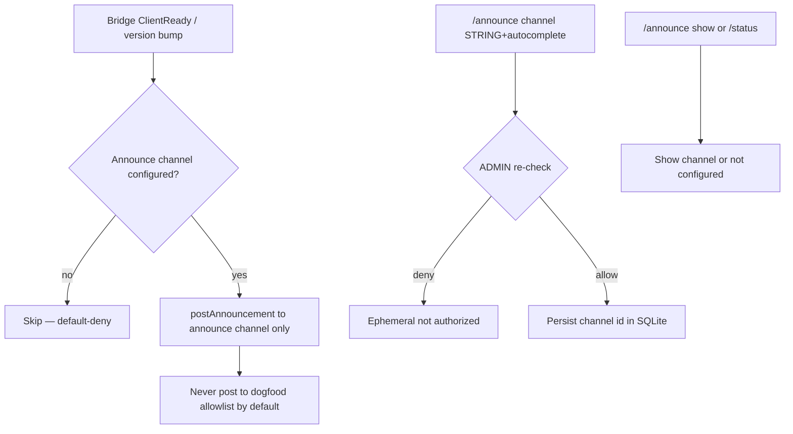
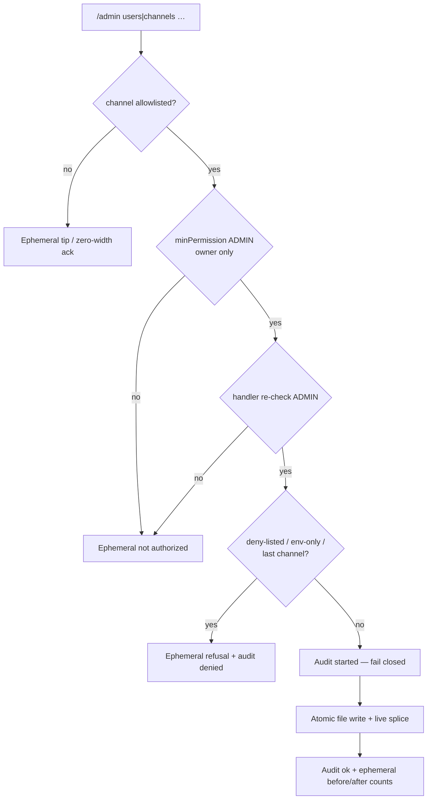
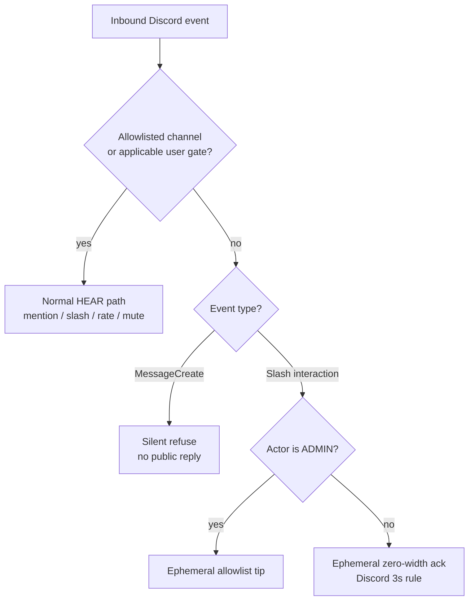

# Discord HEAR surface

Operator / UX inventory for Corvidinho’s Discord bridge (HEAR).  
**As of:** 2026-09-26 (America/Denver). Package version from `src/version.ts` / `package.json`.

Acceptance criteria live in [`hi/discord.md`](../hi/discord.md) (DISCORD-1..12, DISCORD-DENY-1..3, DISCORD-SCHEDULE-1..5, DISCORD-ANNOUNCE-1..6) and [`hi/admin.md`](../hi/admin.md) (ADMIN-1..4).  
Go-live secrets checklist: [`DISCORD-GO-LIVE.md`](DISCORD-GO-LIVE.md). Box updater / slash re-register: [`BOX-UPDATE.md`](BOX-UPDATE.md).

> **Mermaid is docs-only.** Discord chat does **not** render Mermaid natively. Use embeds, code fences, or PNG in Discord; keep flowcharts in this repo doc.

---

## Slash commands (nine: DISCORD-4 six + /schedule + /announce + /admin)

Registered via `buildSlashCommandBodies()` → guild PUT overwrite + clear globals when `DISCORD_GUILD_ID` is set (`discord register-commands` / ClientReady).

| Command | Options | Ephemeral? | Purpose |
|---------|---------|------------|---------|
| `/session list` | — | yes | List active session stubs |
| `/session start` | `topic` (required), optional `project` | public (deferred) | Start session + agent run in isolated worktree |
| `/status` | — | yes | Bridge metrics (version, uptime, protocol, channels, sessions, work, LLM line, slash names, optional git tip) |
| `/agents` | — | yes | List local Corvidinho agent |
| `/work` | `description` (required), optional `project` | public (deferred) | Drive a work task in isolated worktree |
| `/mute` | `user` (user, required) | yes | Mute user (ADMIN; DISCORD-7 re-check) |
| `/unmute` | `user` (user, required) | yes | Unmute user (ADMIN) |
| `/schedule list` | — | yes | List schedules |
| `/schedule create` | `name`, `cadence`, `project`, `prompt`, optional `channel` | yes | Create recurring single-project run (ADMIN; min 5m cadence) |
| `/schedule pause` | `schedule` (id) | yes | Pause (ADMIN) |
| `/schedule resume` | `schedule` (id) | yes | Resume (ADMIN) |
| `/schedule delete` | `schedule` (id) | yes | Delete (ADMIN) |
| `/announce channel` | `channel` (STRING + autocomplete), optional `clear` (bool) | yes | Set/clear dedicated ops/dev announcements channel (ADMIN; DISCORD-ANNOUNCE-1..2/5) |
| `/announce show` | — | yes | Show current announcements channel; empty = not configured (DISCORD-ANNOUNCE-3) |
| `/admin users add` | `user` (user picker, required) | yes | Approve a user: add to `[discord].users` in the allowlist file + live (owner only; ADMIN-1) |
| `/admin channels add` | `channel` (STRING + autocomplete by name/id, required) | yes | Add a channel to `[discord].channels` + live (owner only; ADMIN-2) |
| `/admin channels remove` | `channel` (STRING + autocomplete from allowlist / name/id, required) | yes | Remove a channel from the file + live; refuses env-only entries and the last live channel, counting deny-listed channels as not live (owner only; ADMIN-2) |
| `/admin config show` | — | yes | Allowlist/config view: live vs file vs env counts, owner configured yes/no, rate limit, mutes, audit line, which knobs are updatable (owner only; ADMIN-3) |

Gate order for every slash: **channel allowlist → mute/rate → minPermission → handler**.

### Announcements (DISCORD-ANNOUNCE-1..6)

Dedicated **ops/dev** announcements channel for version bumps, bridge restarts, and ship notes — **separate from the dogfood/chat allowlist**. Default-deny: no announce posts until `/announce channel` sets one. Mutations re-check ADMIN at handler time; empty admin = deny-all. Config persists in shared SQLite `schema_meta` (`discord_announce_channel_id`) under `~/.local/share/corvidinho/`.

On ClientReady (after every successful bridge restart), if configured, Corvidinho posts a short `bridge live **vX.Y.Z**` note plus ≤5 bullets from the matching `CHANGELOG.md` section (fallback: package description or tip) **only** to that channel — never to general allowlisted chat by default (DISCORD-ANNOUNCE-4 / REQ-discord-025).

### Runtime admin (`/admin`, ADMIN-1..4)

Owner-only (IDENTITY-2): the dispatcher floor is ADMIN **and** the handler re-checks ADMIN itself before anything else (ADMIN-4 / DISCORD-7). No owner ⇒ nobody can run `/admin`. Every reply is ephemeral.

| Knob | Updatable from Discord? | Where it lands |
|------|------------------------|----------------|
| `[discord].users` | yes — `/admin users add` (approve) | allowlist file + live |
| `[discord].channels` | yes — `/admin channels add` / `remove` | allowlist file + live |
| Env lists (`CORVIDINHO_DISCORD_ALLOW_*`, `DISCORD_CHANNEL_IDS`), owner (`CORVIDINHO_OWNER_*` / `[owner]`), rate limits, roles, deny lists, `[github]` | no — shown by `/admin config show`; edit on the VM and restart | — |

- **One store.** Writes go to the allowlist file the bridge already loaded (`CORVIDINHO_ALLOWLIST_FILE`, else `~/.config/corvidinho/allowlist.toml|json`; created `0600` on first write if missing). The rewrite is atomic (temp file in the same dir + fsync + rename, mode kept, symlink target followed). TOML edits touch only the one key line inside `[discord]`; `[owner]`, `[github]`, comments and blank lines stay verbatim. JSON keeps every other key and refuses files whose numeric ids would lose precision.
- **Live, no restart.** The live list is recomputed exactly as a restart would load it (file ∪ env) and spliced in place, so the router, scheduler, slash gate and `/status` see it immediately.
- **Env is read-only at runtime.** Env entries are never written to the file. Removing an env-only channel is refused with a pointer to the VM env; removing a file+env channel removes it from the file and says it is still live via env.
- **Empty stays deny-all.** Deny lists still win (adding a deny-listed id is refused). Removing the last live channel is refused — it would lock out every message and slash (including `/admin`) and the bridge would refuse to start. A channel that is also on `deny_channels` does not count as live, so a removal that would leave only deny-listed channels is refused too (same lockout, since deny wins).
- **First user narrows access.** While `users` and `roles` are both empty, callers in an allowlisted channel resolve to STANDARD. Adding the first user flips every unlisted non-owner caller to BLOCKED; the reply warns about it.
- **Audit (SAFE-5).** Each mutation appends `started` then `ok`/`error` rows (surface `discord:admin`, actor = invoker id, args digest only) to the shared audit chain before touching the file; if the trail is unavailable the command fails closed. Guard refusals (deny-listed id, env-only entry, last channel) and a non-owner caught by the handler re-check append `denied` (the dispatcher floor refuses non-owners before the handler, without a row). The reply names the row numbers.
- Subcommand groups: the gateway flattens `SUB_COMMAND_GROUP` options (`/admin users add`) into `subcommandGroup` + `subcommand` + options.

### Memory (no slash)

MEMORY-1..4 / MEMORY-ACL-1..5: local SQLite under `~/.local/share/corvidinho/` (shared with sessions/schedules). No `/memory` slash — agent plugins `memory-store` / `memory-recall` / `memory-forget` / `memory-override`. Forget/override (including self-forget) re-check ADMIN at handler time (**DISCORD-7** / **ADMIN-4**); empty admin = deny-all. The acting user and ADMIN come only from the env the bridge sets per spawn (`CORVIDINHO_ACTING_DISCORD_USER_ID` / `CORVIDINHO_ACTING_IS_ADMIN`) — never from tool argv (`--user` / `--admin` / `--db` are refused). Forget/override are two-phase (**SAFE-4**): the first call returns a confirm token (no content); `--confirm TOKEN` must come from a new turn within 10 minutes, and the token must be typed by the human. Today they are **operator-only** (`corvidinho plugins run memory-forget …` with the acting env set): dangerous tools are not offered to the model, so a Discord chat cannot reach them. A Discord admin path is tracked in #43 (ADMIN slash).

---

## Outbound formats

### Thinking progress embeds (DISCORD-3)

One embed edited in place: description + color + footer (`sess · phase · elapsed [| tool | ~tok]`). Phases: starting / working / done / error. Used by @mention, `/session start`, `/work`.

Live source (AGENT-8 / DISCORD-3, #73; AGENT-4 / #85): the bridge spawns `task run --task <prompt> --output ndjson` (no `--no-verify`; empty `filesChanged` still skips verify in the loop) and reads one versioned frame per stdout line as the agent works. The description follows the agent state (`⏳ planning` / `working` / `calling tool <name>` / `verifying` / `done`), the footer shows the current tool, and `~tok` is the provider-reported running total when the LLM returns `usage` (rough estimate otherwise). Tool arguments are never streamed raw. The bridge requires protocol 2 (DISCORD-10): restart the bridge and the corvidinho checkout together after upgrading. If the binary streams another protocol mid-run, its frames are withheld and the reply is a "protocol mismatch — restart the bridge" notice. The final `result.summary` is capped at 4000 characters (Discord shows at most ~1800).

### Session replies (mention / continue)

After thinking settles: plain `content` (truncated ~1800/1900), reply-referenced to the user message. Summary comes from the stream's final `result` frame (same `result` as `task run --json`), falling back to the raw output summary. No attribution footer on Discord outbound today.

### Questions and owner ping (AUTONOMY-1/2)

When choices fit a short list, Corvidinho posts a **Choose** stub and opens an **ephemeral** button UI for the requester only (DISCORD-ASK-1..7). The public Choose stub is the single ask surface (thinking "Needs your input" is collapsed into it — DISCORD-ASK-6). On done (mention or after a button pick), the stub/thinking message is edited into the final answer when practical instead of ✅ Done + a second reply (DISCORD-ASK-7). Buttons expire after ~30 minutes. Free-text clarify is used only when options cannot be listed. Concurrent users each have their own session (SESSION-MULTI).

When a run needs a human, the reply is a question instead of a summary. Two cases:

- **Clarify** — the agent called its `ask-human` tool (the task cannot go on without a human choice). The run ends in state `blocked` (never `done`, verify not run).
- **Stuck** — verification still fails after every retry. The run stays `failed` (AGENT-4) and asks how to proceed.

The reply quotes the question, mentions the configured owner (`CORVIDINHO_OWNER_DISCORD_ID` / allowlist `[owner]`, IDENTITY-1) on its first line, and for mentions ends with "Reply to this message to answer." — replying continues the same session (DISCORD-2). The post limits allowed mentions to the owner plus the replied-to user; `@everyone` / `@here` in the model's text are defanged and secrets scrubbed. No owner configured means no ping (IDENTITY-3); the question still posts and the bridge logs a warning. Scheduled runs post the same question (prefixed with the schedule line) to the schedule's channel and ping the owner once per question: a schedule stuck on the same question keeps posting it each tick without a mention until a run succeeds, the schedule is paused/resumed, or the question changes (digest kept in the schedule row, schema v7). Pings go only where the bridge already posts — no DMs. `/work` and `/session start` show the question in their summary text but do not ping yet; a `/work` run waiting on an answer opens no PR.

### Slash replies

Mostly ephemeral plain text (`/status`, `/agents`, `/session list`, mute/unmute, gates). `/session start` and `/work` use deferred public replies with summary. Replying to a `/session start` or `/work` answer continues that session, with or without the reply ping (DISCORD-2); only the user who started it continues it (SESSION-MULTI-1).

---

## Deny behavior (DISCORD-5 + DISCORD-DENY-1..3)

Outside an allowlisted channel (or from a non-configured user when a user allowlist applies):

| Path | Non-admin | Admin |
|------|-----------|-------|
| **MessageCreate** (@mention / reply / thread) | **Silent** — no public reply, no DM, no reaction | **Silent** (MessageCreate has no ephemeral; tip is slash-only) |
| **Slash** | Ephemeral **zero-width** ack (`\u200b`) only — Discord requires a response within 3s; no useful leak | Ephemeral **allowlist tip** (how to add channel/user to config + restart) |

Never post a public `"not authorized"` on channel deny. Insufficient permission for admin-shaped commands (`/mute`, `/unmute`, `/schedule` mutations, `/announce channel`, `/admin`) still uses ephemeral `"not authorized"` (different from channel deny).

Admin detection: `resolvePermissionLevel` — ADMIN is owner-only (IDENTITY-2): the configured owner (IDENTITY-1: `CORVIDINHO_OWNER_DISCORD_ID` or allowlist `[owner].discord_id`) is ADMIN unless muted or deny-listed. No owner ⇒ nobody ADMIN (IDENTITY-3). `CORVIDINHO_DISCORD_ADMIN_USERS` / `_ROLES` no longer grant ADMIN; the bridge and `doctor` warn when they are set. `/status` shows only “Owner configured: yes/no” plus the display name.

Tip text (approx.):

> This channel isn’t allowlisted. From an allowlisted channel run `/admin channels add` and pick it (live, no restart), or add its id to [discord].channels in ~/.config/corvidinho/allowlist.toml (or CORVIDINHO_DISCORD_ALLOW_CHANNELS / DISCORD_CHANNEL_IDS) and restart the bridge.

---

## Formatting limits (practice)

| Limit | Corvidinho practice |
|-------|---------------------|
| Message content | Hard-cap **1900** at gateway / slash adapt / `discord-post-message` |
| Thinking embeds | Description + footer only; one embed |
| Mermaid | **Repo docs only** — not Discord chat |
| Presence | Custom Status `vX.Y.Z` (DISCORD-12) |

---

## Source map

- Router: `src/discord/message-router.ts`
- Slash: `src/discord/slash-commands.ts`, `slash-dispatch.ts`, `command-handlers/*`
- Thinking: `src/discord/thinking-status.ts`
- Permissions / admin: `src/discord/permissions.ts`
- Types / tip constants: `src/discord/types.ts` (`ALLOWLIST_DENY_TIP`, `EPHEMERAL_SILENT_ACK`)
- Presence: `src/discord/presence.ts`
- Announce: `src/discord/announce.ts`, `announce-store.ts`, `command-handlers/announce.ts`
- Runtime admin: `src/discord/command-handlers/admin.ts`, `admin-allowlist.ts` (file edit + atomic write + live splice)
- Questions / owner ping: `src/discord/ask-ping.ts` (agent side: `src/agent/ask.ts`)

## Session worktrees (SESSION-WORKTREE-1..5)

Each Discord talk that does repo work (`@mention` start, `/session start`, `/work`)
and each `/schedule` tick on project X runs in an **isolated git worktree** (or a
project-scoped directory when the target is not a git repo). Soft session TTL /
new-topic rules still apply; isolation is filesystem/git context, not MEMORY.

| Item | Behavior |
|------|----------|
| Default project | Bridge `projectRoot` |
| Explicit project | Optional `project` on `/session start` and `/work`; required on `/schedule create` |
| Mid-conversation | Project never silently switches once set |
| Root on disk | `{dirname(project)}/.corvid-worktrees/` or `WORKTREE_BASE_DIR` |
| Branch | `talk/{sessionPrefix}` |
| End / TTL / abandon | Worktree parked or removed — another talk must not reuse it as cwd |
| Schedule ticks | Resolve `schedule.project` → worktree cwd → park after run |

Ops: restart the Discord bridge after deploying **0.0.5** so presence and spawn
paths pick up the build. Do not leave abandoned worktrees under the base dir
from crashed runs — prune via `git worktree prune` in the project if needed.

### `/work` → draft PR (AUTONOMOUS-3, GITHUB-2/5, REQ-discord-088)

After a `/work` run finishes, its reply carries one `PR:` line. A draft PR is
opened only when every gate holds; otherwise the line says plainly why not.

| Gate | When it fails |
|------|---------------|
| Run finished cleanly, verify did not fail | `PR: not opened — …` (nothing verified to ship) |
| Run did not stop to ask a human (state `blocked`, AUTONOMY-1) | `PR: not opened — the work run is waiting for your answer to its question.` |
| Ran in a git worktree with changes | `PR: not opened — …` / `PR: none — …` |
| `git-commit` (dirty tree only), `git-push`, `github-pr-create` allowlisted (`CORVIDINHO_ALLOWLIST`, GITHUB-5) | Nothing is committed or pushed; the changes stay on `talk/…` |
| Remote `OWNER/REPO` passes the repo gate (GITHUB-6) | Gate error, nothing pushed |
| Tree passed `fledge lanes run verify --non-interactive` (from the run's result frame, else re-run once) | Nothing pushed (AGENT-4) |

Steps run through the existing typed plugins (`git-commit` → `git-push` →
`github-pr-create --draft`), so SAFE-1 deny and SAFE-5 audit apply. The PR body
is built from the real diff against the remote default branch (name-status,
diffstat, commits) plus the verify result, with repo/model text in code fences
and secrets scrubbed. Allowlisting these plugins is process-wide: the spawned
agent can call them too.

