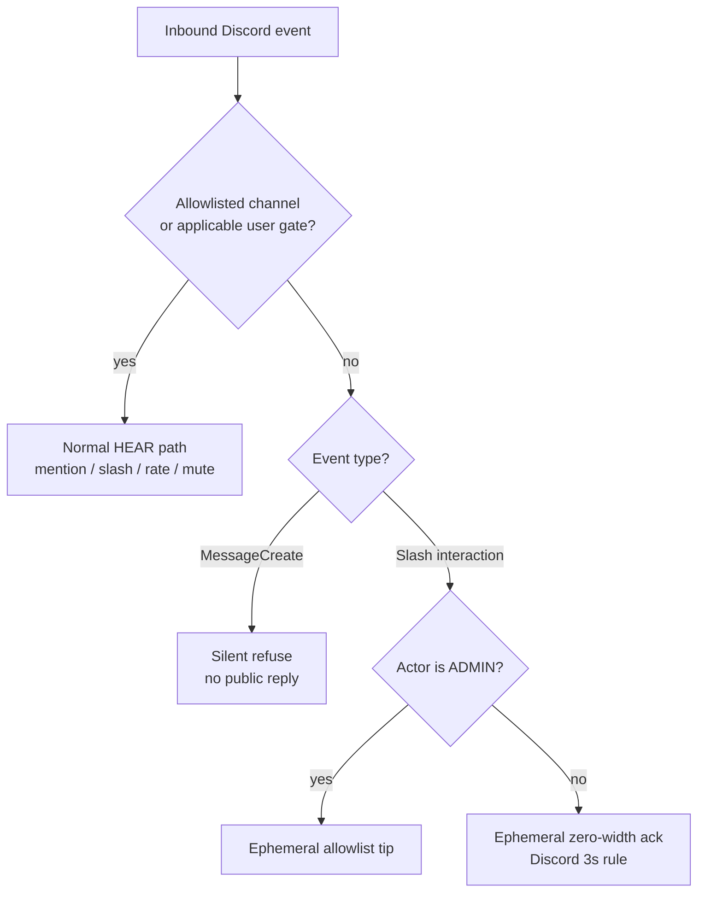

# Discord HEAR surface

Operator / UX inventory for Corvidinho’s Discord bridge (HEAR).  
**As of:** 2026-09-26 (America/Denver). Package version from `src/version.ts` / `package.json`.

Acceptance criteria live in [`hi/discord.md`](../hi/discord.md) (DISCORD-1..12, DISCORD-DENY-1..3, DISCORD-SCHEDULE-1..5, DISCORD-ANNOUNCE-1..6).  
Go-live secrets checklist: [`DISCORD-GO-LIVE.md`](DISCORD-GO-LIVE.md). Box updater / slash re-register: [`BOX-UPDATE.md`](BOX-UPDATE.md).

> **Mermaid is docs-only.** Discord chat does **not** render Mermaid natively. Use embeds, code fences, or PNG in Discord; keep flowcharts in this repo doc.

---

## Slash commands (eight: DISCORD-4 six + /schedule + /announce)

Registered via `buildSlashCommandBodies()` → guild PUT overwrite + clear globals when `DISCORD_GUILD_ID` is set (`discord register-commands` / ClientReady).

| Command | Options | Ephemeral? | Purpose |
|---------|---------|------------|---------|
| `/session list` | — | yes | List active session stubs |
| `/session start` | `topic` (required), optional `project` | public (deferred) | Start session + agent run in isolated worktree |
| `/status` | — | yes | Bridge metrics (version, uptime, protocol, channels, sessions, work, LLM line, slash names, optional git tip) |
| `/agents` | — | yes | List local Corvidinho agent |
| `/work` | `description` (required), optional `project` | public (deferred) | Drive a work task in isolated worktree |
| `/mute` | `user` (user, required) | yes | Mute user (ADMIN; DISCORD-7 re-check) |
| `/unmute` | `user` (user, required) | yes | Unmute user (ADMIN) |
| `/schedule list` | — | yes | List schedules |
| `/schedule create` | `name`, `cadence`, `project`, `prompt`, optional `channel` | yes | Create recurring single-project run (ADMIN; min 5m cadence) |
| `/schedule pause` | `schedule` (id) | yes | Pause (ADMIN) |
| `/schedule resume` | `schedule` (id) | yes | Resume (ADMIN) |
| `/schedule delete` | `schedule` (id) | yes | Delete (ADMIN) |
| `/announce channel` | `channel` (CHANNEL picker), optional `clear` (bool) | yes | Set/clear dedicated ops/dev announcements channel (ADMIN; DISCORD-ANNOUNCE-1..2/5) |
| `/announce show` | — | yes | Show current announcements channel; empty = not configured (DISCORD-ANNOUNCE-3) |

Gate order for every slash: **channel allowlist → mute/rate → minPermission → handler**.

### Announcements (DISCORD-ANNOUNCE-1..6)

Dedicated **ops/dev** announcements channel for version bumps, bridge restarts, and ship notes — **separate from the dogfood/chat allowlist**. Default-deny: no announce posts until `/announce channel` sets one. Mutations re-check ADMIN at handler time; empty admin = deny-all. Config persists in shared SQLite `schema_meta` (`discord_announce_channel_id`) under `~/.local/share/corvidinho/`.

On ClientReady (after every successful bridge restart), if configured, Corvidinho posts a short `bridge live vX.Y.Z` note **only** to that channel — never to general allowlisted chat by default.

### Memory (no slash)

MEMORY-1..4 / MEMORY-ACL-1..5: local SQLite under `~/.local/share/corvidinho/` (shared with sessions/schedules). No `/memory` slash — agent plugins `memory-store` / `memory-recall` / `memory-forget` / `memory-override`. Forget/override (including self-forget) re-check ADMIN at handler time (**DISCORD-7** / **ADMIN-4**); empty admin = deny-all. The acting user and ADMIN come only from the env the bridge sets per spawn (`CORVIDINHO_ACTING_DISCORD_USER_ID` / `CORVIDINHO_ACTING_IS_ADMIN`) — never from tool argv (`--user` / `--admin` / `--db` are refused). Forget/override are two-phase (**SAFE-4**): the first call returns a confirm token (no content); `--confirm TOKEN` must come from a new message/turn within 10 minutes.

---

## Outbound formats

### Thinking progress embeds (DISCORD-3)

One embed edited in place: description + color + footer (`sess · phase · elapsed [| tool | ~tok]`). Phases: starting / working / done / error. Used by @mention, `/session start`, `/work`.

### Session replies (mention / continue)

After thinking settles: plain `content` (truncated ~1800/1900), reply-referenced to the user message. Prefer parsed `task run --json` summary. No attribution footer on Discord outbound today.

### Slash replies

Mostly ephemeral plain text (`/status`, `/agents`, `/session list`, mute/unmute, gates). `/session start` and `/work` use deferred public replies with summary.

---

## Deny behavior (DISCORD-5 + DISCORD-DENY-1..3)

Outside an allowlisted channel (or from a non-configured user when a user allowlist applies):

| Path | Non-admin | Admin |
|------|-----------|-------|
| **MessageCreate** (@mention / reply / thread) | **Silent** — no public reply, no DM, no reaction | **Silent** (MessageCreate has no ephemeral; tip is slash-only) |
| **Slash** | Ephemeral **zero-width** ack (`\u200b`) only — Discord requires a response within 3s; no useful leak | Ephemeral **allowlist tip** (how to add channel/user to config + restart) |

Never post a public `"not authorized"` on channel deny. Insufficient permission for admin-shaped commands (`/mute`, `/unmute`, `/schedule` mutations, `/announce channel`) still uses ephemeral `"not authorized"` (different from channel deny).

Admin detection: `resolvePermissionLevel` + `CORVIDINHO_DISCORD_ADMIN_USERS` / `_ROLES`, plus the configured owner (IDENTITY-1: `CORVIDINHO_OWNER_DISCORD_ID` or allowlist `[owner].discord_id`; ADMIN unless muted or deny-listed). Empty owner and empty admin lists ⇒ nobody ADMIN. `/status` shows only “Owner configured: yes/no” plus the display name.

Tip text (approx.):

> This channel isn’t allowlisted. Add its id to discord.channels in ~/.config/corvidinho/allowlist.toml (or CORVIDINHO_DISCORD_CHANNELS / DISCORD_CHANNEL_IDS) and restart the bridge.

---

## Formatting limits (practice)

| Limit | Corvidinho practice |
|-------|---------------------|
| Message content | Hard-cap **1900** at gateway / slash adapt / `discord-post-message` |
| Thinking embeds | Description + footer only; one embed |
| Mermaid | **Repo docs only** — not Discord chat |
| Presence | Custom Status `vX.Y.Z` (DISCORD-12) |

---

## Source map

- Router: `src/discord/message-router.ts`
- Slash: `src/discord/slash-commands.ts`, `slash-dispatch.ts`, `command-handlers/*`
- Thinking: `src/discord/thinking-status.ts`
- Permissions / admin: `src/discord/permissions.ts`
- Types / tip constants: `src/discord/types.ts` (`ALLOWLIST_DENY_TIP`, `EPHEMERAL_SILENT_ACK`)
- Presence: `src/discord/presence.ts`
- Announce: `src/discord/announce.ts`, `announce-store.ts`, `command-handlers/announce.ts`

## Session worktrees (SESSION-WORKTREE-1..5)

Each Discord talk that does repo work (`@mention` start, `/session start`, `/work`)
and each `/schedule` tick on project X runs in an **isolated git worktree** (or a
project-scoped directory when the target is not a git repo). Soft session TTL /
new-topic rules still apply; isolation is filesystem/git context, not MEMORY.

| Item | Behavior |
|------|----------|
| Default project | Bridge `projectRoot` |
| Explicit project | Optional `project` on `/session start` and `/work`; required on `/schedule create` |
| Mid-conversation | Project never silently switches once set |
| Root on disk | `{dirname(project)}/.corvid-worktrees/` or `WORKTREE_BASE_DIR` |
| Branch | `talk/{sessionPrefix}` |
| End / TTL / abandon | Worktree parked or removed — another talk must not reuse it as cwd |
| Schedule ticks | Resolve `schedule.project` → worktree cwd → park after run |

Ops: restart the Discord bridge after deploying **0.0.5** so presence and spawn
paths pick up the build. Do not leave abandoned worktrees under the base dir
from crashed runs — prune via `git worktree prune` in the project if needed.
