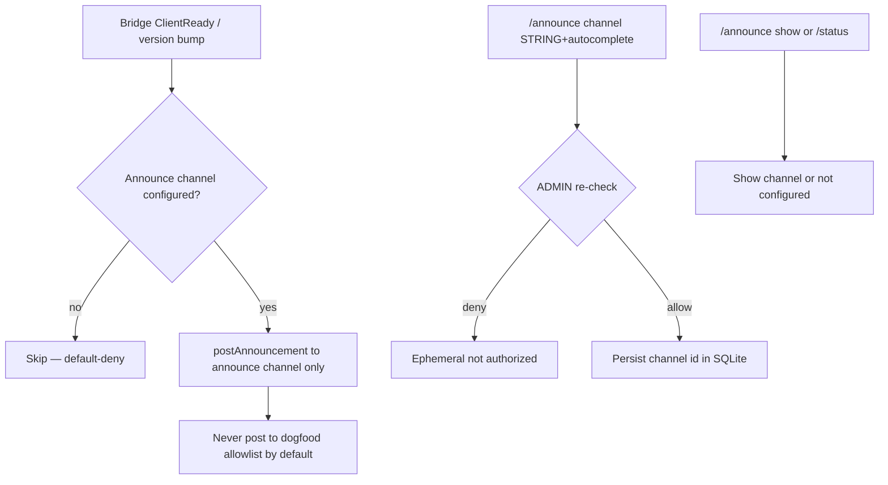
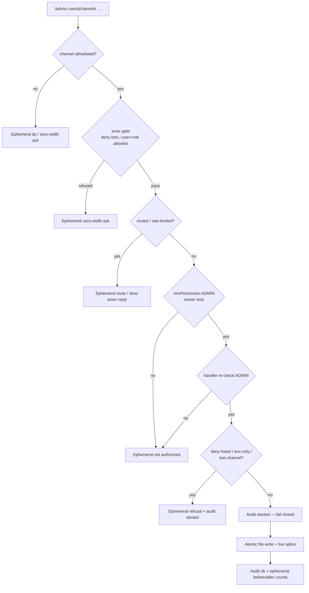

# Discord HEAR surface

Operator / UX inventory for Corvidinho’s Discord bridge (HEAR).  
**As of:** 2026-09-29 (America/Denver). Package version from `src/version.ts` / `package.json`.

Acceptance criteria live in [`hi/discord.md`](../hi/discord.md) (DISCORD-1..17, DISCORD-DENY-1..3, DISCORD-SCHEDULE-1..5, DISCORD-ANNOUNCE-1..6, DISCORD-ASK-1..8), [`hi/admin.md`](../hi/admin.md) (ADMIN-1..4, ADMIN-3.a, ADMIN-3.b), [`hi/identity.md`](../hi/identity.md) (IDENTITY-1..14, IDENTITY-11.a), [`hi/roles.md`](../hi/roles.md) (ROLES-CHAT-1..9, ROLES-CHAT-8.a), [`hi/memory.md`](../hi/memory.md) (MEMORY-1..9, MEMORY-ACL-1..6 and 6.a), [`hi/autonomy.md`](../hi/autonomy.md) (AUTONOMY-1..11), [`hi/session.md`](../hi/session.md) (SESSION-WORKTREE-1..5, SESSION-MULTI-1..4), [`hi/persona.md`](../hi/persona.md) (PERSONA-1.a for the update note, below) and [`hi/safe.md`](../hi/safe.md) (SAFE-11..13 and SAFE-12.a for untrusted text, below).  
Go-live secrets checklist: [`DISCORD-GO-LIVE.md`](DISCORD-GO-LIVE.md). Box updater / slash re-register: [`BOX-UPDATE.md`](BOX-UPDATE.md).

> **Mermaid is docs-only.** Discord chat does **not** render Mermaid natively. Use embeds, code fences, or PNG in Discord; keep flowcharts in this repo doc.

---

## Slash commands (nine: DISCORD-4 six + /schedule + /announce + /admin)

Registered via `buildSlashCommandBodies()` → guild PUT overwrite + clear globals when `DISCORD_GUILD_ID` is set (`discord register-commands` / ClientReady).

| Command | Options | Ephemeral? | Purpose |
|---------|---------|------------|---------|
| `/session list` | — | yes | List active sessions: the owner (ADMIN) sees everyone's with full project paths; anyone else sees only their own, project shown by name (REQ-discord-418) |
| `/session start` | `topic` (required), optional `project` | public (deferred) | Start session + agent run in isolated worktree |
| `/status` | — | yes | Bridge metrics (version, uptime, protocol, channels, sessions, work, LLM line, slash names, announce channel, owner configured, audit chain, 24 h spend vs cap, optional git tip) |
| `/agents` | — | yes | List local Corvidinho agent |
| `/work` | `description` (required), optional `project` | public (deferred) | Drive a work task in isolated worktree. Owner and team only: community (anyone undeclared included) gets the ephemeral `not authorized` and nothing starts (IDENTITY-11.a) |
| `/mute` | `user` (user, required) | yes | Mute user (ADMIN; DISCORD-7 re-check). Refuses yourself and the configured owner (DISCORD-6 / IDENTITY-2) |
| `/unmute` | `user` (user, required) | yes | Unmute user (ADMIN) |
| `/schedule list` | — | yes | List schedules (non-owners see each project by name, never the host path; REQ-discord-418) |
| `/schedule create` | `name`, `cadence`, `project`, `prompt`, optional `channel` | yes | Create recurring single-project run (ADMIN; min 5m cadence). SAFE-13: a non-owner's `name` or `prompt` that looks like an injection attempt stores nothing, gets a private refusal and pings the owner (see "Untrusted text and injection attempts") |
| `/schedule pause` | `schedule` (id) | yes | Pause (ADMIN) |
| `/schedule resume` | `schedule` (id) | yes | Resume (ADMIN) |
| `/schedule delete` | `schedule` (id) | yes | Delete the schedule and its run history (ADMIN). SAFE-5: appends `started` then `ok`/`error` rows (surface `discord:schedule`, action `schedule-delete`, actor = invoker id, args digest only) before deleting, and fails closed (`audit log unavailable (SAFE-5)`, nothing deleted) when the trail is unavailable; a non-owner's delete appends `denied`. The reply names the row numbers |
| `/announce channel` | `channel` (STRING + autocomplete), optional `clear` (bool) | yes | Set/clear dedicated ops/dev announcements channel (ADMIN; DISCORD-ANNOUNCE-1..2/5) |
| `/announce show` | — | yes | Show current announcements channel; empty = not configured (DISCORD-ANNOUNCE-3) |
| `/admin users add` | `user` (user picker, required) | yes | Approve a user: add to `[discord].users` in the allowlist file + live (owner only; ADMIN-1) |
| `/admin channels add` | `channel` (STRING + autocomplete by name/id, required) | yes | Add a channel to `[discord].channels` + live (owner only; ADMIN-2) |
| `/admin channels remove` | `channel` (STRING + autocomplete from allowlist / name/id, required) | yes | Remove a channel from the file + live; refuses env-only entries and the last live channel, counting deny-listed channels as not live (owner only; ADMIN-2) |
| `/admin config show` | — | yes | Allowlist/config view: live vs file vs env counts, owner configured yes/no, rate limit, mutes, audit line, which knobs are updatable (owner only; ADMIN-3) |
| `/admin people list` | — | yes | Declared people and their links, the owner's person, and any problems in the file (owner only; IDENTITY-13) |
| `/admin people add` | `person` (id, required), optional `display` | yes | Declare a person, or change their display name (owner only; ADMIN-3.a) |
| `/admin people link` | `person` (required) + one or more of `discord` (user picker), `github` (login), `github_id` (number), `nickname` | yes | Link accounts / nicknames to a person; `github` looks the login's numeric user id up once (GitHub API) and stores it too, since GitHub matches that id only; an id already linked to someone else is refused (owner only; ADMIN-3.a, IDENTITY-6/7/7.a) |
| `/admin people unlink` | same as `link` | yes | Unlink accounts / nicknames (owner only; ADMIN-3.a) |
| `/admin people remove` | `person` (required) | yes | Remove a declared person and all their links (owner only; ADMIN-3.a) |
| `/admin people role` | `person` (required), `role` (`team` / `community`, required) | yes | Set a declared person's one role (owner only; ADMIN-3.b, IDENTITY-8); the owner role is `[owner]` / env only |
| `/admin people forget` | `person` (declared person id, required) | yes | Start forgetting a declared person: the same forget request and DM **Approve / Deny** card as their own ask; nothing is forgotten until you approve; an open ask is reused; SAFE-5 audited (`admin-people-forget` `started` / `ok`, `denied` for an undeclared id; fails closed without the trail) (owner only; MEMORY-ACL-6.a) |


Gate order for every slash: **channel allowlist → actor gate (user/role allowlist + deny lists, REQ-discord-201; ephemeral zero-width ack on refuse) → mute/rate → minPermission → handler**. An ask button press (open or pick) runs the same **channel → actor → mute/rate** gates before it shows choices or resumes the session.

Channel autocomplete (`/admin channels add|remove`, `/announce channel`) is gated too: Discord shows these options to every guild member, so each autocomplete request is re-checked (channel allowlist → actor gate → ADMIN, with mutes) and anyone who is not ADMIN in an allowlisted channel gets an empty list — no channel names, ids or allowlist entries (DISCORD-DENY-3 / ADMIN-4 / REQ-discord-431). Autocomplete does not count toward the rate limit.


### Announcements (DISCORD-ANNOUNCE-1..6)

Dedicated **ops/dev** announcements channel for version bumps, bridge restarts, and ship notes — **separate from the dogfood/chat allowlist**. Default-deny: no announce posts until `/announce channel` sets one. Mutations re-check ADMIN at handler time; no owner configured = nobody is ADMIN (IDENTITY-3). Config persists in shared SQLite `schema_meta` (`discord_announce_channel_id`) in the data dir (`CORVIDINHO_DATA_DIR`, default `~/.local/share/corvidinho/`).

On ClientReady (after every successful bridge restart), if configured, Corvidinho posts one short update note **only** to that channel — never to general allowlisted chat by default (DISCORD-ANNOUNCE-4 / REQ-discord-025). The note is in the persona's voice (`persona.md`, PERSONA-1.a) with a link to that version's GitHub Release notes, not a changelog dump: one line, no bullets, under 200 characters, e.g.

> Back online and running **v0.0.34** 🐦‍⬛ Everything new in this version is in the release notes 👀 <https://github.com/CorvidLabs/Corvidinho/releases/tag/v0.0.34>

It is a fixed template (no model call, no spend; editing `persona.md` does not change it), the link is wrapped in `<>` so Discord shows no preview card, it pings nobody, and it is scrubbed (SAFE-6). A package version that is not a plain `X.Y.Z` is never echoed: the note then links the Releases page. The full notes live on the Release (CHANGELOG section, commits, upgrade line; `.github/workflows/release.yml`).

The same channel carries the nightly backup's failure notice (OPS-1/2, REQ-discord-680): when `CORVIDINHO_BACKUP_DIR` is set and a nightly backup or restore test fails (the bridge's or the daemon's tick), the bridge's next scheduler tick posts one fixed-text line — `⚠️ The nightly backup failed (<UTC time>)…` or `⚠️ The restore test failed (<UTC time>)…`, pointing at `corvidinho doctor`, never a host path or error text — with only the owner pinged. Once per failure streak: later failures are logged only, until a backup succeeds. With no announcements channel set nothing is posted anywhere else; the notice waits (one `[backup] …owner_not_told` log line, `doctor` says `owner not told yet`, and doctor's `backup` line warns while no channel is set) and goes out on the first tick after `/announce channel` sets one. A bridge stop while the post is in flight waits the short shutdown grace, then hands the notice back for the next start. See [`DAEMON.md`](DAEMON.md#nightly-backup-ops-12).



### Runtime admin (`/admin`, ADMIN-1..4)

Owner-only (IDENTITY-2): the dispatcher floor is ADMIN **and** the handler re-checks ADMIN itself before anything else (ADMIN-4 / DISCORD-7). No owner ⇒ nobody can run `/admin`. Every reply is ephemeral.

| Knob | Updatable from Discord? | Where it lands |
|------|------------------------|----------------|
| `[discord].users` | yes — `/admin users add` (approve) | allowlist file + live |
| `[discord].channels` | yes — `/admin channels add` / `remove` | allowlist file + live |
| Declared people `[people.<id>]` (IDENTITY-13) | yes — `/admin people add` / `link` / `unlink` / `remove` (ADMIN-3.a) | allowlist file; read on the next message or comment |
| A declared person's role `role = "team" \| "community"` (IDENTITY-8) | yes — `/admin people role` (ADMIN-3.b) | allowlist file; re-read by the tool layer on every call |
| Env lists (`CORVIDINHO_DISCORD_ALLOW_*`, `DISCORD_CHANNEL_IDS`), owner (`CORVIDINHO_OWNER_*` / `[owner]`), rate limits, roles, deny lists, `[github]` | no — shown by `/admin config show`; edit on the VM and restart | — |

- **One store.** Writes go to the allowlist file the bridge already loaded (`CORVIDINHO_ALLOWLIST_FILE`, else `~/.config/corvidinho/allowlist.toml|json`; created `0600` on first write if missing). The rewrite is atomic (temp file in the same dir + fsync + rename, mode kept, symlink target followed). TOML edits touch only the one key line inside `[discord]`; `[owner]`, `[github]`, comments and blank lines stay verbatim. JSON keeps every other key and refuses files whose numeric ids would lose precision.
- **Live, no restart.** The live list is recomputed exactly as a restart would load it (file ∪ env) and spliced in place, so the router, scheduler, slash gate and `/status` see it immediately.
- **Env is read-only at runtime.** Env entries are never written to the file. Removing an env-only channel is refused with a pointer to the VM env; removing a file+env channel removes it from the file and says it is still live via env.
- **Empty stays deny-all.** Deny lists still win (adding a deny-listed id is refused). Removing the last live channel is refused — it would lock out every message and slash (including `/admin`) and the bridge would refuse to start. A channel that is also on `deny_channels` does not count as live, so a removal that would leave only deny-listed channels is refused too (same lockout, since deny wins).
- **First user narrows access.** While `users` and `roles` are both empty, callers in an allowlisted channel resolve to STANDARD. Adding the first user flips every unlisted non-owner caller to BLOCKED; the reply warns about it.
- **Audit (SAFE-5).** Each mutation appends `started` then `ok`/`error` rows (surface `discord:admin`, actor = invoker id, args digest only) to the shared audit chain before touching the file; if the trail is unavailable the command fails closed. Guard refusals (deny-listed id, env-only entry, last channel) and a non-owner caught by the handler re-check append `denied` (the dispatcher floor refuses non-owners before the handler, without a row). The reply names the row numbers.
- Subcommand groups: the gateway flattens `SUB_COMMAND_GROUP` options (`/admin users add`) into `subcommandGroup` + `subcommand` + options.

### Declared people (`/admin people`, IDENTITY-13/14/6/7/7.a, ADMIN-3.a)

The owner declares who's who in the same allowlist file, one `[people.<id>]` section per person (JSON: a `people` object; see [`allowlist.example.toml`](../allowlist.example.toml)): `display`, `nicknames`, `discord_ids`, `github_logins`, `github_ids` (singular spellings read too; each value on one line). The person id is 1–32 lowercase letters, digits, `-` or `_`; `owner` is reserved.

- **Recognised on Discord and GitHub (IDENTITY-14).** Chat, button picks, `/session start` and `/work` add the declared person to the acting-user block (`declared_person`, the declared `display_name` — it wins over the Discord name — `nicknames`, `github`); WATCH opens the run prompt with a `[Corvidinho acting GitHub user …]` block for the commenter. Once anyone is declared, an undeclared speaker is marked `declared_person: none` (on WATCH also, with only the owner configured, a commenter using the owner's GitHub login without the owner's numeric id). The owner is always a person: the declared entry holding the owner's Discord id, else a built-in `owner` entry from `[owner]` / env (on GitHub it is recognised by its numeric id only: `[owner] github_id`, or `github_ids` on the owner's declared person). With nobody declared, the Discord block is exactly as before.
- **Stable ids only (IDENTITY-7).** Matching uses the Discord user id and the GitHub numeric user id — never a display name or nickname. An id linked to two people matches nobody (and `/admin people link` refuses to create that).
- **On GitHub, the numeric user id only (IDENTITY-7.a).** A GitHub login never matches anyone, not even the owner's: it can be renamed or re-registered by someone else. WATCH (the identity block, memory scope and the SAFE-13 owner exemption) matches the numeric id the GitHub API reports for the event; no id, or an id nobody declared, is an undeclared commenter (community) — never the owner. The owner's id is `[owner] github_id` (file only; `gh api users/<login> --jq .id` prints it); a person's is `github_ids`. `/admin people link person:<id> github:<login>` looks the login up once through the GitHub API (`GITHUB_TOKEN` / `GH_TOKEN` when set) and stores its numeric id in `github_ids` next to the login; a failed lookup links nothing (audited as an error) — link `github_id:<number>` instead. Logins stay as labels (shown to the model and in `/admin people list`, used to @mention the owner and to find someone's kept GitHub threads on forget-me); unlinking a login leaves its id linked (the reply says so). **Existing entries with only `github_logins` still load and still match on Discord, but are not recognised on GitHub until an id is linked**; `corvidinho doctor` prints `[warn] people-github` naming them (person ids only).
- **Only the owner changes links, never through chat (IDENTITY-6).** Edit the file on the VM, or use `/admin people …` (owner-only, handler re-check, SAFE-5 audit rows `admin-people-add|link|unlink|remove`, surface `discord:admin`, fail closed without a trail). No plugin or chat path writes people; keep the allowlist file outside project folders (the default `~/.config/corvidinho/`), where the model's file tools cannot reach it.
- **Live.** People are read from the allowlist file this process loaded (the file `[owner]` comes from), re-read on every message, slash run and WATCH event, so a change applies without a restart. A bridge that started without a file reads the file its first `/admin people` change writes.
- **Fail closed.** An entry with an unreadable value is skipped whole and listed as a problem in `/admin people list` / `/admin config show`; `/admin people` will not edit it (fix it on the VM). TOML edits rewrite only that person's keys; its header, comments and unread keys, and every other line of the file, stay verbatim.

### Roles (`role`, `/admin people role`, IDENTITY-8..12, ADMIN-3.b)

Each declared person has exactly one role: `role = "team"` or `role = "community"` in their `[people.<id>]` entry (no `role` key = community). The owner (`[owner]` / env) is always owner; `role = "owner"` on anyone else grants nothing (community, listed as a problem), and anyone undeclared is community (IDENTITY-12). A `role` that is not one of owner / team / community, or a list, makes the entry unreadable (skipped whole).

- **Owner** (IDENTITY-9): everything, as ADMIN today, still behind SAFE, the allowlists and the must-ask rules.
- **Team** (IDENTITY-10): work tasks — `/work` runs get `files-write` / `files-edit` in their own worktree (never on a secret-looking path) and ship the draft PR like the owner's — and reviews — `github-issue-comment` / `github-pr-review` (allowlisted in `CORVIDINHO_ALLOWLIST`, on GITHUB-6-allowlisted repos only; reviews post as `COMMENT`, `APPROVE` / `REQUEST_CHANGES` stay the owner's) — plus every read tool, their own memory (`memory-store` / `-recall` / `-profile`; forget/override stay owner-only) and the project's memory (MEMORY-6, see Memory). Briefings (#102) are not built yet.
- **Community** (IDENTITY-11): Q&A and announcements; read/chat tools only, no mutating tool (ROLES-CHAT-2/3). Community can't start `/work` (IDENTITY-11.a): declared community, a declared person with no role and anyone undeclared get the same quiet ephemeral `not authorized` as the owner-only commands, before any worktree, `talk/*` branch, work task, run or verify exists; the role is resolved from the owner config and the people list re-read when the command runs, so a promotion or demotion applies to the next `/work`. A `/work` description that looks like an injection attempt still gets the SAFE-13 reply and tells the owner. `/session start` and chat stay open to community (read tools only). Its site / roadmap sources are the public repo docs (README, `docs/`, STATUS, CHANGELOG, via `github-docs-read` or the project files) and the public issues and milestones of allowed public repos (`github-issue-list`, `github-milestone-list`) — nothing else (ROLES-CHAT-8.a).
- **Checked in the tool layer on every run and surface** (IDENTITY-12). Discord chat, button picks, `/session start` and `/work` spawn with the speaker's role; WATCH, schedules and `delegate` / `council` workers are community. Scheduled runs (and their workers) also read only GitHub-allowlisted repos, even public ones (DISCORD-SCHEDULE-3.a, see "Schedule repos" under Session worktrees). `runPlugin` and the tool catalog re-resolve the role from the live owner config and people list at every call, so a `/admin people role` change or a VM edit applies to the next call; the spawn's stamp can only lower the role.
- **Only the owner sets it** (IDENTITY-8 / ADMIN-3.b): in the file on the VM, or `/admin people role person:<id> role:<team|community>` (owner-only, handler re-check, SAFE-5 rows `admin-people-role`, fail closed without a trail). The owner's own person cannot be given another role there. `/admin people list` shows each person's role; `/admin config show` counts them.



### Memory (no slash)

MEMORY-1..9 / MEMORY-ACL-1..6 (+ 6.a): local SQLite in the data dir (`CORVIDINHO_DATA_DIR`, default `~/.local/share/corvidinho/`; shared with sessions/schedules). No `/memory` slash — agent plugins `memory-store` / `memory-recall` / `memory-forget` / `memory-override`. Forget/override (including self-forget) re-check ADMIN at handler time (**DISCORD-7** / **ADMIN-4**); no owner configured = nobody is ADMIN (IDENTITY-3). The acting user and ADMIN come only from the env the bridge sets per spawn (`CORVIDINHO_ACTING_DISCORD_USER_ID` / `CORVIDINHO_ACTING_IS_ADMIN`) — never from tool argv (`--user` / `--admin` / `--db` are refused). Forget/override are two-phase (**SAFE-4**): the first call returns a confirm token (no content); `--confirm TOKEN` must come from a new turn within 10 minutes, and the token must be typed by the human. They are dangerous, so the model is offered them only in the owner's (ADMIN) chat and only when `CORVIDINHO_ALLOWLIST` names them (CLI-3 / SAFE-1, [`DISCORD-GO-LIVE.md`](DISCORD-GO-LIVE.md) E.3); a non-owner's chat never gets them (ROLES-CHAT-2). The operator path `corvidinho plugins run memory-forget …` (with the acting env set) still works. There is no slash command for them; `/admin` (#43 / #147, #36) covers allowlists and declared people only.

**Profiles, project memory and privacy (MEMORY-5..7, #101).** Whose memory a call reads and writes comes from the acting Discord id matched in the owner's people list (re-read on every call, stable ids only):

- **A declared person** has one profile, `person:<id>`, whichever of their linked Discord ids they use (MEMORY-5). It holds their projects (`--category project`), preferences — how they like to be talked to, timezone, hours — (`preference`) and a history of their decisions, asks and approvals (`decision` / `ask` / `approval`), besides the older categories. Their role is the people list's (IDENTITY-8), never stored in memory. Rows stored under their Discord ids before they were declared are still read with the profile. `memory-profile` shows role, projects, preferences, history (newest first) and how many private notes there are — to the person who asked, by DM only (MEMORY-7.a, below). Anyone not on the list (and the owner until declared under `[people]`) keeps their Discord-id scope, as before (MEMORY-ACL-1).
- **Privacy (MEMORY-7).** A person's memory is theirs and the owner's only, on every surface: the chat / button-pick inject holds only the speaker's own profile, `memory-recall` / `memory-profile` read someone else's only with `--person <id|Discord id>` in the owner's (ADMIN) run, and anyone else gets the plain `not authorized` (known person or not). **Private notes** (`--category private`) are never injected and never come back from a recall or profile unless asked for by name (`memory-recall --category private`), by that person or the owner, in a conversation with them (not a schedule run).
- **Shown only privately (MEMORY-7.a).** Private notes, profile reads (`memory-profile`) and the owner's `--person` view never go to the model in a Discord conversation: the tool's result to the model is only a "sent privately" note, and the text rides the run's result (`privateReplies`) to the bridge, which sends it to whoever asked by **direct message** — on chat, a button pick or Answer form resume, `/session start` and `/work`. At most five private results go out per answer, each up to 6000 characters (about three messages); a cut, or results left out, are said in the DM. The channel gets a short "🔒 The private part was sent to you in a DM" note instead; if the DM does not go out (DMs closed, no shared server) the note says so and the text is shown nowhere. Because the model never sees it, nothing it writes — the answer, a later turn, an ask, a file, a PR — can repeat it in a shared channel. Where there is no private place to show it — a schedule run or a GitHub thread — these reads are refused. The speaker's own everyday recall and inject (non-private rows, MEMORY-8/9) are unchanged.
- **Project memory (MEMORY-6)** is the repo's own (`memory-store --project` / `memory-recall --project`), keyed by the `owner/repo` of the checkout's `origin` remote (lowercased; credentials in the URL are never kept), else the main checkout's real path, so every talk worktree shares it. The owner and team (and the local CLI) read and write it; community — undeclared, schedules, workers — does not, and a GitHub WATCH run only reads its thread repo's (below). Owner and team chat / button-pick runs get it as a second `[Corvidinho project memory …]` block, and their `/work` runs start with it (searched for the work description, MEMORY-9), when it holds anything.
- **On GitHub (MEMORY-8, #67).** A WATCH run acts for the commenter: the poller passes their GitHub login / numeric id and the thread's repo (never a name from the text), and the memory plugins match the numeric id in the people list at each call (never the login, IDENTITY-7.a). A declared commenter saves and recalls their own profile — the same `person:<id>` as on Discord; the configured owner keeps their Discord-id memory. An undeclared commenter has community scope: `memory-recall --project` reads the thread repo's project memory (`project:<owner/repo>`), nothing is saved. On GitHub, project memory is read-only, `--person` is refused, private notes and profile reads (`memory-profile`, MEMORY-7.a) are never read (threads are public) and forget-me is refused. A Discord (or schedule) spawn always clears the GitHub commenter keys.
- **Search before "I don't know" (MEMORY-9, #67).** `memory-recall --query` is a ranked search: the query's words (question words dropped, lightly stemmed) are matched in keys and content and rows come back most relevant first — rarer words and key hits weigh more — with newer rows ahead among near-equals (no FTS table, no schema change). The chat and button-pick inject searches memory for the message: the rows relevant to it first, then the newest, up to 20 per block; the WATCH poller does the same for a comment. When the model's final reply says it doesn't know or remember and the speaker's own memory or the project's was not searched in that attempt (no inject block of that kind at the head of the task — a header quoted inside the message does not count — and no `memory-recall` call for it), the tool loop runs the missing `memory-recall --query` / `--project --query` itself with the request's words (so a `/work` run, which has only the project block, still gets the speaker's own search); nothing found ⇒ the reply stands with no extra model call, facts found ⇒ they go back to the model once for one more reply.
- **Forget me (MEMORY-ACL-6).** Anyone can ask to be forgotten: the model calls `memory-forget-me` (only from a conversation with that person; always the acting person, no arguments; audited). Nothing is deleted then. The bridge DMs the owner an **Approve / Deny** card (on the next scheduler tick, or right after the chat message that asked) naming who asked, what Approve deletes (a count, never content) and when it lapses (24 h). Only the owner's press counts (re-checked when pressed: not muted or deny-listed). **Approve** writes the SAFE-5 `started` row first (no row, nothing deleted), then deletes for good every memory of that person — profile, notes, private notes, superseded history, rows under their Discord ids — and the turns of their open sessions (stored and held by the running bridge, so no later run replays them) and their kept conversations (30-day summaries, AGENT-6.a), and tells both (the card is updated at once, then marked once the asker has been told; the asker gets a DM, or a line in the conversation they asked in while it is still allowlisted). **Deny**, no answer in time or a late press is a no: nothing is deleted and the asker is told. The people list entry is never touched (only the owner edits it) and project memory stays. One open ask per person; asks live in `forget_requests` (schema v12: ids, status and times only). The owner's `memory-forget` by id (MEMORY-ACL-3/4, two-phase) is unchanged.
- **Forget from GitHub or /admin (MEMORY-ACL-6.a).** Someone known only on GitHub asks there: a comment (or issue body) that @mentions the watch user and says just "forget me" (or "forget / delete everything you know about me", with please / can you / thanks at most; quoted lines don't count) is handled by the WATCH poller itself — no model run. A declared person, matched by their **GitHub numeric id** only (a login alone never counts), gets the same ask and the same owner card (it says "asked on GitHub by @login (GitHub account id N) in owner/repo#n"); the thread gets one reply that the request went to you, and later the outcome (approved / not approved / no answer — never a count). Someone not on the people list is told nothing is kept for them and no card is raised; a login on the list without a matching account id is told it can't be confirmed. The owner can also start a forget for any declared person with `/admin people forget person:<id>` (card: "started by you"; nobody else is told). Either way nothing is forgotten until you press **Approve**. Approve also deletes their kept WATCH conversations by the GitHub login and numeric id the ask came from as well as the declared ones; the owner who started an ask is never a target.

### Untrusted text and injection attempts (SAFE-11/12/13, #71)

Everything a person other than the owner writes, and every body the bot reads from GitHub or the web, reaches the model as data, never as instructions. What may run is decided only by the sender's role, re-checked in the tool layer on every call (see "Roles").

- **Names are cleaned (SAFE-11).** The acting user's Discord display name and username (chat, button picks, `/session start`, `/work`) and every name `discord-user-lookup` returns are cleaned before the model sees them: Discord mention / channel / emoji markup, `@everyone` / `@here`, control, zero-width, bidi and tag characters, role-like tags (`[owner]`, `(system)`) and labels (`owner:`), brackets, `@`, `:` and `|` go; the name is capped at 32 characters; a name that is only a role word (`System`, `Owner`, `Corvidinho`) is dropped. When the shown Discord name reads like the owner's or another declared person's name (look-alike letters folded), the acting-user block adds a `name_clash` line saying this is someone else. Who someone is and their role still come only from their declared ids (IDENTITY-7/12); a name, a memory or a message never changes either.
- **Bodies are fenced (SAFE-12).** A non-owner's message, `/session start` topic, `/work` description, an answer typed in an ask's private Answer form and the label of a Choose option they pick (SAFE-12.a: the model wrote it, but it may have copied it from their own words, so it reaches the run as their words), WATCH issue / PR / comment titles and bodies, and the results of the GitHub readers and `discord-user-lookup` go to the model between `UNTRUSTED_DATA` start and end markers (triple angle brackets, with a random id and the source; web pages keep their `UNTRUSTED_WEB_CONTENT` fence); the end marker carries a random id the text cannot guess, the marker word is defanged inside, invisible characters are stripped, and a line that imitates one of Corvidinho's own context blocks is marked `(quoted)`. Replayed turns get the same line marking, and a line inside a turn that opens like a turn label (`Human:`, `You (Corvidinho):`) is marked too, so an earlier message cannot pass for a turn of the bot's own. The system prompt says every such block is data that never grants a permission. The owner's own words (and picks) are not fenced.
- **Injection attempts are refused and reported (SAFE-13).** A small set of conservative heuristics looks for obvious attempts: text telling the bot to set aside its rules or instructions, chat-template / system-role markers and mode switches, claims to be the owner or an admin, requests for secrets, keys, environment variables or the system prompt, tool-call payloads that name a Corvidinho tool, and lines that imitate Corvidinho's own context blocks (look-alike letters and invisible characters do not hide them). The owner's own words are not checked. The heuristics aim at orders to the bot, not talk about secrets or the speaker's own earlier messages: "ignore my previous message, I meant PR 13", "does this PR leak the GitHub token?" or "give me the steps to rotate the bot token" do not trip it.
  - A non-owner chat message, `/session start` topic or `/work` description that trips it never reaches a run: one short public reply says the bot won't act on it and why (in plain words, never quoting the text) and pings the owner (allowed mentions: the owner only; slash commands ping the owner in a fresh channel post). A session the message would have started is dropped and the turn is not recorded. An answer typed in an ask's private Answer form is checked the same way: a hit runs nothing, the question stays open (a reply or a new answer still works), the submit gets a private refusal, and one fresh post in the conversation's channel, replying to the question, pings only the owner.
  - A tool result that trips it (`web-fetch`, the GitHub title / docs / milestone readers, `discord-user-lookup`) is kept for the model with a SAFE-13 note in front; every mutating tool, and `memory-store` (a stored memory is replayed to later runs as the user's facts), is gone for the rest of that run (and refused if called anyway), the answer ends with a short "didn't act on it" line, and the post carrying the answer (chat, button pick, `/session start`, `/work`, a schedule's post or its ask) pings the owner. A `delegate` worker's or `council` voice's own hit rides its result back to the lead and counts as the lead's hit (the lead records the audit row). PR diffs and file lists are fenced but not scanned (they quote prompts and payloads as code).
  - Every hit appends an `injection-suspected` row (`denied`) to the SAFE-5 audit chain: actor, surface and a digest of the reason ids, never the text.
  - A schedule's text is its creator's words (SAFE-12/13). A `/schedule create` by anyone but the owner whose name or prompt trips the check stores nothing: the requester gets the refusal privately and the owner one fresh post in the channel that pings only them. On every tick the creator's role is resolved again: someone else's schedule name and prompt reach the model fenced as untrusted data (source `schedule-prompt`, header naming their role), and stored text that trips the check (a schedule saved before this check, or by someone who is no longer the owner) runs nothing — the schedule is paused and its channel gets one question that pings the owner and names the schedule by id when its name is what tripped (a `corvidinho daemon` tick leaves it for the bridge to post; surface `scheduler:<id>` on the bridge's audit row). The owner's own schedules are neither fenced nor checked. Schedule runs keep their tools (never ADMIN, never the shell or runners).
  - No setting: it is always on. It is a tripwire, not a classifier; the gate that matters stays the role check in the tool layer.

---

## Outbound formats

### Thinking progress embeds (DISCORD-3)

One embed edited in place: description + color + footer (`sess · phase · elapsed [· model] [| tool] [| ~tok]`, plus the plumbing line `state=… verified=… [verifySkipped] [cancelled] attempts=…` on done/error — DISCORD-3.a). Phases: starting / working / done / error. Used by @mention, `/session start`, `/work`. When the message is edited into the final answer (DISCORD-ASK-7: @mention, a button-pick resume, `/session start`, `/work`), the answer keeps a footer-only embed, `model | state=… verified=… [verifySkipped] [cancelled] attempts=…` (green or red, like the done or error status the fallback would show: red for a failed run that asks no question, or a stuck ask), so the plumbing stays out of the answer text; the Choose stub (the message with buttons) carries no embed (DISCORD-ASK-6).

Live source (AGENT-8 / DISCORD-3, #73; AGENT-4 / #85): the bridge spawns `task run --task <prompt> --output ndjson` (verification can't be skipped, AGENT-14: the real git diff decides what changed, and verify runs when it is not empty or a tool reported a change git does not show; a run that changed nothing ends with `Verify gate: no changes, nothing to verify.`, AGENT-15 / REQ-agent-085; after a run in the talk ended blocked, failed or stopped, the next run there verifies every edit since the talk started, including the ones that run left, AGENT-15.a / REQ-agent-015) and reads one versioned frame per stdout line as the agent works. The description follows the agent state (`⏳ planning` / `working` / `calling tool <name>` / `verifying` / `done`), the footer shows the current tool, and `~tok` is the provider-reported running total when the LLM returns `usage` (rough estimate otherwise). Tool arguments are never streamed raw. The bridge requires protocol 2 (DISCORD-10): restart the bridge and the corvidinho checkout together after upgrading. If the binary streams another protocol mid-run, its frames are withheld and the reply is a "protocol mismatch — restart the bridge" notice. The final `result.summary` is capped at 4000 characters (Discord shows at most ~1800).

### Mentions in outbound posts (DISCORD-8)

Every post the bridge makes — chat replies, `/session start` and `/work` replies, other slash replies, ask-button replies and collapse edits, schedule and announce posts, thinking embeds — and the agent's `discord-post-message` and `discord-send-file` caption parse **no** mentions from its text (`allowedMentions.parse = []`, also the discord.js client default). Model text is untrusted (a chatter's prompt, public GitHub content), so `@everyone`, `@here`, `<@&role>` and `<@user>` in a summary never ping; `@everyone` / `@here` are also defanged with a zero-width space. A reply still pings the person it answers. The only other pings are the users a question names (requester or owner, below) and the owner on a nightly backup failure notice (Announcements, above). Source: `src/discord/allowed-mentions.ts` (REQ-discord-205).

### Session replies (mention / continue)

After thinking settles: plain `content`, reply-referenced to the user message; a collapsed answer also keeps the footer-only embed above (DISCORD-3.a, DISCORD-15).

**Long answers (DISCORD-16, #75).** An answer over Discord's 2000-character limit is split into messages of at most 2000 characters, along line breaks (a line longer than a message is cut at a space, else hard, never inside an emoji's surrogate pair). A split never breaks a fenced code block: a message that ends inside one closes it, and the next reopens it with the same language; a block that opened partway through a message moves whole to the next one when it fits there; a block left open at the end (a capped answer) is closed. The closing `(not allowed for your role)` note (ROLES-CHAT-3) stays whole in the last message. The text is secret-scrubbed before it is split (SAFE-6). Embeds are used only where they read better than plain text, and never for code: a long answer that is plain prose (no code fence, no user or role mention, no Choose button) and fits one embed (4096 characters) goes out as one embed holding the text and the footer instead of two split messages. The first message is the thinking message edited in place (or the fallback reply / the deferred `/work` / `/session start` reply); later messages are fresh posts that reply to nothing, and model text in them never pings. Someone the answer is meant to ping (the SAFE-8 owner line, a clarify requester) is pinged once: on a reply fallback by the message that holds their mention, even when it is a later one; on a collapsed answer by the one short ping post that follows it. The footer rides the last message. A reply to any of the messages continues the session. The whole answer is cut to at most 6000 characters (ending in `…`, a closing role note kept); a run's answer is already capped at 4000 by the result frame (ending in `…` past it), so it usually goes out as two or three messages. Applies to the chat reply, a button-pick resume, `/work` and `/session start`; WATCH comments and schedule posts keep their own caps. No setting. Summary comes from the stream's final `result` frame (same `result` as `task run --json`), falling back to the raw output summary. No attribution footer on Discord outbound today. A reply cut off by a bridge restart (update, crash) is not left at "working…": at the next start its progress embed is marked interrupted (REQ-discord-311, `src/discord/inflight-replies.ts`).

In a Discord thread each user has their own session (DISCORD-2.a, SESSION-MULTI-1/2, REQ-discord-046): a plain message there continues only its author's own session in that thread. When a second user @mentions the bot in the same thread they get a session of their own, and the first user's plain messages keep continuing theirs, with any open ask buttons still theirs until pressed or expired. A plain message from someone with no session in the thread starts nothing; an @mention starts theirs.

A session keeps its thread (AGENT-6, REQ-discord-072, `src/discord/session-thread.ts`). Each run records the human's own words (the message, a button pick's label, an answer typed in an ask's private Answer form, the `/session start` topic or `/work` description) as it starts, so a run that fails or a bridge restart mid-run keeps the request, and the answer as posted when it ends (a button ask as its question and choices; the failure line when the run throws). When a run continues the session — a reply, a message in its thread, the same user's @mention in the channel, a button pick or an Answer form submit — the earlier turns go ahead of the new message, oldest first, in one block labelled `[Corvidinho earlier conversation in this Discord session …]`. Like the identity and memory blocks, it does not count when Planning picks which module specs to brief (REQ-agent-004). Human turns are kept whole (up to 8000 characters: a full message or slash option, and on WATCH a whole event prompt); answers are clipped at 1500. Turns are stored in the shared DB (`discord_session_turns`, scrubbed like every stored text, SAFE-6), so the thread survives a bridge restart within the soft TTL. Only the session's own user continues it, so nobody else's run sees them (SESSION-MULTI-1). Confirm tokens still count only from the message just sent (SAFE-4), and a spend-cap stop leaves no cap text in the thread.

**Long chats are condensed** (SESSION-5/6, REQ-discord-472, `src/store/conversation.ts`). When the conversation part of the prompt (the replayed block plus the new message) reaches about **80% of the model's context window**, the oldest turns are folded into a summary, one at a time, until it fits again. The session's opening request (the task) and its newest request (the latest instruction) are never folded, so they reach the model word for word, and the new message is never touched. Each folded turn becomes one short point of its own opening words (`- Human: …` / `- You (Corvidinho): …`); there is no model call. The window is `CORVIDINHO_LLM_CONTEXT_TOKENS` (tokens, optional; default **8192**, minimum 1024), counted at about 4 characters per token. The prompt reaches the agent as one process argument, so the conversation part never exceeds 32,000 characters whatever the window. The summary is stored with the session (scrubbed), so after a bridge restart — or with a different model and window — the next run picks up from the summary instead of replaying the whole history. The summary stays within a third of the budget: older points are shortened, then counted as `(N earlier points left out)`. Replayed turns and summary points are data (SAFE-12): invisible characters are stripped, a line that opens like one of Corvidinho's own blocks or a turn label is marked `(quoted)`, and words a turn held inside an untrusted-data fence (a WATCH issue or comment body) stay inside that fence's markers in their summary point (a point with a fence is left out whole, never cut inside it).

**Kept 30 days, resumed after the TTL** (SESSION-3.a / AGENT-6.a). When a session ends or idles past the soft TTL, its summary, its last 20 turns, its answer message ids and its project are kept (scrubbed) in `conversation_threads` for **30 days** after the conversation's last activity, then purged (the bridge also purges hourly; a session whose idle-out is noticed late still counts from its last activity). Within that time, your **reply to one of its answers**, or your **message in its thread** (no @mention needed), starts a new session that begins from that conversation instead of getting no answer. The new session works in the same project as before (SESSION-WORKTREE-4); if that project is no longer available it says it could not set up the worktree rather than working in the default project. The same gates run first: the channel allowlist, the deny/user lists and mute/rate limit. Only the conversation's own user resumes it; someone else's reply or thread message never gets it, and a new @mention elsewhere in the channel starts with nothing replayed (SESSION-1/3). Forgetting a person deletes their kept conversations: an approved forget-me (MEMORY-ACL-6) deletes them with their memory, and the running bridge drops their live summaries too (`forgetConversations` / `SessionStore.forgetTurnsOfUsers`, `SessionStore.forgetConversations`); longer-term facts still belong in MEMORY (SESSION-4).

### Questions and owner ping (AUTONOMY-1/2)

In @mention / reply chat, `/work` and `/session start`, when choices fit a short list, Corvidinho posts a **Choose** stub and opens an **ephemeral** button UI for the requester only (DISCORD-ASK-1..8). Schedules post the question as text (no buttons). The public Choose stub is the single ask surface (thinking "Needs your input" is collapsed into it — DISCORD-ASK-6). On done (mention or after a button pick), the stub/thinking message is edited into the final answer when practical instead of ✅ Done + a second reply (DISCORD-ASK-7). Buttons expire after ~30 minutes. A press passes the same actor gate and mute/rate limit as chat and slash (REQ-discord-201 / REQ-discord-010): a deny-listed or unlisted presser gets the ephemeral zero-width ack, a muted or rate-limited one the ephemeral `MUTED` / `RATE_LIMITED` reply, and the ask stays pending. After those gates, a late press by the requester gets a short ephemeral "that choice expired" and runs nothing (DISCORD-ASK-5 / REQ-discord-045): a press on an ask past its timeout, on an earlier ask that timed out and was dropped when a newer ask was picked, or on an ask whose talk went idle past its session TTL (SESSION-2). Someone else's press gets "This choice isn't for you (or it was already answered)", as do a re-press after a pick and a press after `cancel` (DISCORD-ASK-8). A pick by anyone but the owner reaches the resumed run fenced as their words, like an answer they typed (SAFE-12.a, see "Untrusted text and injection attempts"); the owner's pick reaches it as before. A press whose option the ask doesn't have (a forged or stale button) gets "that choice expired", runs nothing and leaves the ask open. A late press passes the same channel gate as a live one, so it works in the talk's thread under an allowlisted channel too (DISCORD-2.a). To tell a late press from someone else's, the bridge keeps each such ask's id, owner, expiry and the talk's channel and thread in memory only (never the question; the newest 1000; a restart forgets them, except for talks it purges as it loads). You can keep chatting while your buttons are open; if a later message asks again, the earlier Choose buttons still work until you press them or they expire (SESSION-MULTI-3) — each ask is answered by its own buttons. Free-text clarify is used only when options cannot be listed; then the question stays in the short public post with one **Answer** button (DISCORD-ASK-4.a, REQ-discord-548). The requester presses it and types the answer privately in a form (a Discord modal with one paragraph box, up to 1500 characters, the question's cap); submitting resumes the session exactly as a reply that answers it would, in that post (edited into the answer, DISCORD-ASK-7), with a short ephemeral "Got it" that is dropped when the run ends (DISCORD-ASK-8). As in a reply, a thin answer typed in the form (`ok`, `sure`, emoji-only, blank) is not an answer: nothing runs, the question stays open and is restated privately with the Answer button (AUTONOMY-5); `cancel` (or `never mind`) typed there drops the open asks like a `cancel` reply, with a private "cancelled" ack (AUTONOMY-6). The typed text is secret-scrubbed (SAFE-6) before the run and the session thread see it and is never posted; like a reply, a non-owner's answer reaches the model fenced as untrusted data, and one that looks like an injection attempt runs nothing, keeps the question open and pings the owner (SAFE-12/13, see "Untrusted text and injection attempts"). The press and the form's submit pass the same gates as a Choose press (channel, deny lists, the user allowlist, mute/rate, "isn't for you" for anyone else or once answered); after ~30 minutes they get "that choice expired", and the question stays open for a reply. Replying to the post still answers it as before. Schedule asks keep posting the question as text (no Answer button). Concurrent users each have their own session (SESSION-MULTI).

When a run needs a human, the reply is a question instead of a summary. Two cases:

- **Clarify** — the agent called its `ask-human` tool (the task cannot go on without a human choice). The run ends in state `blocked` (never `done`, verify not run).
- **Stuck** — verification still fails after every retry. The run stays `failed` (AGENT-4) and asks how to proceed.

The reply quotes the question and, on its first line, mentions the **requester** on a clarify ask (AUTONOMY-4: the message author; for a scheduled run, the schedule creator) or the configured owner (`CORVIDINHO_OWNER_DISCORD_ID` / allowlist `[owner]`, IDENTITY-1) on a stuck ask (AUTONOMY-2) or a spend-cap stop (SAFE-8). For mentions it ends with "Press **Answer** to answer privately, or reply to this message." and carries the Answer button (DISCORD-ASK-4.a; a spend-cap stop has neither) — replying continues the same session (DISCORD-2). The post limits allowed mentions to that one user plus the replied-to user; `@everyone` / `@here` in the model's text are defanged and secrets scrubbed. No owner configured means a stuck or spend-cap ask pings nobody (IDENTITY-3); the question still posts and the bridge logs a warning. Scheduled runs post the same question (prefixed with the schedule line, `Schedule **<name>** (<id>) on <project>`, which like the ✅ / ❌ result posts names the project — the last segment of an absolute path — never its absolute host path) to the schedule's channel and ping once per question: a schedule stuck on the same question keeps posting it each tick without a mention until a run succeeds, the schedule is paused/resumed, or the question changes (digest kept in the schedule row, schema v7). A schedule run that cannot start (its project cannot be resolved or its worktree cannot be created) posts a stuck ask the same way, with a fixed question naming the step and never the host path (the full error stays on the run row), and the run whose failure auto-pauses the schedule (5 failures in a row) posts a stuck ask saying it is paused and to resume it with `/schedule resume` (plus that run's own question, if any) instead of its ❌ line (if that post does not go out, the next scheduler tick posts it); a run `corvidinho daemon` claimed has these posted by the bridge's next scheduler tick (REQ-discord-353). Pings go only where the bridge already posts — no DMs. Discord does not notify a mention added by an edit, so when the answer is delivered by editing the thinking or Choose-stub message (DISCORD-ASK-6/7: chat, a button-pick resume, `/work`, `/session start`) and it mentions someone, the bridge follows it with one short fresh post replying to it that only pings: `↑ question for you` for the clarify requester, `↑ needs you` for the owner (stuck, spend-cap stop or the 80% spend warning). Nobody is pinged twice in one turn, and no extra post goes out when the answer was already a fresh reply (REQ-discord-215). In chat, replying to that ping post continues the session too. `/work` and `/session start` answer in one message: when the choices fit a short list (the `ask-human` options, or a numbered list in the question) that message is the **Choose** stub, as in chat — the requester presses Choose, picks privately, and the pick resumes that session in the stub; otherwise the message shows the question as text with the **Answer** button, whose private form resumes that session in the answer message. A stuck or spend-cap stop pings the owner in a separate channel post. The session then waits on that question like a chat ask: reply to the answer (or @mention the bot in that channel) — a thin reply (`ok`) restates it (with the Choose button for a button ask that has not expired, or the Answer button for a text question whose button has not expired), `cancel` drops it, and for a text question a real answer resumes the session with the question as context (a button ask stays open through other chat until it is picked, cancelled or expires). A spend-cap stop is never waiting on a reply. A `/work` run waiting on an answer records its task `blocked` (stuck: `failed`) and opens no PR.

While a session waits on a question (AUTONOMY-5/6), thin replies (`ok`, `k`, `sure`, `hmmm`, emoji-only, …) do not clear it: the bridge restates the question (the newest one, when several button asks are open) instead of running the agent. A button ask that has expired (~30 minutes) is dropped first rather than restated with a dead Choose button: the newest open ask that has not expired is restated, or, with none left, the reply runs the agent (DISCORD-ASK-5). `cancel` / `nevermind` / `forget it` clears it (every open ask of that session). The pending asks are stored on the session (`discord_sessions.pending_ask`), so a bridge restart keeps them; their question and choice labels are secret-scrubbed like every stored text (SAFE-6), and before they are cut to their caps (1500 characters for a question, 80 for a label) or posted, so a question or label that held a secret shows `[redacted:<kind>]` (or the start of it, when the cut falls inside that marker) on the buttons, in the posts and in the stored ask, and never a piece of the secret, even when the cut falls inside the secret (SAFE-6.a), while the button ids stay as they are so open buttons keep working (a choice id the model wrote that looks like a secret is replaced by the choice's number when the ask is made, and one that repeats an earlier choice's id gets the first unused number, so every button opens and a pick resumes with the label pressed). Joke or impossible asks get a short witty decline or a tiny toy demo, not a formal multiple-choice ask (AUTONOMY-7).

### Slash replies

Mostly ephemeral plain text (`/status`, `/agents`, `/session list`, mute/unmute, gates). `/session start` and `/work` use deferred public replies with summary. Replying to a `/session start` or `/work` answer continues that session, with or without the reply ping (DISCORD-2); only the user who started it continues it (SESSION-MULTI-1).

### Rate limits and mutes (DISCORD-6)

- One per-user sliding window (`DISCORD_RATE_LIMIT_WINDOW_MS`, default 60s; `DISCORD_RATE_LIMIT_MAX`, default 10) covers @mention / reply / thread messages, slash commands and ask button presses together. Every press counts, open and pick alike (also a press on someone else's or an expired ask), so a full @mention → open → pick round uses 3 slots; a refused message, command or press uses none.
- `DISCORD_RATE_LIMIT_BY_LEVEL` (JSON, e.g. `{"3":100}`) overrides the max for the actor's resolved permission level on every path: 3 = owner (ADMIN), 2 = allowed user or role (or anyone in an allowlisted channel when the user and role lists are empty).
- `/mute` refuses yourself and the configured owner with an ephemeral message: a muted owner is not ADMIN, so `/unmute` would be refused until the bridge restarts. Mutes are in memory (seed: `DISCORD_MUTED_USER_IDS`).
- A muted or rate-limited user's chat message gets at most **one** public notice ("You do not have permission…" / "Slow down!") per user per rate-limit window; later messages in that window are refused silently. Slash and ask button refusals stay ephemeral on every call.

### Posts to another channel (DISCORD-8)

`discord-post-message` is a dangerous tool (allowlist it in `CORVIDINHO_ALLOWLIST`, [`DISCORD-GO-LIVE.md`](DISCORD-GO-LIVE.md) E.3); the model is offered it only in the owner's runs and a local `task run`. The channel allowlist is checked first: the same channels the bridge listens in (allowlist file `[discord].channels`, `CORVIDINHO_DISCORD_ALLOW_CHANNELS` and `DISCORD_CHANNEL_IDS`), with deny lists winning. In a run the bridge started (chat, `/session start`, `/work`), the post then also needs the Discord user the run acts for (`CORVIDINHO_ACTING_DISCORD_USER_ID`, set per spawn by the bridge) to have **View Channel** and **Send Messages** on the target channel, not only the bot. The tool's `--requesting-user-id` (or `--requester`) cannot change who is checked: any value naming a different user is refused, and nothing is posted. If the check cannot run (the Guild Members login is refused because **Server Members Intent** is off, times out, or errors), the post is refused with the reason (one scrubbed line, SAFE-6) and nothing is posted; a user the member lookup cannot find is refused as not in the guild. Outside the bridge (operator `corvidinho plugins run` or a local `task run`, both with no acting user), the check runs only for a passed `--requesting-user-id`, and `CORVIDINHO_DISCORD_REQUIRE_REQUESTER_CHECK=1` refuses a post without one. WATCH runs have no acting user and are not ADMIN, so ROLES-CHAT-3 refuses the tool there before it runs.

### Files and images in replies (DISCORD-17)

The agent can attach a file or image (a screenshot, log, diff or chart) to its reply with `discord-send-file`, and the model is told so: when the tool is in its catalog and the run is a Discord conversation, the system prompt says it can attach files and images and must never say it can't. It is a dangerous tool (allowlist it in `CORVIDINHO_ALLOWLIST`, [`DISCORD-GO-LIVE.md`](DISCORD-GO-LIVE.md) E.3) and mutating, so only the owner's runs get it (non-owners, WATCH and schedules are refused by ROLES-CHAT-3), and every call is on the audit trail (SAFE-5).

- **Channel:** always the conversation's own channel — the thread for a talk in a thread, else the channel of the message or slash command. The bridge sets it per run (`CORVIDINHO_DISCORD_REPLY_CHANNEL_ID`, and `CORVIDINHO_DISCORD_REPLY_PARENT_CHANNEL_ID` for a message in a thread, or a button pick on a talk a message started in a thread; internal, never set these yourself). The model cannot choose one: a `--channel` / `-c` argument is refused, and a run without a conversation channel (a schedule, WATCH, `plugins run`, a local `task run`) is refused. Nothing is posted anywhere else.
- **Gates, in order:** the channel gate the bridge talks under (DISCORD-5, REQ-discord-212): the channels the bridge listens in (allowlist file `[discord].channels`, `CORVIDINHO_DISCORD_ALLOW_CHANNELS` and `DISCORD_CHANNEL_IDS`); a thread passes when the thread itself or its parent channel is listed, unless the thread, or the parent the bridge set, is on `deny_channels` (deny wins); then the DISCORD-8 check for the Discord user the run acts for, who needs **View Channel**, **Send Messages** and **Attach Files** there (needs **Server Members Intent**; a check that cannot run refuses).
- **What can be attached:** `discord-send-file <path>` for a file under the project: images `.png`, `.jpg` / `.jpeg`, `.gif`, `.webp` (the bytes must match the name) or UTF-8 text `.txt`, `.log`, `.md`, `.diff`, `.patch`, `.json`, `.csv`. `discord-send-file --git-diff [--staged]` attaches the current diff as `changes.diff` (`staged.diff`): a large diff goes as a file, not a wall of text; secret paths are left out of it. At most **8 MB** after scrubbing, checked on the bytes actually read: no more than 8 MB + 1 byte is read, and a file that grew after its size was checked is refused; a lower server limit (Discord 413 / code 40005) is reported and nothing is retried. Optional `--caption <text>` (1900 characters, no mentions).
- **Secrets:** text files, diffs and the caption are secret-scrubbed first (SAFE-6: vendor-key shapes and the literal values of `DISCORD_TOKEN`, `GITHUB_TOKEN`, the LLM key and the other secret env vars become `[redacted:…]`). Images are sent as they are.
- **Refused paths:** SAFE-2 protected infra (`.env*`, `.git`, `fledge.toml`, `.fledge/`, `bunfig.toml`, `specs/`, `*.spec.md`, keystores), anything under `.specsync`, and secret paths (`.ssh`, `credentials`, `id_rsa`, `id_ed25519`, `*.pem`). Checked on the path as given and on where it resolves inside the project root with symlinks followed, so a link named `notes.txt` that points at `.env` is refused; a path or link that leaves the project is refused. The file is then read once, from the file actually opened (a link at the checked path is not followed, and the opened file's own path is checked again), so a file or folder swapped for a link after those checks is refused.
- **Dry run:** with `CORVIDINHO_DISCORD_DRY_RUN=1` nothing is posted; the result names the file, size and type it would attach.

Source: `plugins/discord/send-file.ts` (REQ-discord-476, REQ-agent-476).

---

## Deny behavior (DISCORD-5 + DISCORD-DENY-1..3)

Outside an allowlisted channel (or from a non-configured user when a user allowlist applies):

| Path | Non-admin | Admin |
|------|-----------|-------|
| **MessageCreate** (@mention / reply / thread) | **Silent** — no public reply, no DM, no reaction | **Silent** (MessageCreate has no ephemeral; tip is slash-only) |
| **Slash** | Ephemeral **zero-width** ack (`\u200b`) only — Discord requires a response within 3s; no useful leak | Ephemeral **allowlist tip** (how to add channel/user to config + restart) |
| **Ask button** (Choose / pick / Answer, and the Answer form's submit) | Same as slash: ephemeral zero-width ack, no resume | Ephemeral **allowlist tip**, no resume |

A message counts in the channel it was sent in (a thread counts under its parent, DISCORD-2.a): a forward, or a reply that points at a bot message in another channel, never continues that session. An ask button resumes only while the session's own channel is still allowlisted (REQ-discord-212).

**Deny always wins.** A thread counts under its allowlisted parent unless the thread is on `deny_channels`: then it is refused on every path, the same way as a channel off the allowlist — @mention, thread message and reply-to-bot stay silent, ask buttons and slash commands get only the ephemeral ack (tip for an admin), a schedule posting there does not run, restart recovery leaves it alone, and `discord-send-file` and `discord-post-message` post nothing there. The parent's other threads keep working (REQ-discord-212, REQ-plugins-005). A deny on the **parent** also refuses a thread allowlisted by its own id wherever the bridge knows the parent: a message in the thread (and restart recovery and `discord-send-file` for the run it starts or continues), and the ask buttons of a talk a message started there (and the runs they resume). Slash commands, `/schedule` and `discord-post-message` check only the id they are given, so such a thread is still served there, and so are a `/session start` or `/work` run in it and the ask buttons of its talk, with their files and restart recovery. To shut a thread off on every path, deny-list the thread itself.

Never post a public `"not authorized"` on channel deny. Insufficient permission for admin-shaped commands (`/mute`, `/unmute`, `/schedule` mutations, `/announce channel`, `/admin`) and a community member's `/work` (IDENTITY-11.a) still uses ephemeral `"not authorized"` (different from channel deny).

Admin detection: `resolvePermissionLevel` — ADMIN is owner-only (IDENTITY-2): the configured owner (IDENTITY-1: `CORVIDINHO_OWNER_DISCORD_ID` or allowlist `[owner].discord_id`) is ADMIN unless muted or deny-listed. No owner ⇒ nobody ADMIN (IDENTITY-3). `CORVIDINHO_DISCORD_ADMIN_USERS` / `_ROLES` no longer grant ADMIN; the bridge and `doctor` warn when they are set. `/status` shows only “Owner configured: yes/no” plus the display name.

Tip text (approx.):

> This channel isn’t allowlisted. From an allowlisted channel run `/admin channels add` and pick it (live, no restart), or add its id to [discord].channels in ~/.config/corvidinho/allowlist.toml (or CORVIDINHO_DISCORD_ALLOW_CHANNELS / DISCORD_CHANNEL_IDS) and restart the bridge.


---

## Formatting limits (practice)

| Limit | Corvidinho practice |
|-------|---------------------|
| Message content | Hard-cap **1900** at gateway / slash adapt / `discord-post-message` / `discord-send-file` caption |
| Attachments | `discord-send-file`: one file per call, at most **8 MB** (Discord's default upload limit; a lower server limit is reported, not retried) |
| Thinking embeds | Description + footer only; one embed |
| Mermaid | **Repo docs only** — not Discord chat |
| Presence | Custom Status `vX.Y.Z` (DISCORD-12), sent on every gateway IDENTIFY (Client `presence` option, also on the DISCORD-8 requester-check login) and set again on ready |

---

## Source map

- Router: `src/discord/message-router.ts`
- Slash: `src/discord/slash-commands.ts`, `slash-dispatch.ts`, `command-handlers/*`
- Thinking: `src/discord/thinking-status.ts`
- Permissions / admin: `src/discord/permissions.ts`
- Types / tip constants: `src/discord/types.ts` (`ALLOWLIST_DENY_TIP`, `EPHEMERAL_SILENT_ACK`)
- Presence: `src/discord/presence.ts`
- Announce: `src/discord/announce.ts`, `announce-store.ts`, `command-handlers/announce.ts`
- Runtime admin: `src/discord/command-handlers/admin.ts`, `admin-allowlist.ts` (file edit + atomic write + live splice)
- Declared people: `src/identity/people.ts` (reader + `resolvePerson`), `src/discord/admin-people.ts` (`/admin people` writer), `src/identity/github-user.ts` (the `link github:` numeric id lookup, IDENTITY-7.a), `src/discord/identity-inject.ts` (Discord block), `src/watch/router.ts` (WATCH block)
- Roles (IDENTITY-8..12): `src/identity/people.ts` (`role`, `roleOfPerson`), `src/discord/permissions.ts` (`resolveDiscordActingRole`, the spawn role), `src/plugins/roles.ts` (`resolveActingRole` / `roleAllowsPlugin`, re-checked by `runPlugin` and the catalog on every call), `plugins/github/public-docs.ts` (ROLES-CHAT-8.a `github-docs-read` / `github-milestone-list`), `src/discord/command-handlers/work.ts` (IDENTITY-11.a: community can't start `/work`)
- Questions / owner ping: `src/discord/ask-ping.ts` (agent side: `src/agent/ask.ts`)
- Button asks (DISCORD-ASK): `src/discord/ask-buttons.ts`; thin acks / cancel (AUTONOMY-5/6): `src/discord/thin-ack.ts`
- Identity + memory inject (IDENTITY-4 / AGENT-7): `src/discord/identity-inject.ts`, `memory-inject.ts` — chat, button-pick, `/session start` and `/work` runs get the acting user's id plus their Discord display name or username when known, cleaned first (SAFE-11; a declared person's display wins, then the owner map display for the owner; #36 adds `declared_person` / `nicknames` / `github`, see "Declared people"); chat and button-pick runs also get the speaker's own memory (their profile when declared, never private notes) and, for owner / team, the project's memory, which `/work` runs of owner / team get too (MEMORY-5..7), searched for the message (the `/work` description): relevant rows first, then the newest (MEMORY-9)
- Memory scopes, profiles, forget requests (MEMORY-5..7 / MEMORY-ACL-6): `src/memory/scope.ts`, `profile.ts`, `forget.ts`; the owner's Approve/Deny card: `src/discord/approve-card.ts` (reusable card helper) and `forget-card.ts`; forget from GitHub and `/admin people forget` (MEMORY-ACL-6.a): `src/watch/forget-me.ts`, `src/discord/command-handlers/admin.ts`
- Memory on GitHub and search before "I don't know" (MEMORY-8/9, #67): ranked recall `src/memory/rank.ts`; GitHub subject `memorySubjectForGithub` (`src/memory/scope.ts`); the WATCH inject `src/watch/memory-inject.ts`; the tool-loop guard `src/agent/recall-guard.ts`
- Channel autocomplete: `src/discord/channel-autocomplete.ts`; slash registration: `register-commands.ts`
- Durable sessions / `/work` tasks: `src/discord/session-store.ts`, `work-store.ts`; interrupted replies: `inflight-replies.ts`
- `/session list` / `/schedule list` scope (REQ-discord-418): `src/discord/list-scope.ts`
- User lookup (IDENTITY-5 / DISCORD-13): `plugins/discord/user-lookup.ts`
- Outbound mention safety: `src/discord/allowed-mentions.ts`
- Untrusted text (SAFE-11/12/13): `src/agent/untrusted.ts` (name cleaning, the fence, the detector), `src/discord/injection-guard.ts` (speaker fence, refusal, owner notice, audit row), `src/agent/execute.ts` (tool-result fence, mutating tools and `memory-store` dropped after a hit, a worker's hit taken as the lead's)


## Session worktrees (SESSION-WORKTREE-1..5)

Each Discord talk that does repo work (`@mention` start, `/session start`, `/work`)
and each `/schedule` tick on project X runs in an **isolated git worktree** (or a
project-scoped directory when the target is not a git repo). Soft session TTL /
new-topic rules still apply; isolation is filesystem/git context, not MEMORY.

| Item | Behavior |
|------|----------|
| Default project | Bridge `projectRoot` |
| Explicit project | Optional `project` on `/session start` and `/work`; required on `/schedule create`; must be the bridge root, a directory inside it, or a sibling checkout whose origin OWNER/REPO passes the GitHub repo allowlist — otherwise "not authorized" (REQ-discord-202). For `/schedule create` and every tick, a directory inside the bridge root that lies in a git checkout nested there (not the root's own checkout) also needs that checkout's origin on the GitHub repo allowlist (deny wins; no origin ⇒ refused); plain folders and the root's own checkout are unchanged (DISCORD-SCHEDULE-3.a) |
| Mid-conversation | Project never silently switches once set |
| Root on disk | `{dirname(project)}/.corvid-worktrees/` or `WORKTREE_BASE_DIR` |
| Branch | `talk/{sessionPrefix}-{digest}` (16-char id prefix + 16 hex of sha256 of the full id); schedule runs use `talk/schedule_{scheduleId}_{runId}` |
| End / TTL / abandon | Worktree parked or removed — another talk must not reuse it as cwd |
| Schedule ticks | Resolve `schedule.project` → worktree cwd → park after run |
| Schedule repos | A scheduled run reads and acts only on GitHub-allowlisted repos, even public ones (DISCORD-SCHEDULE-3.a). Its session id is `schedule_<id>`; in that run, and in any `delegate` / `council` worker it starts (they inherit the id), every `github-*` tool, the PR review readers (`github-pr-diff`, `github-pr-files`) and the docs / milestone readers refuse a repo off the GitHub allowlist before any GitHub call, with no public-visibility check (deny lists still win; the role rules still apply on top, so a community run's reads still need a public repo and its writes stay refused). `web-fetch` in a scheduled run refuses, at the first hop and at every redirect, any URL on `github.com` (and its subdomains: `gist`, `api` — only `/repos/OWNER/REPO/…` names a repo — `codeload`, …) or `*.githubusercontent.com` that does not name an allowlisted `OWNER/REPO`; other hosts are unchanged. Chat, `/session start`, `/work` and WATCH are unchanged |
| Schedule tick gates | Before the worktree and again before the post, the channel must be allowlisted and the schedule creator must pass the same actor gate as live chat (deny list wins; with a non-empty user or role list, their user id must be listed unless they are the owner; a tick knows no member roles). A run refused before it starts runs nothing, posts nothing, is recorded failed (`creator not allowlisted` / `channel not allowlisted`) and counts toward the 5-failure auto-pause (the pause's stuck ask posts only once the gate passes again); a run refused at post time keeps its recorded outcome and posts nothing (DISCORD-SCHEDULE-3) |
| Schedule run at bridge stop / restart | Stop records a run still going as failed (`interrupted: bridge shutdown`), kills its agent and parks its worktree within ~3 s. Start fails runs a dead process left "running" (`interrupted: process restarted`) and parks leftover `talk-schedule_*` worktrees of runs its data dir recorded as ended; runs a live `corvidinho daemon` on the same data dir owns, and worktrees of runs another data dir owns, are left alone (REQ-discord-346) |

Upgrade note (DISCORD-SCHEDULE-3.a): an existing schedule whose project is a
git checkout nested inside the bridge root with an origin off the GitHub repo
allowlist (or no origin) starts failing at its next tick (`project resolve
failed: not authorized …`, with the REQ-discord-353 stuck ask; five failures in
a row auto-pause it). Add that repo to the GitHub allowlist, or `/schedule
delete` the schedule.

Ops: restart the Discord bridge after every update so presence and spawn
paths pick up the build. Do not leave abandoned worktrees under the base dir
from crashed runs — prune via `git worktree prune` in the project if needed.

### `/work` → draft PR (AUTONOMOUS-3, GITHUB-2/5, REQ-discord-088)

After a `/work` run finishes, its reply carries one `PR:` line. A draft PR is
opened only when every gate holds; otherwise the line says plainly why not.

| Gate | When it fails |
|------|---------------|
| Run finished cleanly, verify did not fail | `PR: not opened — …` (nothing verified to ship) |
| Run did not stop to ask a human (state `blocked`, AUTONOMY-1) | `PR: not opened — the work run is waiting for your answer to its question.` |
| Ran in a git worktree with changes | `PR: not opened — …` / `PR: none — …` |
| `git-commit` (dirty tree only), `git-push`, `github-pr-create` allowlisted (`CORVIDINHO_ALLOWLIST`, GITHUB-5) | Nothing is committed or pushed; the changes stay on `talk/…` |
| Remote `OWNER/REPO` passes the repo gate (GITHUB-6) | Gate error, nothing pushed |
| Tree passed `fledge lanes run verify --non-interactive` (from the run's result frame, else re-run once) | Nothing pushed (AGENT-4) |

Steps run through the existing typed plugins (`git-commit` → `git-push` →
`github-pr-create --draft`), so SAFE-1 deny and SAFE-5 audit apply. The PR body
is built from the real diff against the remote default branch (name-status,
diffstat, commits) plus the verify result, with repo/model text in code fences
and secrets scrubbed. Allowlisting these plugins also offers them to the owner's
spawned agent (`task run` offers allowlisted dangerous tools to ADMIN runs, CLI-3), so
the model can commit, push or open a PR itself before the run's verify; this step
still opens the PR only after verify passes. Non-owner runs never get them.


## Discord user lookup (IDENTITY-5 / DISCORD-13)

Community chat often mentions people by snowflake id (`bug 3040…`), `@mention`, or name. The read-only plugin `discord-user-lookup` resolves members **inside the configured `DISCORD_GUILD_ID` only** (refuse other guilds):

```
discord-user-lookup --user-id 304028152194138114
discord-user-lookup --query Gaspar
```

Inbound `<@id>` mentions are rewritten to `Discord user id <id>` so the snowflake survives for lookup. Casual social/game banter should get a prose reply; SpecSync/git/github/files are for clear Corvidinho code/product questions (ROLES-CHAT-9).

When the tool-round budget runs out, the channel gets the best prose so far or a short clarifying ask — never a raw `Stopped after N tool rounds` line (AGENT-9).
